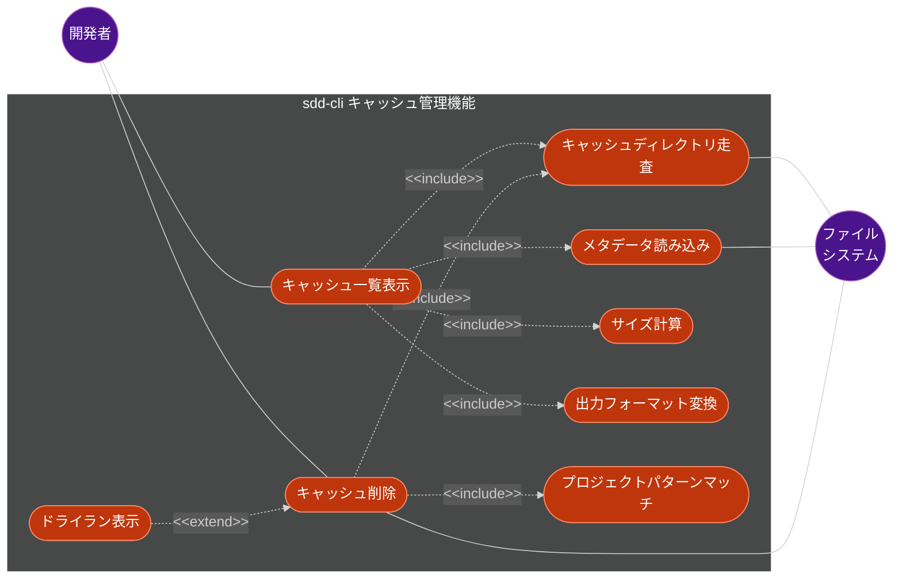
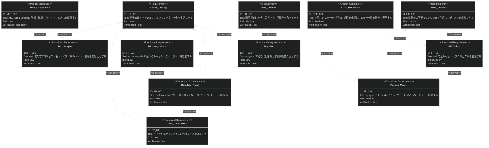
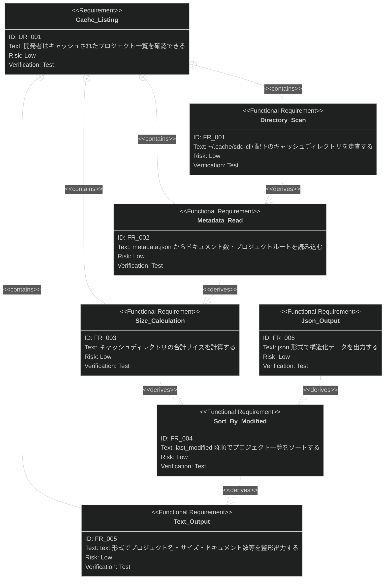
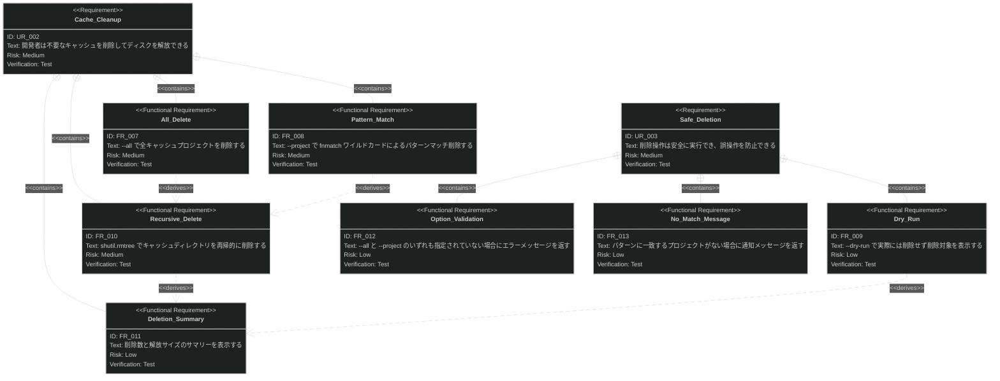

# キャッシュ管理機能 要求仕様書

## 概要

本ドキュメントは、sdd-cli のキャッシュ管理機能に関する要求仕様書（PRD）です。

`~/.cache/sdd-cli/` 配下に保存されるプロジェクト別インデックスキャッシュの一覧表示と削除を対象とします。CLI コマンド
`sdd-cli cache list` および `sdd-cli cache clean` がこの機能のエントリーポイントです。

---

# 1. 要求図の読み方

## 1.1. 要求タイプ

- **requirement**: 一般的な要求（ユーザー要求）
- **functionalRequirement**: 機能要求
- **designConstraint**: 設計制約（非機能要求含む）

## 1.2. リスクレベル

- **High**: 高リスク（実装が複雑、ビジネスクリティカル）
- **Medium**: 中リスク（重要だが代替可能）
- **Low**: 低リスク（実装が単純）

## 1.3. 検証方法

- **Test**: テストによる検証（自動テスト）
- **Demonstration**: デモンストレーションによる検証
- **Inspection**: インスペクション（レビュー）による検証

## 1.4. 関係タイプ

- **contains**: 包含関係（親要求が子要求を含む）
- **derives**: 派生関係（要求から別の要求が導出される）
- **traces**: トレース関係（要求間の追跡可能性）

---

# 2. 要求一覧

## 2.1. ユースケース図（概要）

## 2.2. ユースケース図（詳細）

### キャッシュ一覧表示

| Actor    | Use Case            | Description                                                 |
|:---------|:--------------------|:------------------------------------------------------------|
| 開発者      | キャッシュ一覧表示 (UC1)     | `sdd-cli cache list` で全キャッシュプロジェクトの情報を一覧表示する                |
| ファイルシステム | キャッシュディレクトリ走査 (UC3) | `~/.cache/sdd-cli/` 配下の `{project-name}.{hash}` ディレクトリを列挙する |
| ファイルシステム | メタデータ読み込み (UC4)     | 各キャッシュディレクトリ内の `metadata.json` からドキュメント数・プロジェクトルート等を読み込む    |
| -        | サイズ計算 (UC5)         | キャッシュディレクトリ内の全ファイルの合計サイズを計算する                               |
| -        | 出力フォーマット変換 (UC6)    | `--format` オプションに応じて text/json 形式で出力する                      |

### キャッシュ削除

| Actor | Use Case            | Description                                            |
|:------|:--------------------|:-------------------------------------------------------|
| 開発者   | キャッシュ削除 (UC2)       | `sdd-cli cache clean` でキャッシュディレクトリを削除しディスクを解放する        |
| -     | プロジェクトパターンマッチ (UC7) | `--project` オプションで fnmatch ワイルドカードによるプロジェクト名フィルタリングを行う |
| -     | ドライラン表示 (UC8)       | `--dry-run` オプションで実際に削除せず削除対象を表示する                     |

## 2.3. 機能一覧（テキスト形式）

- キャッシュ一覧表示
    - キャッシュディレクトリ走査
        - `~/.cache/sdd-cli/` 配下ディレクトリの列挙
        - `{project-name}.{hash}` 形式のディレクトリ名パース
    - メタデータ読み込み
        - `metadata.json` の読み込み（存在する場合のみ）
        - ドキュメント数・インデックス日時・プロジェクトルートの取得
    - サイズ計算
        - 全ファイルの合計サイズ算出（バイト・MB）
    - 最終更新日時の取得
    - last_modified 降順ソート
    - 出力フォーマット変換
        - text 形式：番号付きリスト（名前、サイズ、ドキュメント数、最終更新、ルート）
        - json 形式：構造化 JSON 出力
- キャッシュ削除
    - 全プロジェクト削除（`--all`）
    - パターンマッチ削除（`--project` + fnmatch ワイルドカード）
    - ドライラン（`--dry-run`）
    - `shutil.rmtree` による再帰的ディレクトリ削除
    - 削除数・解放サイズのサマリー表示
    - エラー発生時の継続処理とエラー一覧表示

---

# 3. 要求図（SysML Requirements Diagram）

## 3.1. 全体要求図

## 3.2. キャッシュ一覧表示 詳細図

## 3.3. キャッシュ削除 詳細図

---

# 4. 要求の詳細説明

## 4.1. ユーザー要求

### UR-001: キャッシュ一覧表示

開発者は `sdd-cli cache list` コマンドで、`~/.cache/sdd-cli/`
配下に保存されているすべてのプロジェクト別インデックスキャッシュの状況（プロジェクト名、キャッシュサイズ、ドキュメント数、最終更新日時、プロジェクトルートパス）を確認できる。

**検証方法:** テストによる検証

### UR-002: キャッシュ削除

開発者は `sdd-cli cache clean` コマンドで、不要になったキャッシュディレクトリを削除し、ディスク容量を解放できる。全プロジェクトの一括削除、またはワイルドカードパターンによる選択的削除が可能。

**検証方法:** テストによる検証

### UR-003: 安全な削除操作

削除操作は安全に実行でき、`--dry-run` オプションによる事前確認や、オプション未指定時のエラーメッセージによって誤操作を防止できる。

**検証方法:** テストによる検証

## 4.2. 機能要求

### FR-001: キャッシュディレクトリ走査

`~/.cache/sdd-cli/` 配下のディレクトリを列挙し、`{project-name}.{hash}` 形式のディレクトリ名をパースしてプロジェクト名とハッシュを抽出する。ドット（
`.`）を含まないディレクトリやファイルはスキップする。

**検証方法:** テストによる検証

### FR-002: metadata.json 読み込み

各キャッシュディレクトリ内の `metadata.json` が存在する場合、JSON として読み込み、`document_count`（ドキュメント数）、
`indexed_at`（インデックス日時）、`root`（プロジェクトルートパス）を取得する。ファイルが存在しない場合やパースに失敗した場合は空辞書として扱い、処理を継続する。

**検証方法:** テストによる検証

### FR-003: キャッシュサイズ計算

キャッシュディレクトリ内の全ファイルを再帰的に走査し、各ファイルの `st_size` を合算して合計サイズ（バイト単位）を計算する。MB
単位（小数点以下 2 桁）の値も併せて提供する。

**検証方法:** テストによる検証

### FR-004: 最終更新日時によるソート

キャッシュプロジェクト一覧は、ディレクトリの `st_mtime`（最終更新日時）の降順（最新順）でソートして返す。

**検証方法:** テストによる検証

### FR-005: text 形式出力

`sdd-cli cache list` のデフォルト出力形式。以下の情報を番号付きリストで表示する:

- プロジェクト数・合計キャッシュサイズのサマリー
- 各プロジェクト: 名前.ハッシュ、サイズ（MB）、ドキュメント数、最終更新日時、プロジェクトルート

キャッシュが存在しない場合は `"No cached projects found."` を表示する。

**検証方法:** テストによる検証

### FR-006: json 形式出力

`sdd-cli cache list --format json` で構造化 JSON を出力する。各プロジェクトの `name`, `hash`, `directory`, `size_bytes`,
`size_mb`, `last_modified`, `document_count`, `indexed_at`, `project_root` をフィールドとして含む。`ensure_ascii=False`
で日本語パスを正しく出力する。

**検証方法:** テストによる検証

### FR-007: 全プロジェクト削除

`sdd-cli cache clean --all` で `~/.cache/sdd-cli/` 配下のすべてのキャッシュプロジェクトを削除する。

**検証方法:** テストによる検証

### FR-008: パターンマッチ削除

`sdd-cli cache clean --project <PATTERN>` で、プロジェクト名が fnmatch
ワイルドカードパターンに一致するキャッシュのみを削除する。パターンはプロジェクト名（ハッシュを除く部分）に対してマッチングする。

**含まれる機能:**

- FR-012: `--all` と `--project` のいずれも指定されていない場合、`"Please specify --all or --project <pattern>"`
  のエラーメッセージを返す
- FR-013: パターンに一致するプロジェクトが存在しない場合、`"No projects matching '<pattern>' found."` のメッセージを返す

**検証方法:** テストによる検証

### FR-009: ドライラン

`sdd-cli cache clean --dry-run` で、実際に削除を実行せず、削除対象のプロジェクト名・サイズを `[DRY RUN]` プレフィックス付きで表示する。
`--all` または `--project` と組み合わせて使用する。

**検証方法:** テストによる検証

### FR-010: 再帰的ディレクトリ削除

`shutil.rmtree` を使用してキャッシュディレクトリを再帰的に削除する。ディレクトリ内のすべてのファイルとサブディレクトリを含めて完全に削除する。

**検証方法:** テストによる検証

### FR-011: 削除サマリー表示

削除処理完了後に、削除されたプロジェクト数と解放されたディスク容量（MB）のサマリーを表示する。ドライラン時は `[DRY RUN]`
プレフィックスを付与する。

**検証方法:** テストによる検証

## 4.3. 設計制約（非機能要求）

### NFR-001: エラー耐性

キャッシュ削除中に個別のディレクトリ削除でエラー（パーミッション拒否、ファイルロック等）が発生した場合、当該エラーを記録して処理を継続する。すべての削除処理完了後にエラー一覧をサマリーに含めて表示する。

**検証方法:** テストによる検証

### NFR-002: XDG Base Directory 準拠

キャッシュベースディレクトリは XDG Base Directory 仕様に準拠し、`~/.cache/sdd-cli/` を使用する。`cache.py` の
`get_cache_base()` が返すパスに依存する。

**検証方法:** インスペクションによる検証

### NFR-003: キャッシュディレクトリ不在時の安全な動作

`~/.cache/sdd-cli/` ディレクトリが存在しない場合、一覧表示では空リストを返し、削除では `"No cache directory found."`
メッセージを返す。例外は発生させない。

**検証方法:** テストによる検証

### NFR-004: metadata.json パース失敗時のグレースフルデグラデーション

`metadata.json` が存在しない、または JSON として不正な場合でも、`document_count: 0`、`indexed_at: ""`、`project_root: ""`
のデフォルト値で処理を継続する。

**検証方法:** テストによる検証

---

# 5. 制約事項

## 5.1. 技術的制約

- キャッシュディレクトリの命名規則は `{project-name}.{hash}` 形式に固定されており、ドット（`.`）を含まないディレクトリ名は無視される
- ディレクトリ名は `rsplit(".", 1)` でパースされるため、プロジェクト名にドットが含まれていてもハッシュ部分が正しく分離される
- fnmatch パターンマッチはプロジェクト名（ハッシュを除く部分）に対してのみ適用される

## 5.2. ビジネス的制約

- キャッシュディレクトリの構造は `cache.py` の `get_cache_dir()` が生成する形式と一致している必要がある
- `metadata.json` のスキーマは `commands/index.py` のインデックス構築処理が出力する形式に依存する

---

# 6. 前提条件

- `~/.cache/sdd-cli/` ディレクトリはインデックス構築時（`sdd-cli index`）に自動生成されること
- キャッシュディレクトリ内の `metadata.json` はインデックス構築時に保存されること（FR-018: document-indexing PRD 参照）
- Python 3.9 以上がインストールされていること
- ファイルシステムに対する読み取り・削除権限があること

---

# 7. スコープ外

以下は本 PRD のスコープ外とします：

- キャッシュの自動有効期限管理（TTL ベースの自動削除）
- キャッシュサイズの上限設定
- 個別ファイル単位のキャッシュ削除（ディレクトリ単位のみ）
- キャッシュの圧縮・最適化
- キャッシュベースディレクトリのカスタマイズ（XDG_CACHE_HOME 対応）
- インデックスの再構築（-> document-indexing PRD で定義）
- キャッシュディレクトリの生成ロジック（-> document-indexing PRD で定義）

---

# 8. 用語集

| 用語                 | 定義                                                            |
|--------------------|---------------------------------------------------------------|
| キャッシュディレクトリ        | `~/.cache/sdd-cli/{project-name}.{hash}/` 形式のプロジェクト別インデックス保存先 |
| XDG Base Directory | Linux/macOS のディレクトリ配置標準仕様。キャッシュは `~/.cache/` に配置              |
| fnmatch            | Python 標準ライブラリのファイル名パターンマッチモジュール。`*`, `?`, `[seq]` をサポート      |
| metadata.json      | キャッシュディレクトリ内に保存されるインデックスメタ情報ファイル（日時・ドキュメント数・ルートパス）            |
| ドライラン              | 実際の操作を行わず、実行結果をシミュレーション表示する動作モード                              |
| shutil.rmtree      | Python 標準ライブラリのディレクトリ再帰削除関数                                   |
| SHA-256 ハッシュ       | プロジェクトパスから生成される一意識別子。先頭 8 文字を使用                               |
| project-name       | プロジェクトルートディレクトリの末尾ディレクトリ名                                     |
