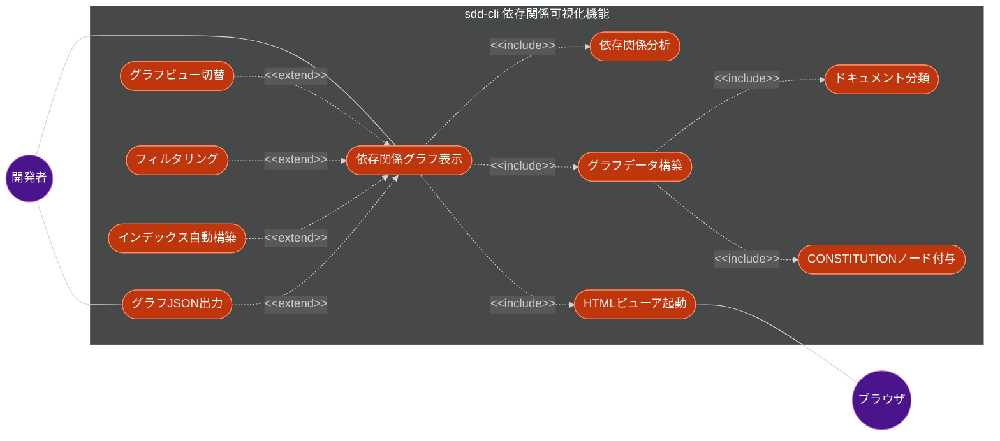
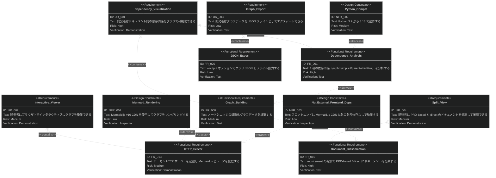
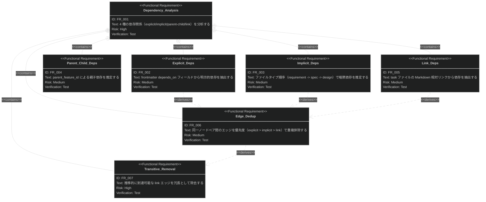
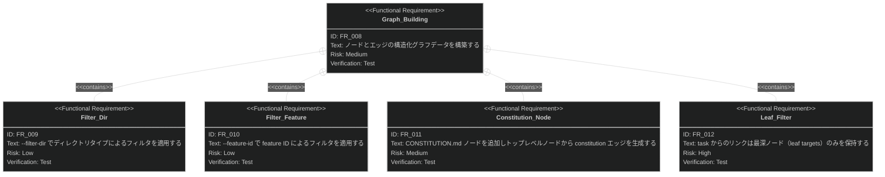
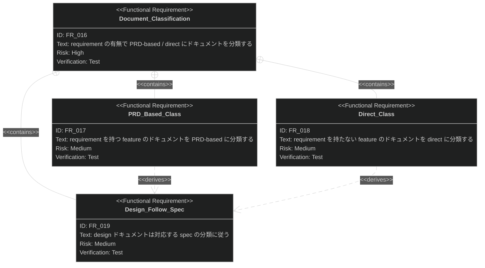
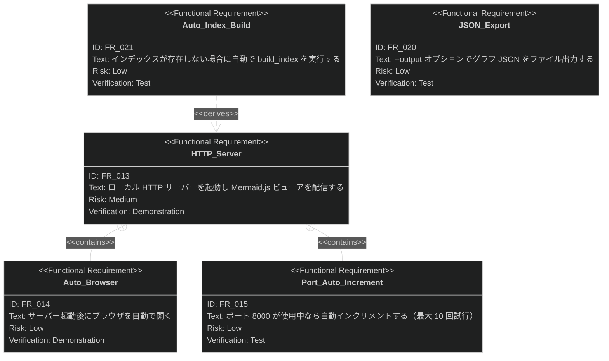

# 依存関係可視化機能 要求仕様書

## 概要

本ドキュメントは、sdd-cli の依存関係可視化機能に関する要求仕様書（PRD）です。

`.sdd/` 配下の Markdown ドキュメント間の依存関係を分析し、グラフデータ（ノード・エッジ）を構築して、インタラクティブな HTML
ビューアで表示する機能を対象とします。CLI コマンド `sdd-cli visualize` がこの機能のエントリーポイントです。

---

# 1. 要求図の読み方

## 1.1. 要求タイプ

- **requirement**: 一般的な要求（ユーザー要求）
- **functionalRequirement**: 機能要求
- **designConstraint**: 設計制約（非機能要求含む）

## 1.2. リスクレベル

- **High**: 高リスク（実装が複雑、ビジネスクリティカル）
- **Medium**: 中リスク（重要だが代替可能）
- **Low**: 低リスク（実装が単純）

## 1.3. 検証方法

- **Test**: テストによる検証（自動テスト）
- **Demonstration**: デモンストレーションによる検証
- **Inspection**: インスペクション（レビュー）による検証

## 1.4. 関係タイプ

- **contains**: 包含関係（親要求が子要求を含む）
- **derives**: 派生関係（要求から別の要求が導出される）
- **traces**: トレース関係（要求間の追跡可能性）

---

# 2. 要求一覧

## 2.1. ユースケース図（概要）

## 2.2. ユースケース図（詳細）

### 依存関係グラフ表示

| Actor | Use Case         | Description                                        |
|:------|:-----------------|:---------------------------------------------------|
| 開発者   | 依存関係グラフ表示 (UC1)  | `sdd-cli visualize` でドキュメント間の依存関係をインタラクティブに表示する    |
| -     | 依存関係分析 (UC2)     | 4 種の依存関係（explicit/implicit/parent-child/link）を推定する |
| -     | グラフデータ構築 (UC3)   | ノード・エッジの構造化データを構築しフィルタ適用する                         |
| -     | グラフビュー切替 (UC4)   | Single View / Split View（PRD-based/direct）を切り替える   |
| ブラウザ  | HTMLビューア起動 (UC5) | ローカル HTTP サーバーを起動しブラウザで Mermaid.js グラフを表示する        |

### グラフデータ出力

| Actor | Use Case                | Description                                      |
|:------|:------------------------|:-------------------------------------------------|
| 開発者   | グラフJSON出力 (UC6)         | `--output` オプションでグラフ JSON をファイルに出力する             |
| -     | インデックス自動構築 (UC7)        | インデックスが未構築の場合、自動で `build_index()` を実行する          |
| -     | ドキュメント分類 (UC8)          | requirement の有無で PRD-based / direct にドキュメントを分類する |
| -     | CONSTITUTIONノード付与 (UC9) | トップレベルノードに CONSTITUTION.md への暗黙エッジを付与する          |
| -     | フィルタリング (UC10)          | `--filter-dir` / `--feature-id` でグラフをフィルタする      |

## 2.3. 機能一覧（テキスト形式）

- 依存関係分析
    - Explicit 依存: frontmatter `depends_on` フィールドからの明示的依存
    - Implicit 依存: ファイルタイプ順序に基づく暗黙的依存（requirement -> spec -> design）
    - Parent-Child 依存: `parent_feature_id` による親子関係
    - Link 依存: Markdown 相対リンクからの依存（task ファイルのみ）
    - エッジ重複排除（explicit > implicit > link の優先度）
    - 推移的 link エッジの除去
    - leaf targets フィルタ（task からのリンクは最深ノードのみ保持）
- グラフデータ構築
    - ノード構築（id, title, directory, file_type, feature_id, links）
    - エッジ構築（source, target, type）
    - ディレクトリフィルタ（`--filter-dir`）
    - feature ID フィルタ（`--feature-id`）
    - CONSTITUTION.md ノードの自動付与
    - constitution エッジの生成（トップレベルノード -> CONSTITUTION.md）
- ドキュメント分類（Split View）
    - PRD-based: requirement を持つ feature のドキュメント群
    - Direct: requirement を持たない feature のドキュメント群
    - design は対応する spec の分類に従う
    - task はリンク先が requirement/PRD-based spec なら PRD-based
- HTML ビューア
    - ローカル HTTP サーバー起動
    - Mermaid.js によるグラフレンダリング（BT レイアウト）
    - Single View / Split View のタブ切替
    - ズーム（拡大・縮小・リセット）
    - パン（ドラッグ操作）
    - ノードクリックによる詳細表示
    - ダーク/ライトテーマ切替
    - SVG ダウンロード
- グラフ JSON 出力（`--output` オプション）
- インデックス未構築時の自動構築

---

# 3. 要求図（SysML Requirements Diagram）

## 3.1. 全体要求図

## 3.2. 依存関係分析 詳細図

## 3.3. グラフデータ構築 詳細図

## 3.4. ドキュメント分類 詳細図

## 3.5. HTML ビューア 詳細図

---

# 4. 要求の詳細説明

## 4.1. ユーザー要求

### UR-001: 依存関係の可視化

開発者は `sdd-cli visualize` コマンドを実行することで、`.sdd/` 配下のドキュメント間の依存関係をグラフとして可視化できる。requirement,
spec, design, task の各ドキュメントタイプ間の関係性が一目で把握でき、プロジェクト全体の構造を理解できる。

**検証方法:** デモンストレーションによる検証

### UR-002: インタラクティブなビューア操作

開発者はブラウザ上で表示されたグラフに対して、ズーム（拡大・縮小）、パン（ドラッグによるスクロール）、ノードクリックによる詳細表示、テーマ切替（ダーク/ライト）、SVG
ダウンロードなどのインタラクティブ操作が行える。

**検証方法:** デモンストレーションによる検証

### UR-003: グラフデータのエクスポート

開発者は `--output` オプションを使用して、依存関係グラフデータを JSON ファイルとしてエクスポートできる。外部ツールとの連携やレポート生成に利用可能。

**検証方法:** テストによる検証

### UR-004: PRD-based / Direct の分離表示

開発者は Split View を使用して、requirement（PRD）が存在するドキュメント群と、requirement なしで CONSTITUTION
から直接派生するドキュメント群を分離して確認できる。プロジェクトのドキュメント体系の網羅性を把握できる。

**検証方法:** デモンストレーションによる検証

## 4.2. 機能要求

### FR-001: 依存関係分析

インデックスから取得した全ドキュメントに対し、以下の 4 種の依存関係を分析する。分析結果は `(source, target, link_type)`
のタプルリストとして返される。

**含まれる機能:**

- FR-002: frontmatter `depends_on`（`depends-on`, `depends_on`, `dependencies`）フィールドから明示的依存を抽出する。ソースの
  file_type に基づき、TYPE_HIERARCHY（requirement -> spec -> design -> task）の上流方向に最も近い型のドキュメントを解決先とする
- FR-003: 同一 feature_id を持つドキュメント間で、ファイルタイプ順序に基づく暗黙依存を推定する。spec は requirement
  に、design は spec に暗黙的に依存する。task は暗黙依存の対象外（link エッジで接続）
- FR-004: `parent_feature_id` を持つドキュメントは、同じ file_type の親 feature ドキュメントに対して暗黙依存として接続する
- FR-005: task ファイルの Markdown 本文内の相対リンクを解決し、リンク先ドキュメントへの link 依存を生成する。リンク先は
  leaf targets（最深ノード）のみを保持する
- FR-006: 同一ノードペア間（A->B と B->A を同一視）のエッジを、優先度 explicit > implicit > link で重複排除する
- FR-007: 推移的に到達可能な link エッジを除去する。A->B（任意エッジ）かつ B->C（任意エッジ）が存在する場合、A->C の link
  エッジは冗長として除去する

**検証方法:** テストによる検証

### FR-008: グラフデータ構築

分析された依存関係と全ドキュメントから、GraphNode と GraphEdge の構造化データを構築する。

**含まれる機能:**

- FR-009: `--filter-dir` オプションで directory フィールドによるフィルタを適用する。requirement, specification, task
  から選択可能
- FR-010: `--feature-id` オプションで feature_id によるフィルタを適用する
- FR-011: グラフに CONSTITUTION.md ノードを追加し、他のエッジの source に存在しないトップレベルノード（対象 file_type:
  requirement, spec, task）から CONSTITUTION.md への constitution エッジを生成する
- FR-012: task ファイルからの link 依存において、依存チェーンの中で最深のノード（leaf targets）のみを保持する。A->B->C
  の依存チェーンで task が A と C の両方にリンクしている場合、A はC の祖先として除去される

**検証方法:** テストによる検証

### FR-013: HTTP サーバーとビューア配信

Python 標準ライブラリの `http.server` を使用してローカル HTTP サーバーを起動し、パッケージ同梱の静的ファイル（HTML/CSS/JS）とインメモリ
JSON データを配信する。

**含まれる機能:**

- FR-014: サーバー起動後 1 秒遅延でブラウザを自動的に開く（`webbrowser.open`）
- FR-015: デフォルトポート 8000 が使用中の場合、ポート番号を自動インクリメントする（最大 10 回試行）。すべて使用中の場合は
  `RuntimeError` を発生させる

**検証方法:** デモンストレーションによる検証

### FR-016: ドキュメント分類（Split View）

ドキュメントを PRD-based と direct の 2 グループに分類し、それぞれ独立したグラフを構築する。

**含まれる機能:**

- FR-017: requirement を持つ feature のドキュメント（requirement 自身、対応する spec、リンク先が PRD-based な task）を
  PRD-based に分類する
- FR-018: requirement を持たない feature のドキュメント（spec、対応する task）を direct に分類する。direct グラフでは
  CONSTITUTION.md から spec と task にエッジが接続される
- FR-019: design ドキュメントは対応する spec の分類に従う。spec が PRD-based なら PRD-based、direct なら direct。spec
  が存在するが分類未決定の場合は PRD-based とする

**検証方法:** テストによる検証

### FR-020: グラフ JSON ファイル出力

`--output` オプションが指定された場合、依存関係グラフデータを JSON ファイルとして出力する。出力先ディレクトリが存在しない場合は自動的に作成する。ファイル名は指定パスの
stem に `.json` 拡張子を付与する。

**検証方法:** テストによる検証

### FR-021: インデックス自動構築

XDG キャッシュディレクトリ内にインデックスデータベース（`index.db`）が存在しない場合、`build_index()`
を自動実行してインデックスを構築してからグラフ生成を行う。

**検証方法:** テストによる検証

## 4.3. 設計制約（非機能要求）

### NFR-001: Mermaid.js CDN 利用

フロントエンドのグラフレンダリングには Mermaid.js v10（CDN: `cdn.jsdelivr.net/npm/mermaid@10`）を使用する。Mermaid
のフローチャート記法（`graph BT`）で Bottom-to-Top レイアウトのグラフを生成する。

**検証方法:** インスペクションによる検証

### NFR-002: Python バージョン互換性

Python 3.9〜3.13 のすべてのバージョンで動作する。`importlib.resources` の API 差異に対応する互換処理が必要。

**検証方法:** テストによる検証（CI マトリックスで複数バージョンテスト）

### NFR-003: フロントエンド外部依存の最小化

HTML ビューアは Mermaid.js CDN 以外の外部依存（フレームワーク、ライブラリ）を使用しない。CSS・JS はバニラで実装する。

**検証方法:** インスペクションによる検証

### NFR-004: テーマ対応

HTML ビューアはダーク/ライトテーマの切替に対応する。テーマ設定は `localStorage` に永続化し、システム設定（
`prefers-color-scheme`）をデフォルト値とする。ノードの色はファイルタイプ別（requirement: 青系、spec: 緑系、design:
シアン系、task: 黄系、constitution: 紫系）に設定される。

**検証方法:** デモンストレーションによる検証

### NFR-005: ズーム・パン操作

グラフビューアはマウスホイールまたはボタンによるズーム（30%〜400%、ステップ 20%）、ドラッグによるパン操作、キーボードショートカット（
`+`/`-` でズーム、`0` でリセット、`Escape` で詳細パネル閉じ）に対応する。

**検証方法:** デモンストレーションによる検証

### NFR-006: ノード詳細表示

グラフ上のノードをクリックすると、File Path、Directory、Feature ID、Links、Parent の詳細情報をオーバーレイパネルで表示する。

**検証方法:** デモンストレーションによる検証

### NFR-007: インメモリ JSON 配信

3 種のグラフデータ（`dependency-graph.json`、`prd-based-graph.json`、`direct-graph.json`）はインメモリで保持し、HTTP
リクエスト時に直接応答する。ファイルシステムへの書き込みは `--output` 指定時のみ行う。

**検証方法:** テストによる検証

### NFR-008: エラーハンドリング

インデックスにドキュメントが存在しない場合は `ValueError` を発生させる。Ctrl+C でサーバーを正常終了する。

**検証方法:** テストによる検証

---

# 5. 制約事項

## 5.1. 技術的制約

- HTTP サーバーは Python 標準ライブラリの `http.server` と `socketserver` を使用する（外部 WSGI/ASGI フレームワーク不使用）
- Mermaid.js のレンダリングはブラウザ側で行うため、CDN へのネットワーク接続が必要
- `importlib.resources` の API が Python 3.9 と 3.10 以降で異なるため互換処理が必要
- ポート 8000〜8009 がすべて使用中の場合はサーバー起動に失敗する

## 5.2. ビジネス的制約

- document-indexing 機能（`sdd-cli index`）によるインデックス構築が前提
- `.sdd/` ディレクトリ構造と frontmatter 形式は AI-SDD Workflow の規約に従う
- TYPE_HIERARCHY（requirement -> spec -> design -> task）の順序は固定

---

# 6. 前提条件

- プロジェクトルートに `.sdd/` ディレクトリが存在すること
- インデックスが構築済みであること（未構築の場合は自動構築される）
- Markdown ドキュメントが YAML frontmatter 形式に従っていること（依存関係分析の精度に影響）
- Python 3.9 以上がインストールされていること
- ブラウザが利用可能であること（HTML ビューア表示のため）
- CDN（`cdn.jsdelivr.net`）へのネットワーク接続が可能であること（Mermaid.js 読み込みのため）

---

# 7. スコープ外

以下は本 PRD のスコープ外とします：

- ドキュメントのインデックス構築機能（-> document-indexing PRD で定義）
- ドキュメントの全文検索機能（-> document-search PRD で定義）
- キャッシュの一覧・削除機能（-> cache-management PRD で定義）
- グラフの永続化（ブラウザを閉じるとグラフ状態は失われる）
- リアルタイムのファイル変更監視・自動更新
- グラフのレイアウトアルゴリズムのカスタマイズ（Mermaid.js のデフォルトに依存）
- 循環依存の検出・警告
- 複数プロジェクト間の依存関係可視化
- サーバーの HTTPS 対応

---

# 8. 用語集

| 用語               | 定義                                                             |
|------------------|----------------------------------------------------------------|
| SDD              | Specification-Driven Development。仕様駆動開発                        |
| PRD              | Product Requirements Document。要求仕様書。requirement ドキュメントのこと      |
| CONSTITUTION.md  | AI-SDD Workflow のプロジェクト憲法ファイル。すべてのドキュメントの最上位に位置する              |
| TYPE_HIERARCHY   | ドキュメントタイプの階層順序。requirement -> spec -> design -> task           |
| explicit 依存      | frontmatter `depends_on` フィールドで明示的に宣言された依存関係                   |
| implicit 依存      | ファイルタイプ順序と feature_id の一致により自動推定される依存関係                        |
| parent-child 依存  | ディレクトリネストによる親子関係に基づく依存                                         |
| link 依存          | Markdown 本文中の相対リンクから推定される依存関係（task ファイルのみ）                     |
| constitution エッジ | トップレベルノードから CONSTITUTION.md への暗黙エッジ                            |
| leaf targets     | 依存チェーンにおいて最も下流（最深）のノード。祖先ノードは除去される                             |
| PRD-based        | requirement ドキュメントを持つ feature に属するドキュメント群                      |
| direct           | requirement を持たず、CONSTITUTION から直接派生するドキュメント群                  |
| GraphNode        | グラフのノード。id, title, directory, file_type, feature_id, links を持つ |
| GraphEdge        | グラフのエッジ。source, target, type を持つ                               |
| DependencyGraph  | ノードとエッジの集合からなるグラフデータ構造                                         |
| Mermaid.js       | テキストベースのダイアグラム描画ライブラリ。フローチャート記法で依存グラフを表現                       |
| feature_id       | ドキュメントが属する機能を識別する ID                                           |
| file_type        | ドキュメントの分類（requirement/spec/design/task）                        |
