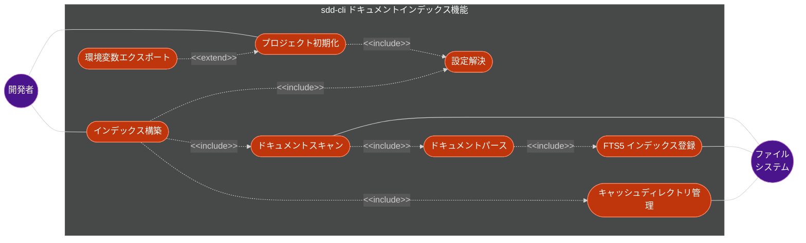
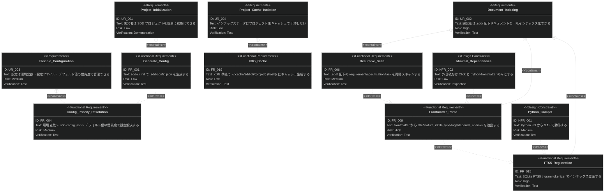
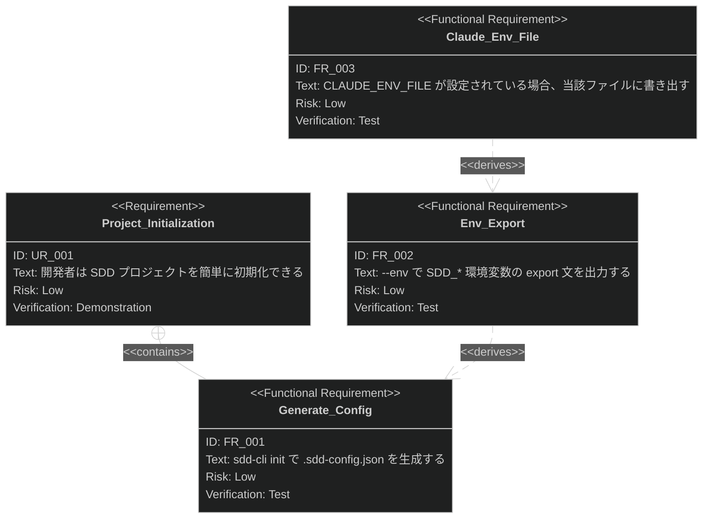

# ドキュメントインデックス機能 要求仕様書

## 概要

本ドキュメントは、sdd-cli のドキュメントインデックス機能に関する要求仕様書（PRD）です。

`.sdd/` 配下の Markdown ドキュメント（requirement/specification/task）をスキャン・パースし、SQLite FTS5
でインデックス化する機能を対象とします。CLI コマンド `sdd-cli init` および `sdd-cli index` がこの機能のエントリーポイントです。

---

# 1. 要求図の読み方

## 1.1. 要求タイプ

- **requirement**: 一般的な要求（ユーザー要求）
- **functionalRequirement**: 機能要求
- **designConstraint**: 設計制約（非機能要求含む）

## 1.2. リスクレベル

- **High**: 高リスク（実装が複雑、ビジネスクリティカル）
- **Medium**: 中リスク（重要だが代替可能）
- **Low**: 低リスク（実装が単純）

## 1.3. 検証方法

- **Test**: テストによる検証（自動テスト）
- **Demonstration**: デモンストレーションによる検証
- **Inspection**: インスペクション（レビュー）による検証

## 1.4. 関係タイプ

- **contains**: 包含関係（親要求が子要求を含む）
- **derives**: 派生関係（要求から別の要求が導出される）
- **traces**: トレース関係（要求間の追跡可能性）

---

# 2. 要求一覧

## 2.1. ユースケース図（概要）

## 2.2. ユースケース図（詳細）

### プロジェクト初期化

| Actor | Use Case         | Description                                           |
|:------|:-----------------|:------------------------------------------------------|
| 開発者   | プロジェクト初期化 (UC1)  | `sdd-cli init` で `.sdd-config.json` を生成し SDD 設定を初期化する |
| -     | 設定解決 (UC3)       | 環境変数 > `.sdd-config.json` > デフォルト値の優先度で SDD 設定を解決する   |
| -     | 環境変数エクスポート (UC8) | `--env` オプションで `SDD_*` 環境変数の export 文を出力する            |

### インデックス構築

| Actor    | Use Case            | Description                                                            |
|:---------|:--------------------|:-----------------------------------------------------------------------|
| 開発者      | インデックス構築 (UC2)      | `sdd-cli index` で `.sdd/` 配下ドキュメントをスキャン・パース・FTS5 登録する                  |
| ファイルシステム | ドキュメントスキャン (UC4)    | requirement/specification/task ディレクトリの Markdown ファイルを再帰的に収集する          |
| -        | ドキュメントパース (UC5)     | frontmatter 解析で title/feature_id/file_type/tags/depends_on/links を抽出する |
| ファイルシステム | FTS5 インデックス登録 (UC6) | trigram tokenizer を使った SQLite FTS5 テーブルとメタデータテーブルに登録する                 |
| ファイルシステム | キャッシュディレクトリ管理 (UC7) | XDG Base Directory 準拠の `~/.cache/sdd-cli/{project}.{hash}/` を管理する      |

## 2.3. 機能一覧（テキスト形式）

- プロジェクト初期化
    - `.sdd-config.json` 生成
    - 環境変数エクスポート（`--env` オプション）
    - `CLAUDE_ENV_FILE` への書き出し
- 設定管理
    - 設定優先度解決（環境変数 > 設定ファイル > デフォルト値）
    - JSON バリデーション
- インデックス構築
    - ドキュメントスキャン
        - requirement/specification/task ディレクトリの再帰スキャン
        - task ディレクトリは `index.md`/`tasks.md` のみ
        - 隠しファイル除外
    - ドキュメントパース
        - frontmatter メタデータ抽出
        - feature_id 推定（frontmatter またはファイル名）
        - file_type 推定（パス・ファイル名・ディレクトリ）
        - parent_feature_id 推定（ディレクトリネスト）
        - コードブロック除去
        - 相対リンク抽出
    - FTS5 インデックス登録
        - trigram tokenizer による全文検索テーブル
        - メタデータテーブル登録
        - 既存インデックスクリア再構築
        - metadata.json 保存
- キャッシュディレクトリ管理
    - XDG Base Directory 準拠のキャッシュ生成
    - SHA-256 ハッシュによるプロジェクト識別

---

# 3. 要求図（SysML Requirements Diagram）

## 3.1. 全体要求図

## 3.2. プロジェクト初期化 詳細図

## 3.3. インデックス構築 詳細図

```mermaid
%%{init: {'theme': 'dark'}}%%
requirementDiagram
    requirement Document_Indexing {
        id: UR_002
        text: "開発者は .sdd/ 配下ドキュメントを一括インデックス化できる"
        risk: high
        verifymethod: test
    }

    functionalRequirement Recursive_Scan {
        id: FR_006
        text: ".sdd/ 配下の requirement/specification/task を再帰スキャンする"
        risk: medium
        verifymethod: test
    }

    functionalRequirement Task_Managed_Files {
        id: FR_007
        text: "task ディレクトリでは index.md と tasks.md のみをスキャン対象とする"
        risk: low
        verifymethod: test
    }

    functionalRequirement Hidden_File_Exclusion {
        id: FR_008
        text: "隠しファイルをスキャン対象から除外する"
        risk: low
        verifymethod: test
    }

    functionalRequirement Frontmatter_Parse {
        id: FR_009
        text: "frontmatter から title/feature_id/file_type/tags/depends_on/links を抽出する"
        risk: high
        verifymethod: test
    }

    functionalRequirement Feature_Id_Inference {
        id: FR_010
        text: "feature_id を frontmatter またはファイル名から推定する"
        risk: medium
        verifymethod: test
    }

    functionalRequirement File_Type_Inference {
        id: FR_011
        text: "file_type をパス・ファイル名・ディレクトリから推定する"
        risk: medium
        verifymethod: test
    }

    functionalRequirement Parent_Feature_Inference {
        id: FR_012
        text: "parent_feature_id をディレクトリネスト階層から推定する"
        risk: medium
        verifymethod: test
    }

    functionalRequirement Code_Block_Removal {
        id: FR_013
        text: "コードブロックを除去したコンテンツを検索用に生成する"
        risk: low
        verifymethod: test
    }

    functionalRequirement Link_Extraction {
        id: FR_014
        text: "Markdown 本文から相対リンクを抽出する"
        risk: medium
        verifymethod: test
    }

    functionalRequirement FTS5_Registration {
        id: FR_015
        text: "SQLite FTS5 trigram tokenizer でインデックス登録する"
        risk: high
        verifymethod: test
    }

    functionalRequirement Metadata_Table {
        id: FR_016
        text: "メタデータテーブルに構造化データを登録する"
        risk: medium
        verifymethod: test
    }

    functionalRequirement Clear_Rebuild {
        id: FR_017
        text: "既存インデックスをクリアして再構築する"
        risk: low
        verifymethod: test
    }

    functionalRequirement Save_Metadata_Json {
        id: FR_018
        text: "metadata.json に日時・ドキュメント数・ルートパスを保存する"
        risk: low
        verifymethod: test
    }

    Document_Indexing - contains -> Recursive_Scan
    Document_Indexing - contains -> Frontmatter_Parse
    Document_Indexing - contains -> FTS5_Registration
    Recursive_Scan - contains -> Task_Managed_Files
    Recursive_Scan - contains -> Hidden_File_Exclusion
    Frontmatter_Parse - contains -> Feature_Id_Inference
    Frontmatter_Parse - contains -> File_Type_Inference
    Frontmatter_Parse - contains -> Parent_Feature_Inference
    Frontmatter_Parse - contains -> Code_Block_Removal
    Frontmatter_Parse - contains -> Link_Extraction
    FTS5_Registration - contains -> Metadata_Table
    FTS5_Registration - contains -> Clear_Rebuild
    Save_Metadata_Json - derives -> FTS5_Registration
```

---

# 4. 要求の詳細説明

## 4.1. ユーザー要求

### UR-001: プロジェクト初期化

開発者は `sdd-cli init` コマンドを実行するだけで、SDD プロジェクトの設定ファイル（`.sdd-config.json`）が自動生成され、プロジェクトの
SDD 環境が整う。

**検証方法:** デモンストレーションによる検証

### UR-002: ドキュメントインデックス化

開発者は `sdd-cli index` コマンドで `.sdd/` 配下のすべての Markdown ドキュメントを一括でインデックス化でき、後続の検索・依存関係分析に利用できる状態にする。

**検証方法:** テストによる検証

### UR-003: 柔軟な設定管理

設定は環境変数・設定ファイル（`.sdd-config.json`）・デフォルト値の 3 段階の優先度で柔軟に管理できる。CI
環境では環境変数、ローカルでは設定ファイルといった使い分けが可能。

**検証方法:** テストによる検証

### UR-004: プロジェクト別キャッシュ

インデックスデータはプロジェクトごとに独立したキャッシュディレクトリに保存され、複数プロジェクトを同時に扱っても干渉しない。

**検証方法:** テストによる検証

## 4.2. 機能要求

### FR-001: .sdd-config.json 生成

`sdd-cli init` コマンドでプロジェクトルートに `.sdd-config.json` を生成する。既に存在する場合は上書きせず、既存の設定を保持する。

**含まれる機能:**

- FR-002: `--env` オプションで `SDD_*` 環境変数の export 文を stdout に出力する
- FR-003: `CLAUDE_ENV_FILE` 環境変数が設定されている場合、当該ファイルに環境変数を書き出す

**検証方法:** テストによる検証

### FR-004: 設定優先度解決

SDD 設定（root, directories, lang）を以下の優先度で解決する:

1. 環境変数（`SDD_ROOT`, `SDD_REQUIREMENT_DIR`, `SDD_SPECIFICATION_DIR`, `SDD_TASK_DIR`）
2. `.sdd-config.json` のフィールド値
3. デフォルト値（root: `.sdd`, lang: `en`, directories: requirement/specification/task）

**検証方法:** テストによる検証

### FR-005: JSON バリデーション

`.sdd-config.json` の読み込み時に JSON フォーマットの妥当性を検証する。不正な JSON やオブジェクト以外の型の場合は
`ValueError` を発生させる。

**検証方法:** テストによる検証

### FR-006: ドキュメントスキャン

`.sdd/` 配下の requirement, specification, task ディレクトリの `.md` ファイルを再帰的に収集する。

**含まれる機能:**

- FR-007: task ディレクトリでは `index.md` と `tasks.md` のみをスキャン対象とする
- FR-008: `.` で始まる隠しファイルをスキャン対象から除外する

**検証方法:** テストによる検証

### FR-009: frontmatter メタデータ抽出

Markdown ファイルの YAML frontmatter を解析し、以下のメタデータを抽出する:

- title: frontmatter `title` フィールドまたは最初の H1 見出し
- feature_id: frontmatter `feature-id` / `feature_id` / `id` またはファイル名から推定
- file_type: パス・ファイル名・ディレクトリから推定（requirement/spec/design/task）
- tags: frontmatter `tags` フィールド（リストまたはカンマ区切り文字列）
- depends_on: frontmatter `depends-on` / `depends_on` / `dependencies` フィールド
- links: Markdown 本文中の相対リンク

**含まれる機能:**

- FR-010: feature_id の推定ロジック（frontmatter → ファイル名 → 親ディレクトリ名）
- FR-011: file_type の推定ロジック（ディレクトリ → ファイル名サフィックス → パス文字列）
- FR-012: parent_feature_id のディレクトリネスト階層からの推定
- FR-013: fenced code block とインラインコードを除去した検索用コンテンツの生成
- FR-014: `[text](path.md)` 形式およびバッククォート形式の相対リンク抽出

**検証方法:** テストによる検証

### FR-015: FTS5 インデックス登録

SQLite FTS5 仮想テーブル（trigram tokenizer）にドキュメントを登録する。

**含まれる機能:**

- FR-016: `documents_meta` テーブルに構造化メタデータ（file_type, feature_id, parent_feature_id, tags, depends_on,
  links）を登録する
- FR-017: インデックス構築時に既存データをクリアして再構築する

**検証方法:** テストによる検証

### FR-018: metadata.json 保存

インデックス構築完了後に、キャッシュディレクトリ内に `metadata.json`（インデックス日時、ドキュメント数、プロジェクトルートパス）を保存する。

**検証方法:** テストによる検証

### FR-019: XDG キャッシュディレクトリ生成

XDG Base Directory 仕様に準拠し、`~/.cache/sdd-cli/{project-name}.{hash}/` にプロジェクト別キャッシュディレクトリを生成する。

**含まれる機能:**

- FR-020: プロジェクトパスの SHA-256 先頭 8 文字をハッシュとして使用し、キャッシュディレクトリを一意に識別する

**検証方法:** テストによる検証

## 4.3. 設計制約

### NFR-001: Python バージョン互換性

Python 3.9〜3.13 のすべてのバージョンで動作する。`importlib.resources` の互換処理など、バージョン差異への対応が必要。

**検証方法:** テストによる検証（CI マトリックスで複数バージョンテスト）

### NFR-002: 外部依存の最小化

ランタイム依存は `click`（CLI フレームワーク）と `python-frontmatter`（YAML frontmatter パーサー）のみとする。SQLite は
Python 標準ライブラリを使用する。

**検証方法:** インスペクションによる検証

### NFR-003: 進捗表示

インデックス構築時に 10 件ごとに進捗を表示する。

**検証方法:** デモンストレーションによる検証

### NFR-004: 出力抑制オプション

`sdd-cli index --quiet` オプションで進捗表示を含むすべての標準出力を抑制できる。

**検証方法:** テストによる検証

### NFR-005: パース失敗時のグレースフルデグラデーション

個別ファイルのパースが失敗した場合、警告メッセージを表示して当該ファイルをスキップし、残りのファイルのインデックス構築を継続する。

**検証方法:** テストによる検証

### NFR-006: SDD ルート不在時のエラーメッセージ

SDD ルートディレクトリ（`.sdd/`）が存在しない場合、明確なエラーメッセージを返す。

**検証方法:** テストによる検証

---

# 5. 制約事項

## 5.1. 技術的制約

- SQLite FTS5 の trigram tokenizer を使用するため、SQLite 3.9.0 以上が必要
- `importlib.resources` の API が Python 3.9 と 3.10 以降で異なるため互換処理が必要

## 5.2. ビジネス的制約

- AI-SDD Workflow プラグインとの互換性を維持する必要がある
- `.sdd/` ディレクトリ構造は AI-SDD-PRINCIPLES.md の規約に従う

---

# 6. 前提条件

- プロジェクトルートに `.sdd/` ディレクトリが存在すること（`sdd-cli index` 実行時）
- Markdown ドキュメントが YAML frontmatter 形式に従っていること（必須ではないが、メタデータ抽出精度に影響）
- Python 3.9 以上がインストールされていること

---

# 7. スコープ外

以下は本 PRD のスコープ外とします：

- ドキュメントの全文検索機能（→ document-search PRD で定義）
- 依存関係の可視化機能（→ dependency-visualization PRD で定義）
- キャッシュの一覧・削除機能（→ cache-management PRD で定義）
- インクリメンタルインデックス更新（将来的に検討）
- リモートドキュメントのインデックス化

---

# 8. 用語集

| 用語                 | 定義                                        |
|--------------------|-------------------------------------------|
| SDD                | Specification-Driven Development。仕様駆動開発   |
| FTS5               | Full-Text Search 5。SQLite の全文検索拡張モジュール    |
| trigram tokenizer  | 3 文字ずつの部分文字列に分割するトークナイザー。日本語検索に有効         |
| frontmatter        | Markdown ファイル先頭の `---` で囲まれた YAML メタデータ領域 |
| XDG Base Directory | Linux/macOS のディレクトリ配置標準仕様                 |
| feature_id         | ドキュメントが属する機能を識別する ID                      |
| file_type          | ドキュメントの分類（requirement/spec/design/task）   |
| parent_feature_id  | 階層構造における親機能の feature_id                   |
