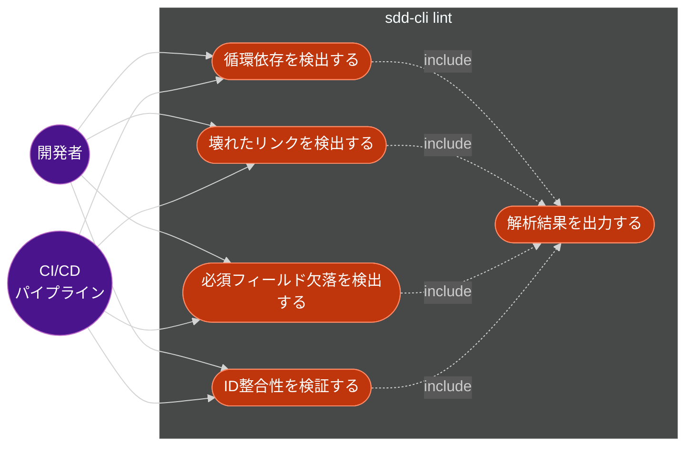
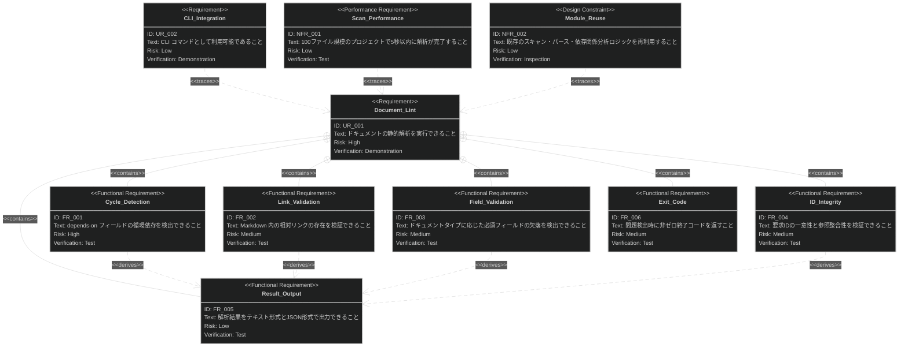

# document-lint 要求仕様書

## 概要

`.sdd/` 配下のドキュメントに対して静的解析を行い、YAML フロントマッタの循環依存、ファイルリンクの不整合、必須フィールドの欠落、要求 ID の一意性・参照整合性の問題を検出する CLI コマンド `sdd-cli lint` を提供する。CI/CD パイプラインやローカル開発フローに組み込むことで、ドキュメントの品質を継続的に担保する。

---

# 1. 要求図の読み方

## 1.1. 要求タイプ

- **requirement**: 一般的な要求
- **functionalRequirement**: 機能要求
- **performanceRequirement**: パフォーマンス要求
- **interfaceRequirement**: インターフェース要求
- **designConstraint**: 設計制約

## 1.2. リスクレベル

- **High**: 高リスク（ビジネスクリティカル、実装困難）
- **Medium**: 中リスク（重要だが代替可能）
- **Low**: 低リスク（Nice to have）

## 1.3. 検証方法

- **Analysis**: 分析による検証
- **Test**: テストによる検証
- **Demonstration**: デモンストレーションによる検証
- **Inspection**: インスペクション（レビュー）による検証

## 1.4. 関係タイプ

- **contains**: 包含関係（親要求が子要求を含む）
- **derives**: 派生関係（要求から別の要求が導出される）
- **satisfies**: 満足関係（要素が要求を満たす）
- **verifies**: 検証関係（テストケースが要求を検証する）
- **refines**: 詳細化関係（要求をより詳細に定義する）
- **traces**: トレース関係（要求間の追跡可能性）

---

# 2. 要求一覧

## 2.1. ユースケース図（概要）

### アクター一覧

| アクター | 種別 | 説明 |
|:--|:--|:--|
| 開発者 | 人間 | ローカル環境でドキュメント品質を確認する |
| CI/CD パイプライン | 外部システム | 自動化されたパイプラインで品質ゲートとして使用する |

### ユースケース一覧

| ID | ユースケース | 説明 |
|:--|:--|:--|
| UC1 | 循環依存を検出する | YAML フロントマッタの `depends-on` フィールドを解析し、依存関係グラフの循環を検出する |
| UC2 | 壊れたリンクを検出する | Markdown 内の相対リンクを解析し、リンク先ファイルの存在を検証する |
| UC3 | 必須フィールド欠落を検出する | ドキュメントタイプに応じた YAML フロントマッタの必須フィールドの存在を検証する |
| UC4 | ID 整合性を検証する | 要求 ID（UR/FR/NFR）の一意性とドキュメント間の参照整合性を検証する |
| UC5 | 解析結果を出力する | 検出した問題をフォーマットして出力する（テキスト / JSON） |

## 2.3. 機能一覧（テキスト形式）

- 循環依存検出
    - `depends-on` フィールドから依存グラフを構築
    - トポロジカルソートまたは DFS で循環を検出
    - 循環パスを報告
- リンク検証
    - Markdown 内の相対リンク `[text](path)` を抽出
    - リンク先ファイルの存在を確認
    - ドキュメントリンク規約への準拠を検証
- 必須フィールド検証
    - ドキュメントタイプ（prd, spec, design, task）に応じた必須フィールドを定義
    - YAML フロントマッタをパースしてフィールドの存在・形式を検証
- ID 整合性検証
    - 全ドキュメントから要求 ID（UR-xxx, FR-xxx, NFR-xxx）を収集
    - ID の一意性を検証
    - `*_spec.md` / `*_design.md` からの要求 ID 参照先が `requirement/` に存在するかを検証
- 結果出力
    - テキスト形式（デフォルト）とJSON形式（`--json`）をサポート
    - 問題の重大度レベル（error / warning）を表示
    - 終了コードで問題の有無を示す（CI 対応）

---

# 3. 要求図（SysML Requirements Diagram）

## 3.1. 全体要求図

> **注意**: Mermaid `requirementDiagram` の構文制約により、図中の ID はアンダースコア形式（`UR_001`）を使用しています。ドキュメント内の正式な要求 ID はハイフン形式（`UR-001`）です。

---

# 4. 要求の詳細説明

## 4.1. ユーザー要求

### UR-001: ドキュメントの静的解析を実行できること

開発者および CI/CD パイプラインが、`.sdd/` 配下のドキュメントに対して静的解析を実行し、構造的な問題を事前に検出できること。ドキュメント品質を継続的に担保し、AI-SDD ワークフローの信頼性を向上させることが目的である。

| 項目 | 値 |
|:--|:--|
| ID | UR-001 |
| 優先度 | Must |
| リスク | High |

### UR-002: CLI コマンドとして利用可能であること

`sdd-cli lint` コマンドとして CLI から実行可能であり、非対話的に動作すること。`--json` オプションでマシンフレンドリーな出力を提供し、CI/CD パイプラインに統合可能であること。

| 項目 | 値 |
|:--|:--|
| ID | UR-002 |
| 優先度 | Must |
| リスク | Low |

## 4.2. 機能要求

### FR-001: depends-on フィールドの循環依存を検出できること

YAML フロントマッタの `depends-on` フィールドから依存関係グラフを構築し、循環（サイクル）を検出する。循環が検出された場合、関与するドキュメントのパスと循環パスを報告する。

**含まれる機能:**

- 全ドキュメントの `depends-on` フィールドを収集して有向グラフを構築
- DFS またはトポロジカルソートにより循環を検出
- 循環パス（例: `A → B → C → A`）を報告

**検証方法:** テストによる検証

| 項目 | 値 |
|:--|:--|
| ID | FR-001 |
| 派生元 | UR-001 |
| 優先度 | Must |
| リスク | High |

### FR-002: Markdown 内の相対リンクの存在を検証できること

ドキュメント内の Markdown 相対リンク `[text](relative/path.md)` を抽出し、リンク先ファイルが実際に存在するかを検証する。壊れたリンクを検出した場合、リンク元のファイルパスと行番号、リンク先パスを報告する。

**含まれる機能:**

- Markdown 内の相対リンク（`[text](path)` 形式）を正規表現で抽出
- リンク先ファイルの存在をファイルシステムで確認
- 外部 URL（`http://`, `https://`）はスキップ
- アンカーリンク（`#section`）はスキップ

**検証方法:** テストによる検証

| 項目 | 値 |
|:--|:--|
| ID | FR-002 |
| 派生元 | UR-001 |
| 優先度 | Must |
| リスク | Medium |

### FR-003: ドキュメントタイプに応じた必須フィールドの欠落を検出できること

ドキュメントタイプ（prd, spec, design, task）に応じて、YAML フロントマッタに必要な必須フィールドが存在するかを検証する。

**含まれる機能:**

- ドキュメントタイプごとの必須フィールド定義（`id`, `title`, `type`, `status` 等）
- フロントマッタのパースと必須フィールドの存在チェック
- フィールド値の形式検証（例: `status` は `draft`, `active`, `review`, `approved`, `deprecated` のいずれかであること）

**検証方法:** テストによる検証

| 項目 | 値 |
|:--|:--|
| ID | FR-003 |
| 派生元 | UR-001 |
| 優先度 | Should |
| リスク | Medium |

### FR-004: 要求 ID の一意性と参照整合性を検証できること

全ドキュメントから要求 ID（UR-xxx, FR-xxx, NFR-xxx）を収集し、ID の一意性を検証する。また、`*_spec.md` や `*_design.md` から参照されている要求 ID が `requirement/` 内に定義されているかを検証する。

**含まれる機能:**

- 全 `requirement/` ファイルから要求 ID を収集
- ID の重複を検出
- `specification/` ファイル内の要求 ID 参照を抽出
- 参照先が存在しない孤立参照を検出

**検証方法:** テストによる検証

| 項目 | 値 |
|:--|:--|
| ID | FR-004 |
| 派生元 | UR-001 |
| 優先度 | Should |
| リスク | Medium |

### FR-005: 解析結果をテキスト形式と JSON 形式で出力できること

解析結果をデフォルトではテキスト形式で出力し、`--json` オプションで JSON 形式の出力をサポートする。各問題には重大度（error / warning）とファイルパス、問題の説明を含める。

**検証方法:** テストによる検証

| 項目 | 値 |
|:--|:--|
| ID | FR-005 |
| 派生元 | UR-001 |
| 優先度 | Must |
| リスク | Low |

### FR-006: 問題検出時に非ゼロ終了コードを返すこと

error レベルの問題が 1 件以上検出された場合、非ゼロの終了コード（1）を返す。問題が検出されなかった場合は終了コード 0 を返す。warning のみの場合は終了コード 0 を返す。

**検証方法:** テストによる検証

| 項目 | 値 |
|:--|:--|
| ID | FR-006 |
| 派生元 | UR-002 |
| 優先度 | Must |
| リスク | Medium |

## 4.3. 非機能要求

### NFR-001: スキャン性能

100 ファイル規模のプロジェクトで、全解析項目の実行が 5 秒以内に完了すること。

**検証方法:** テストによる検証

| 項目 | 値 |
|:--|:--|
| ID | NFR-001 |
| 優先度 | Should |
| リスク | Low |

### NFR-002: 既存モジュールの再利用

既存の sdd-cli が提供するファイルスキャン、パース、依存関係分析のロジックを可能な限り再利用し、コードの重複を最小限に抑えること。

**検証方法:** インスペクションによる検証

| 項目 | 値 |
|:--|:--|
| ID | NFR-002 |
| 優先度 | Should |
| リスク | Low |

---

# 5. 制約事項

## 5.1. 技術的制約

- Python 3.9〜3.13 互換であること
- 外部ランタイム依存を追加しないこと（Click, python-frontmatter のみ）
- 既存のレイヤードアーキテクチャに従うこと
- ファイルパス操作はプロジェクトルート（`.sdd/` ディレクトリ）配下に限定し、パストラバーサルを防止すること

## 5.2. ビジネス的制約

- 既存の `sdd-cli` のコマンド体系に統合されること
- 既存コマンド（`index`, `search`, `visualize`, `cache`）と同列のサブコマンドとして提供

---

# 6. 前提条件

- `.sdd/` ディレクトリが存在し、AI-SDD ワークフローのドキュメント構造に従っていること
- ドキュメントが YAML フロントマッタを含む Markdown ファイルであること
- `sdd-cli index` でインデックスが構築されている必要はない（lint は独立して動作する）

---

# 7. スコープ外

以下は本 PRD のスコープ外とする：

- Markdown の構文（見出しレベル、リスト構造等）の検証
- Mermaid ダイアグラムの構文検証
- ドキュメントの内容（文章の品質、用語の一貫性等）のセマンティック検証
- 自動修正（fix）機能
- リモートURL（http/https）のリンク先検証

---

# 8. 要求サマリー

| カテゴリ | 件数 |
|:--|:--|
| ユーザー要求（UR） | 2 |
| 機能要求（FR） | 6 |
| 非機能要求（NFR） | 2 |
| **合計** | **10** |

| 優先度 | 件数 |
|:--|:--|
| Must | 5 |
| Should | 4 |
| Could | 0 |

---

# 9. 用語集

| 用語 | 定義 |
|:--|:--|
| 循環依存 | 依存関係グラフにおいて、A → B → C → A のように依存が循環している状態 |
| フロントマッタ | Markdown ファイルの先頭に `---` で囲まれた YAML メタデータ |
| 要求 ID | `UR-xxx`、`FR-xxx`、`NFR-xxx` 形式のドキュメント内で要求を一意に識別する識別子 |
| 壊れたリンク | リンク先のファイルが実際には存在しない Markdown 内の相対リンク |
| 静的解析 | プログラムを実行せずにソースコード（本ケースではドキュメント）の構造的問題を検出する手法 |
