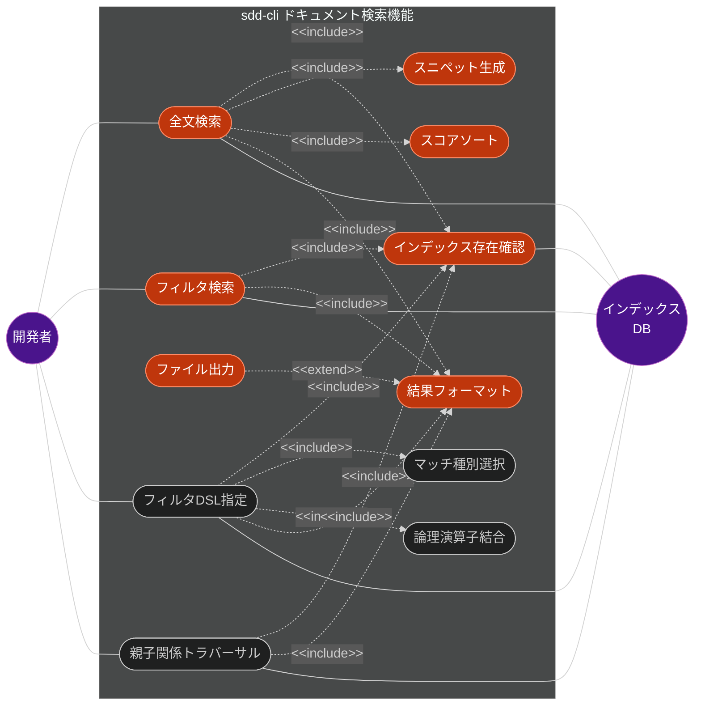
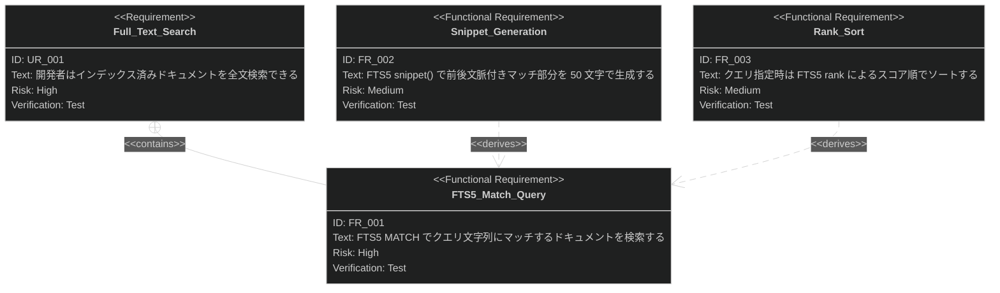
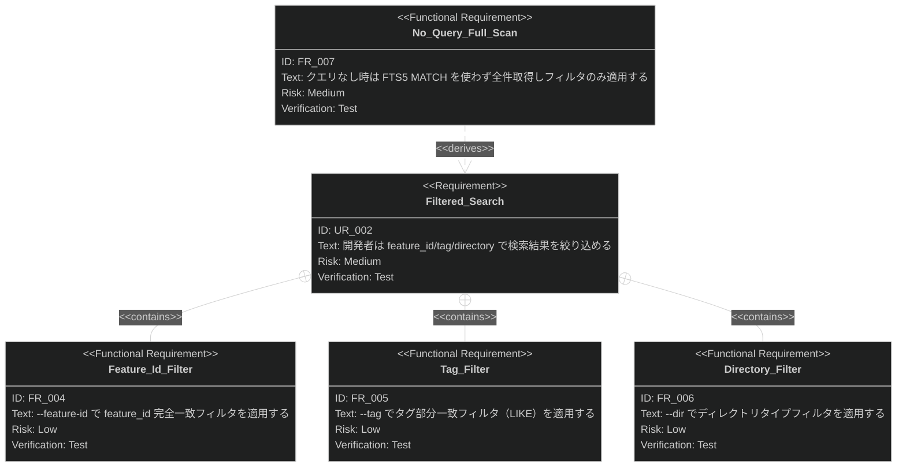
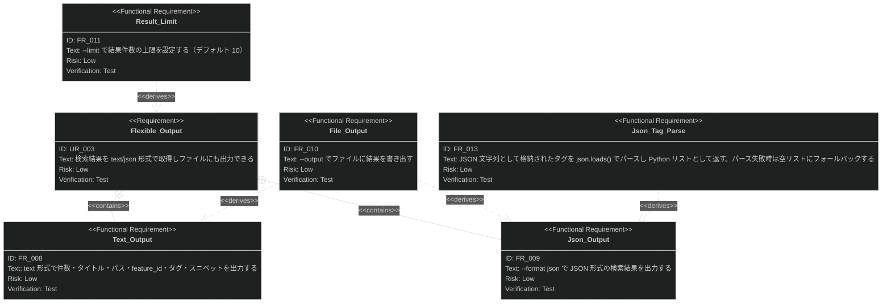

# ドキュメント検索機能 要求仕様書

## 概要

本ドキュメントは、sdd-cli のドキュメント検索機能に関する要求仕様書（PRD）です。

SQLite FTS5 によるインデックス済みドキュメントに対して全文検索を行い、フィルタ DSL（`--filter "field:op:value"`）・論理演算子（AND/OR）・親子関係トラバーサル（`--parent`）と組み合わせて結果を取得する機能を対象とします。CLI コマンド `sdd-cli search` がこの機能のエントリーポイントです。

---

# 1. 要求図の読み方

## 1.1. 要求タイプ

- **requirement**: 一般的な要求（ユーザー要求）
- **functionalRequirement**: 機能要求
- **designConstraint**: 設計制約（非機能要求含む）

## 1.2. リスクレベル

- **High**: 高リスク（実装が複雑、ビジネスクリティカル）
- **Medium**: 中リスク（重要だが代替可能）
- **Low**: 低リスク（実装が単純）

## 1.3. 検証方法

- **Test**: テストによる検証（自動テスト）
- **Demonstration**: デモンストレーションによる検証
- **Inspection**: インスペクション（レビュー）による検証

## 1.4. 関係タイプ

- **contains**: 包含関係（親要求が子要求を含む）
- **derives**: 派生関係（要求から別の要求が導出される）
- **traces**: トレース関係（要求間の追跡可能性）

---

# 2. 要求一覧

## 2.1. ユースケース図（概要）

## 2.2. ユースケース図（詳細）

### 全文検索

| Actor     | Use Case      | Description                                          |
|:----------|:--------------|:-----------------------------------------------------|
| 開発者       | 全文検索 (UC1)    | `sdd-cli search "クエリ"` で FTS5 MATCH によりドキュメントを全文検索する |
| インデックス DB | スニペット生成 (UC6) | FTS5 snippet() 関数でマッチ箇所の前後文脈付きスニペットを生成する             |
| インデックス DB | スコアソート (UC7)  | FTS5 rank によるスコア順で結果をソートする                           |

### フィルタ検索

| Actor | Use Case         | Description                                   |
|:------|:-----------------|:----------------------------------------------|
| 開発者   | フィルタ検索 (UC2)     | `--feature-id`/`--tag`/`--dir` オプションで絞り込み検索する |
| -     | インデックス存在確認 (UC5) | 検索実行前にインデックス DB の存在を確認し、未構築時はエラーを返す           |

### フィルタ DSL・論理演算子・親子トラバーサル

| Actor | Use Case              | Description                                                              |
|:------|:----------------------|:-------------------------------------------------------------------------|
| 開発者   | フィルタ DSL 指定 (UC8)     | `--filter "field:op:value"` 形式で任意のメタデータフィールドにフィルタを指定する                  |
| 開発者   | 論理演算子結合 (UC9)         | `--or` フラグで複数の `--filter` 条件を OR 結合する（デフォルト AND）。異なるフィールド間の OR も可       |
| 開発者   | 親子関係トラバーサル (UC10)     | `--parent` で指定した feature_id を持つドキュメントの全子孫を再帰的に取得する                      |
| -     | マッチ種別選択 (UC11)        | `op` に `exact`（完全一致）/ `contains`（部分一致）/ `regex`（正規表現）を指定する               |

### 結果出力

| Actor | Use Case       | Description                          |
|:------|:---------------|:-------------------------------------|
| -     | 結果フォーマット (UC3) | text（デフォルト）または json 形式で検索結果をフォーマットする |
| -     | ファイル出力 (UC4)   | `--output` オプションで結果をファイルに書き出す        |

## 2.3. 機能一覧（テキスト形式）

- 全文検索
    - FTS5 MATCH によるクエリ検索（trigram tokenizer）
    - クエリなし時の全件取得（フィルタのみ適用）
    - FTS5 rank によるスコア順ソート
    - FTS5 snippet() によるスニペット生成（50 文字）
- フィルタリング
    - `--feature-id`: feature_id 完全一致フィルタ（従来互換）
    - `--tag`: タグ部分一致フィルタ（LIKE）（従来互換）
    - `--dir`: ディレクトリタイプフィルタ（requirement/specification/task）（従来互換）
    - 複数フィルタの AND 結合（デフォルト）
- フィルタ DSL（拡張）
    - `--filter "field:op:value"`: 任意メタデータフィールドへのフィルタ指定
    - `op` に `exact`（完全一致）/ `contains`（部分一致）/ `regex`（正規表現）を指定可能
    - 対象フィールド: `feature_id`, `status`, `type`, `tags`, `category`, `directory`, `file_type`
    - `--or` フラグ: 全 `--filter` 条件を OR 結合（異なるフィールド間も可）
    - 不正な正規表現パターンはエラーメッセージを出力しコード 1 で終了
- 親子関係トラバーサル
    - `--parent <feature_id>`: `parent_feature_id` チェーンを再帰的に辿り全子孫ドキュメントを取得
- 結果出力
    - text 形式出力（デフォルト）
    - json 形式出力（`--format json`）
    - ファイル出力（`--output`）
    - 結果件数上限（`--limit`、デフォルト 10）
- エラーハンドリング
    - インデックス未構築時のエラーメッセージ
    - 結果なし時の "No results found." メッセージ

---

# 3. 要求図（SysML Requirements Diagram）

## 3.1. 全体要求図

> **注意**: 本図はトップレベルの代表的な要求を示す俯瞰図です。全要求の完全なリストはセクション 4（要求の詳細説明）を参照してください。詳細図（3.2〜3.5）に各カテゴリの完全な要求定義を記載しています。

```mermaid
%%{init: {'theme': 'dark'}}%%
requirementDiagram
    requirement Full_Text_Search {
        id: UR_001
        text: "開発者はインデックス済みドキュメントを全文検索できる"
        risk: high
        verifymethod: test
    }

    requirement Filtered_Search {
        id: UR_002
        text: "開発者は feature_id/tag/directory で検索結果を絞り込める"
        risk: medium
        verifymethod: test
    }

    requirement Flexible_Output {
        id: UR_003
        text: "検索結果を text/json 形式で取得しファイルにも出力できる"
        risk: low
        verifymethod: test
    }

    requirement Clear_Error_Handling {
        id: UR_004
        text: "インデックス未構築時や結果なし時に明確なメッセージを返す"
        risk: low
        verifymethod: test
    }

    functionalRequirement FTS5_Match_Query {
        id: FR_001
        text: "FTS5 MATCH でクエリ文字列にマッチするドキュメントを検索する"
        risk: high
        verifymethod: test
    }

    functionalRequirement Feature_Id_Filter {
        id: FR_004
        text: "--feature-id で feature_id 完全一致フィルタを適用する"
        risk: low
        verifymethod: test
    }

    functionalRequirement Tag_Filter {
        id: FR_005
        text: "--tag でタグ部分一致フィルタ（LIKE）を適用する"
        risk: low
        verifymethod: test
    }

    functionalRequirement Directory_Filter {
        id: FR_006
        text: "--dir でディレクトリタイプフィルタを適用する"
        risk: low
        verifymethod: test
    }

    functionalRequirement Text_Output {
        id: FR_008
        text: "text 形式で件数・タイトル・パス・feature_id・タグ・スニペットを出力する"
        risk: low
        verifymethod: test
    }

    functionalRequirement Json_Output {
        id: FR_009
        text: "--format json で JSON 形式の検索結果を出力する"
        risk: low
        verifymethod: test
    }

    functionalRequirement Index_Existence_Check {
        id: FR_012
        text: "インデックス DB が存在しない場合に明確なエラーメッセージを返す"
        risk: low
        verifymethod: test
    }

    designConstraint FTS5_Trigram_Dependency {
        id: NFR_001
        text: "FTS5 trigram tokenizer に依存し SQLite 3.9.0 以上が必要"
        risk: medium
        verifymethod: test
    }

    designConstraint Python_Compat {
        id: NFR_002
        text: "Python 3.9 から 3.13 で動作する"
        risk: medium
        verifymethod: test
    }

    requirement Advanced_Filter {
        id: UR_005
        text: "開発者は --filter DSL で任意のメタデータフィールドに対して AND/OR・マッチ種別を指定して絞り込める"
        risk: high
        verifymethod: test
    }

    requirement Parent_Child_Traversal {
        id: UR_006
        text: "開発者は --parent で指定した機能の全子孫ドキュメントを再帰的に取得できる"
        risk: medium
        verifymethod: test
    }

    requirement Match_Type_Selection {
        id: UR_007
        text: "開発者はフィールドごとに完全一致・部分一致・正規表現のマッチ種別を選択できる"
        risk: medium
        verifymethod: test
    }

    functionalRequirement Filter_DSL {
        id: FR_014
        text: "--filter 'field:op:value' 形式でメタデータフィールドへのフィルタを指定する"
        risk: high
        verifymethod: test
    }

    functionalRequirement OR_Operator {
        id: FR_015
        text: "--or フラグで全 --filter 条件を OR 結合する（異なるフィールド間も可）"
        risk: medium
        verifymethod: test
    }

    functionalRequirement Recursive_Parent_Traversal {
        id: FR_016
        text: "--parent で parent_feature_id チェーンを再帰的に辿り全子孫ドキュメントを取得する"
        risk: medium
        verifymethod: test
    }

    functionalRequirement Regex_Match {
        id: FR_017
        text: "op=regex 時に Python re モジュールでメタデータフィールドに正規表現マッチを適用する"
        risk: high
        verifymethod: test
    }

    functionalRequirement Invalid_Regex_Error {
        id: FR_018
        text: "不正な正規表現パターンはエラーメッセージを stderr に出力しコード 1 で終了する"
        risk: low
        verifymethod: test
    }

    Full_Text_Search - contains -> FTS5_Match_Query
    Filtered_Search - contains -> Feature_Id_Filter
    Filtered_Search - contains -> Tag_Filter
    Filtered_Search - contains -> Directory_Filter
    Advanced_Filter - contains -> Filter_DSL
    Advanced_Filter - contains -> OR_Operator
    Advanced_Filter - contains -> Regex_Match
    Match_Type_Selection - contains -> Regex_Match
    Match_Type_Selection - derives -> Filter_DSL
    Parent_Child_Traversal - contains -> Recursive_Parent_Traversal
    Clear_Error_Handling - contains -> Index_Existence_Check
    Clear_Error_Handling - contains -> Invalid_Regex_Error
    Flexible_Output - contains -> Text_Output
    Flexible_Output - contains -> Json_Output
    FTS5_Match_Query - derives -> Feature_Id_Filter
    FTS5_Match_Query - derives -> Tag_Filter
    FTS5_Match_Query - derives -> Directory_Filter
    Filter_DSL - derives -> Feature_Id_Filter
    Filter_DSL - derives -> Tag_Filter
    OR_Operator - derives -> Filter_DSL
    Regex_Match - derives -> Filter_DSL
    Invalid_Regex_Error - derives -> Regex_Match
    FTS5_Trigram_Dependency - traces -> FTS5_Match_Query
    Python_Compat - traces -> FTS5_Match_Query
    Python_Compat - traces -> Regex_Match
```

## 3.2. 全文検索 詳細図

## 3.3. フィルタ検索 詳細図

## 3.4. 結果出力 詳細図

## 3.5. 設計制約 詳細図

```mermaid
%%{init: {'theme': 'dark'}}%%
requirementDiagram
    functionalRequirement FTS5_Match_Query {
        id: FR_001
        text: "FTS5 MATCH でクエリ文字列にマッチするドキュメントを検索する"
        risk: high
        verifymethod: test
    }

    functionalRequirement Regex_Match {
        id: FR_017
        text: "op=regex 時に Python re モジュールでメタデータフィールドに正規表現マッチを適用する"
        risk: high
        verifymethod: test
    }

    designConstraint FTS5_Trigram_Dependency {
        id: NFR_001
        text: "FTS5 trigram tokenizer に依存し SQLite 3.9.0 以上が必要"
        risk: medium
        verifymethod: test
    }

    designConstraint Python_Compat {
        id: NFR_002
        text: "Python 3.9 から 3.13 で動作する"
        risk: medium
        verifymethod: test
    }

    designConstraint XDG_Cache_Path {
        id: NFR_003
        text: "インデックス DB パスは XDG Base Directory 仕様に準拠した ~/.cache/sdd-cli/{project}.{hash}/index.db を使用する"
        risk: low
        verifymethod: test
    }

    designConstraint Unified_Error_Handling {
        id: NFR_004
        text: "SDDGroup カスタムクラスにより例外は Error: {message} 形式で stderr に出力し終了コード 1 で終了する"
        risk: medium
        verifymethod: test
    }

    designConstraint Minimal_Runtime_Deps {
        id: NFR_005
        text: "検索機能のランタイム依存は click のみとし SQLite は Python 標準ライブラリを使用する"
        risk: low
        verifymethod: inspection
    }

    FTS5_Trigram_Dependency - traces -> FTS5_Match_Query
    Python_Compat - traces -> FTS5_Match_Query
    Python_Compat - traces -> Regex_Match
    XDG_Cache_Path - traces -> FTS5_Match_Query
    Unified_Error_Handling - traces -> FTS5_Match_Query
    Minimal_Runtime_Deps - traces -> FTS5_Match_Query
```

---

# 4. 要求の詳細説明

## 4.1. ユーザー要求

### UR-001: 全文検索

開発者は `sdd-cli search "クエリ"` コマンドを実行することで、インデックス済みの `.sdd/` 配下ドキュメントに対して FTS5
全文検索を行い、関連するドキュメントをスコア順に取得できる。検索結果にはマッチ箇所のスニペットが付与される。

**検証方法:** テストによる検証

### UR-002: フィルタ検索

開発者は `--feature-id`、`--tag`、`--dir` オプションを組み合わせて検索結果を絞り込める。クエリ文字列なしでフィルタのみの検索も可能。複数のフィルタは
AND 条件で結合される。

**検証方法:** テストによる検証

### UR-003: 柔軟な出力形式

検索結果を text（人間可読）または json（プログラム連携用）形式で取得できる。`--output` オプションでファイルへの書き出しにも対応し、他ツールとの連携が容易。

**検証方法:** テストによる検証

### UR-004: 明確なエラーハンドリング

インデックスが未構築の場合は `sdd-cli index` の実行を促すエラーメッセージを返す。検索結果がゼロ件の場合は "No results
found." メッセージを返す。

**検証方法:** テストによる検証

## 4.2. 機能要求

### FR-001: FTS5 MATCH クエリ検索

クエリ文字列が指定された場合、`documents_fts MATCH ?` で FTS5 全文検索を実行する。trigram tokenizer
により日本語を含む任意の文字列でマッチングが可能。

**検証方法:** テストによる検証

### FR-002: スニペット生成

クエリ指定時は FTS5 のスニペット生成機能を用いて、マッチ箇所の前後文脈付きで 50 文字のスニペットを生成する。クエリなし時はコンテンツ先頭 150 文字を切り出す。実装詳細は `document-search_design.md` を参照。

**検証方法:** テストによる検証

### FR-003: スコア順ソート

クエリ指定時は FTS5 の `rank` 値（スコア）で昇順ソートし、関連度の高い結果を上位に表示する。クエリなし時は `file_path`
のアルファベット順でソートする。

**検証方法:** テストによる検証

### FR-004: feature_id 完全一致フィルタ

`--feature-id` オプションで `fts.feature_id = ?` による完全一致フィルタを適用する。特定機能に関連するドキュメントのみを抽出できる。

**検証方法:** テストによる検証

### FR-005: タグ部分一致フィルタ

`--tag` オプションで `fts.tags LIKE ?` による部分一致フィルタを適用する。タグはスペース区切りの文字列として FTS5
テーブルに格納されており、指定タグを含むドキュメントを抽出する。

**検証方法:** テストによる検証

### FR-006: ディレクトリタイプフィルタ

`--dir` オプションで `fts.directory = ?` によるフィルタを適用する。選択肢は `requirement`、`specification`、`task` の 3
種類（Click の `Choice` で制約）。

**検証方法:** テストによる検証

### FR-007: クエリなし全件取得

クエリ文字列が未指定の場合、FTS5 MATCH を使用せず `WHERE 1=1` で全件取得し、フィルタ条件のみを適用する。フィルタも未指定の場合はインデックス内の全ドキュメントを返す。

**検証方法:** テストによる検証

### FR-008: text 形式出力

デフォルトの出力形式。以下の情報を整形して表示する:

- 結果件数（`Found N result(s)`）
- クエリ文字列（指定時のみ）
- 各結果: 番号付きタイトル、パス、feature_id、タグ（存在時）、スニペット（存在時）

スニペット内の改行はスペースに置換して 1 行表示する。

**検証方法:** テストによる検証

### FR-009: json 形式出力

`--format json` オプションで JSON 形式の検索結果を出力する。tags フィールドは Python リストとして出力される。実装詳細は `document-search_design.md` を参照。

**検証方法:** テストによる検証

### FR-010: ファイル出力

`--output` オプションで指定されたファイルパスに検索結果を書き出す。text 形式の場合は書き出し完了メッセージを stdout
に表示する。

**検証方法:** テストによる検証

### FR-011: 結果件数上限

`--limit` オプション（デフォルト 10）で SQL クエリの `LIMIT ?` 句を制御し、返却される結果件数の上限を設定する。

**検証方法:** テストによる検証

### FR-012: インデックス存在確認

検索実行前に XDG キャッシュディレクトリ内の `index.db` の存在を確認する。存在しない場合は `ValueError` を発生させ、
`"Index not found at {db_path}. Please run 'sdd-cli index' first."` というメッセージを返す。

**検証方法:** テストによる検証

### UR-005: フィルタ DSL による高度な絞り込み

開発者は `--filter "field:op:value"` 形式で任意のメタデータフィールドに対してフィルタを指定できる。`op` には `exact`（完全一致）、`contains`（部分一致）、`regex`（正規表現）を指定可能。複数の `--filter` はデフォルトで AND 結合され、`--or` フラグを付与すると OR 結合に切り替わる。OR は異なるフィールド間にも適用できる。

**検証方法:** テストによる検証

### UR-006: 親子関係トラバーサル

開発者は `--parent <feature_id>` を指定することで、該当 feature_id を `parent_feature_id` として持つドキュメントを起点に、`parent_feature_id` チェーンを再帰的に辿り全子孫ドキュメントを取得できる。

**検証方法:** テストによる検証

### UR-007: マッチ種別の選択

開発者はフィルタ DSL の `op` フィールドにより、フィールドごとに完全一致・部分一致・正規表現のいずれかのマッチ種別を選択できる。正規表現の適用対象はメタデータフィールド（`feature_id`, `status`, `type`, `tags`, `category`, `directory`, `file_type`）に限定される。

**検証方法:** テストによる検証

### FR-013: タグの JSON パース

`documents_meta` テーブルに JSON 文字列として格納されたタグを `json.loads()` でパースし、Python リストとして返却する。パース失敗時は空リスト
`[]` にフォールバックする。

**検証方法:** テストによる検証

### FR-014: フィルタ DSL 構文

`--filter "field:op:value"` 形式でフィルタを指定する。`field` は対象メタデータフィールド名、`op` は `exact`/`contains`/`regex` のいずれか、`value` はフィルタ値。複数の `--filter` オプションを指定可能。パース失敗時（区切り文字 `:` が 2 つ未満等）はエラーメッセージを出力しコード 1 で終了する。

対象フィールド: `feature_id`, `status`, `type`, `tags`, `category`, `directory`, `file_type`

**検証方法:** テストによる検証

### FR-015: OR 演算子による結合

`--or` フラグを指定すると、全 `--filter` 条件を `OR` で結合する。`--or` なし時はデフォルトで `AND` 結合。OR は異なるフィールド間にも適用される。従来の `--feature-id`/`--tag`/`--dir` オプションと `--filter` オプションの混在時も同様の論理で結合する。

**検証方法:** テストによる検証

### FR-016: 親子関係再帰トラバーサル

`--parent <feature_id>` が指定された場合、`documents_meta` テーブルを再帰的にクエリし、`parent_feature_id = <feature_id>` となるドキュメントを取得、さらにそれらの `feature_id` を `parent_feature_id` として持つドキュメントを繰り返し辿り、全子孫ドキュメントを収集する。存在しない feature_id を指定した場合は空結果を返す（エラーなし）。

**検証方法:** テストによる検証

### FR-017: 正規表現マッチ

`op=regex` 時、Python の正規表現エンジンを用いてメタデータフィールドの値に正規表現マッチを適用する。適用対象はメタデータフィールド（`feature_id`, `status`, `type`, `tags`, `category`, `directory`, `file_type`）のみ（コンテンツフィールドは対象外）。実装詳細は `document-search_design.md` を参照。

**検証方法:** テストによる検証

### FR-018: 不正な正規表現のエラーハンドリング

`op=regex` 指定時に `re.compile()` で `re.error` が発生した場合、`"Invalid regex pattern: {pattern} - {error}"` メッセージを stderr に出力し、終了コード 1 で終了する。

**検証方法:** テストによる検証

## 4.3. 設計制約（非機能要求）

### NFR-001: FTS5 trigram tokenizer 依存

検索機能は SQLite FTS5 の trigram tokenizer に依存する。これにより日本語を含む多言語対応の部分文字列検索が可能だが、SQLite
3.9.0 以上が必須となる。

**検証方法:** テストによる検証（CI マトリックスで複数バージョンテスト）

### NFR-002: Python バージョン互換性

Python 3.9〜3.13 のすべてのバージョンで動作する。型ヒントや標準ライブラリの API 差異に対応が必要。

**検証方法:** テストによる検証（CI マトリックスで複数バージョンテスト）

### NFR-003: XDG キャッシュディレクトリ準拠

インデックス DB のパスは XDG Base Directory 仕様に準拠した `~/.cache/sdd-cli/{project}.{hash}/index.db`
を使用する。document-indexing 機能で生成されたキャッシュを参照する。

**検証方法:** テストによる検証

### NFR-004: SDDGroup 統一エラーハンドリング

`SDDGroup` カスタムクラスにより、検索中の例外は `Error: {message}` 形式で stderr に出力され、終了コード 1 で終了する。

**検証方法:** テストによる検証

### NFR-005: 外部依存の最小化

検索機能のランタイム依存は `click`（CLI フレームワーク）のみ。SQLite は Python 標準ライブラリの `sqlite3`
モジュールを使用し、追加パッケージは不要。

**検証方法:** インスペクションによる検証

---

# 5. 制約事項

## 5.1. 技術的制約

- SQLite FTS5 の trigram tokenizer を使用するため、SQLite 3.9.0 以上が必要
- FTS5 MATCH クエリの構文は SQLite の仕様に依存する（不正な構文はランタイムエラーとなる）
- tags の LIKE フィルタはスペース区切り文字列に対する部分一致のため、短いタグ名で意図しないマッチが発生する可能性がある
- 正規表現マッチは SQLite の UDF として Python `re.search()` を登録して実現するため、DB 接続ごとに登録が必要
- 正規表現フィルタはメタデータテーブル全件走査（インデックス未使用）のため、大量ドキュメント環境ではパフォーマンスが低下する可能性がある
- 親子再帰トラバーサルは Python 側で反復クエリを実行する（SQLite の再帰 CTE を使用しない）ため、深いネストでは複数回の DB クエリが発生する
- フィルタ DSL のユーザー入力は SQL パラメータ化クエリで処理し、SQL インジェクションを防止すること（T-002 準拠）

## 5.2. ビジネス的制約

- 検索対象は `sdd-cli index` で事前にインデックス構築されたドキュメントに限定される
- document-indexing 機能（`sdd-cli index`）が正常に動作していることが前提
- すべての出力オプション（`--format json`/`--output`）は非対話的実行（CI/CD パイプライン）に対応すること（B-002 準拠）

---

# 6. 前提条件

- `sdd-cli index` によりインデックスが事前に構築されていること
- XDG キャッシュディレクトリ（`~/.cache/sdd-cli/{project}.{hash}/index.db`）にアクセス可能であること
- Python 3.9 以上がインストールされていること

---

# 7. スコープ外

以下は本 PRD のスコープ外とします：

- インデックスの構築・更新機能（document-indexing PRD で定義）
- 依存関係の可視化機能（dependency-visualization PRD で定義）
- キャッシュの一覧・削除機能（cache-management PRD で定義）
- FTS5 クエリ構文のバリデーション・サニタイズ
- 検索結果のページネーション
- インクリメンタル検索・リアルタイム検索
- 検索履歴の保存・管理
- 検索結果のハイライト表示（ターミナル色付け）

---

# 8. 用語集

| 用語                 | 定義                                                                                                            |
|--------------------|---------------------------------------------------------------------------------------------------------------|
| SDD                | Specification-Driven Development。仕様駆動開発                                                                       |
| FTS5               | Full-Text Search 5。SQLite の全文検索拡張モジュール                                                                        |
| trigram tokenizer  | 3 文字ずつの部分文字列に分割するトークナイザー。日本語検索に有効                                                                             |
| MATCH              | FTS5 の全文検索演算子。クエリ文字列との一致を判定する                                                                                 |
| snippet            | FTS5 の snippet() 関数が生成する、マッチ箇所の前後文脈付き抜粋テキスト                                                                   |
| rank               | FTS5 が算出する検索結果のスコア値。値が小さいほど関連度が高い                                                                             |
| feature_id         | ドキュメントが属する機能を識別する ID                                                                                          |
| file_type          | ドキュメントの分類（requirement/spec/design/task）                                                                       |
| XDG Base Directory | Linux/macOS のディレクトリ配置標準仕様                                                                                     |
| frontmatter        | Markdown ファイル先頭の `---` で囲まれた YAML メタデータ領域                                                                     |
| SearchResult       | 検索結果の TypedDict 型。file_path/file_name/directory/file_type/title/feature_id/parent_feature_id/tags/snippet を含む |
| フィルタ DSL          | `--filter "field:op:value"` 形式のフィルタ指定構文。field はメタデータフィールド名、op はマッチ種別、value はフィルタ値 |
| op                 | フィルタ DSL のマッチ種別。`exact`（完全一致）/ `contains`（部分一致）/ `regex`（正規表現）の 3 種類 |
| --or               | 複数の `--filter` 条件を OR 結合に切り替えるフラグ。デフォルトは AND 結合 |
| --parent           | 指定した feature_id の全子孫ドキュメントを再帰的に取得するオプション |
| parent_feature_id  | ドキュメントが属する親機能の feature_id。階層構造の親子関係を表す |
| 再帰トラバーサル          | parent_feature_id チェーンを反復的に辿り、全子孫ドキュメントを収集する処理 |
