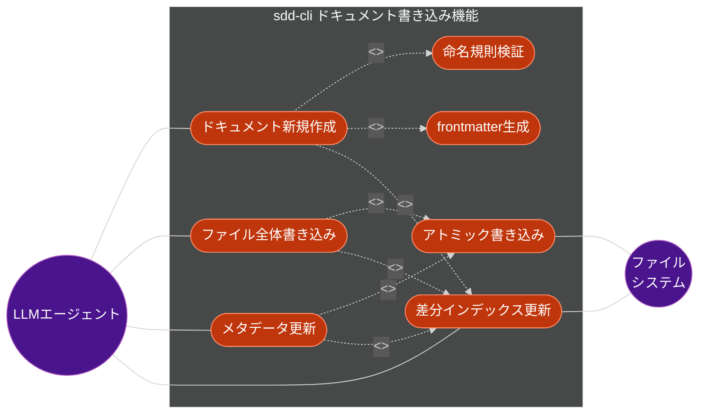

# ドキュメント書き込み機能 要求仕様書

## 概要

本ドキュメントは、sdd-cli のドキュメント書き込み機能に関する要求仕様書（PRD）です。

LLM エージェント（sdd-workflow プラグイン）が Bash 経由で `sdd-cli write` コマンドを呼び出し、`.sdd/` 配下の
Markdown ドキュメントを新規作成・更新できるようにします。また `sdd-cli index --incremental` で変更ファイルのみの
差分インデックス更新を提供します。

**依存方向**: sdd-workflow (プラグイン) → sdd-workflow-cli (本ツール)

---

# 1. 要求図の読み方

## 1.1. 要求タイプ

- **requirement**: 一般的な要求（ユーザー要求）
- **functionalRequirement**: 機能要求
- **designConstraint**: 設計制約（非機能要求含む）

## 1.2. リスクレベル

- **High**: 高リスク（実装が複雑、ビジネスクリティカル）
- **Medium**: 中リスク（重要だが代替可能）
- **Low**: 低リスク（実装が単純）

## 1.3. 検証方法

- **Test**: テストによる検証（自動テスト）
- **Demonstration**: デモンストレーションによる検証
- **Inspection**: インスペクション（レビュー）による検証

---

# 2. 要求一覧

## 2.1. ユースケース図



---

# 3. 要求図（SysML Requirements Diagram）

## 3.1. 全体要求図

```mermaid
%%{init: {'theme': 'dark'}}%%
requirementDiagram
    requirement Document_Creation {
        id: UR_001
        text: "LLMエージェントが .sdd/ 配下に命名規則準拠のドキュメントを新規作成できる"
        risk: medium
        verifymethod: test
    }

    requirement Meta_Update {
        id: UR_002
        text: "既存ドキュメントのメタデータ（frontmatter）を本文を変更せずに更新できる"
        risk: low
        verifymethod: test
    }

    requirement Full_Rewrite {
        id: UR_003
        text: "LLMがファイル全体を提供することでドキュメントの内容を自由に書き換えられる"
        risk: medium
        verifymethod: test
    }

    requirement Incremental_Index {
        id: UR_004
        text: "変更ファイルのみインデックスを差分更新でき、全再構築を回避できる"
        risk: medium
        verifymethod: test
    }

    requirement Auto_Sync {
        id: UR_005
        text: "書き込み操作後にインデックスが自動同期される"
        risk: low
        verifymethod: test
    }

    functionalRequirement Write_Create_Types {
        id: FR_001
        text: "requirement / spec / design / task の4種類のドキュメントタイプを指定して作成できる"
        risk: low
        verifymethod: test
    }

    functionalRequirement Write_Create_Path {
        id: FR_002
        text: "--feature-id と type から命名規則に従ったファイルパスを自動生成する"
        risk: medium
        verifymethod: test
    }

    functionalRequirement Write_Create_Template {
        id: FR_003
        text: ".sdd/*_TEMPLATE.md または内蔵ミニマルテンプレートから frontmatter を生成する"
        risk: low
        verifymethod: test
    }

    functionalRequirement Write_Create_Parent {
        id: FR_004
        text: "--parent でディレクトリ階層（親 feature-id）を指定できる"
        risk: low
        verifymethod: test
    }

    functionalRequirement Write_Create_Overwrite_Guard {
        id: FR_005
        text: "既存ファイルが存在する場合はエラーを返す（上書き防止）"
        risk: low
        verifymethod: test
    }

    functionalRequirement Write_Create_AutoSync {
        id: FR_006
        text: "作成後にインデックスを自動差分更新する"
        risk: low
        verifymethod: test
    }

    functionalRequirement Write_File_Input {
        id: FR_007
        text: "stdin または --content で指定されたテキストをファイル全体として書き込む"
        risk: medium
        verifymethod: test
    }

    functionalRequirement Write_File_Force {
        id: FR_008
        text: "新規ファイル・既存ファイル両方に対応する（既存は --force で上書き確認をスキップ）"
        risk: low
        verifymethod: test
    }

    functionalRequirement Write_File_AutoSync {
        id: FR_009
        text: "書き込み後にインデックスを自動差分更新する"
        risk: low
        verifymethod: test
    }

    functionalRequirement Write_Meta_Set {
        id: FR_010
        text: "--set key=value で frontmatter の任意フィールドを更新できる"
        risk: low
        verifymethod: test
    }

    functionalRequirement Write_Meta_Tags {
        id: FR_011
        text: "--add-tag / --remove-tag でタグを追加・削除できる"
        risk: low
        verifymethod: test
    }

    functionalRequirement Write_Meta_Deps {
        id: FR_012
        text: "--add-dep / --remove-dep で depends-on を管理できる"
        risk: low
        verifymethod: test
    }

    functionalRequirement Write_Meta_BodyPreserve {
        id: FR_013
        text: "本文コンテンツを変更せずにメタデータのみ更新する"
        risk: medium
        verifymethod: test
    }

    functionalRequirement Write_Meta_AutoSync {
        id: FR_014
        text: "更新後にインデックスを自動差分更新する"
        risk: low
        verifymethod: test
    }

    functionalRequirement Incremental_Mtime {
        id: FR_015
        text: "ファイルの最終更新時刻（mtime）を documents_meta テーブルに記録する"
        risk: medium
        verifymethod: test
    }

    functionalRequirement Incremental_Flag {
        id: FR_016
        text: "--incremental フラグ指定時、mtime 比較で変更ファイルのみ再インデックスする"
        risk: medium
        verifymethod: test
    }

    functionalRequirement Incremental_Delete {
        id: FR_017
        text: "インデックスに存在するが実ファイルが削除されたエントリを除去する"
        risk: medium
        verifymethod: test
    }

    functionalRequirement Incremental_Add {
        id: FR_018
        text: "新規追加ファイルをインデックスに追加する"
        risk: low
        verifymethod: test
    }

    functionalRequirement Incremental_Output {
        id: FR_019
        text: "同期結果（追加件数・更新件数・削除件数）を text/json 形式で出力する"
        risk: low
        verifymethod: demonstration
    }

    designConstraint Python_Compat {
        id: NFR_001
        text: "Python 3.9〜3.13 互換性を維持する"
        risk: medium
        verifymethod: test
    }

    designConstraint Backward_Compat {
        id: NFR_002
        text: "index コマンドはフラグなしで従来の全 rebuild 動作を維持する（後方互換）"
        risk: low
        verifymethod: test
    }

    designConstraint Atomic_Write {
        id: NFR_003
        text: "ファイル書き込みは tempfile + rename でアトミックに行う（部分書き込み防止）"
        risk: medium
        verifymethod: inspection
    }

    designConstraint Pathlib {
        id: NFR_004
        text: "パス操作は pathlib.Path を使用する"
        risk: low
        verifymethod: inspection
    }

    designConstraint Output_Format {
        id: NFR_005
        text: "各 write コマンドの出力は text/json 形式に対応する"
        risk: low
        verifymethod: test
    }

    Document_Creation - contains -> Write_Create_Types
    Document_Creation - contains -> Write_Create_Path
    Document_Creation - contains -> Write_Create_Template
    Document_Creation - contains -> Write_Create_Parent
    Document_Creation - contains -> Write_Create_Overwrite_Guard
    Document_Creation - contains -> Write_Create_AutoSync
    Full_Rewrite - contains -> Write_File_Input
    Full_Rewrite - contains -> Write_File_Force
    Full_Rewrite - contains -> Write_File_AutoSync
    Meta_Update - contains -> Write_Meta_Set
    Meta_Update - contains -> Write_Meta_Tags
    Meta_Update - contains -> Write_Meta_Deps
    Meta_Update - contains -> Write_Meta_BodyPreserve
    Meta_Update - contains -> Write_Meta_AutoSync
    Incremental_Index - contains -> Incremental_Mtime
    Incremental_Index - contains -> Incremental_Flag
    Incremental_Index - contains -> Incremental_Delete
    Incremental_Index - contains -> Incremental_Add
    Incremental_Index - contains -> Incremental_Output
    Auto_Sync - derives -> Write_Create_AutoSync
    Auto_Sync - derives -> Write_File_AutoSync
    Auto_Sync - derives -> Write_Meta_AutoSync
    Python_Compat - traces -> Write_File_Input
    Atomic_Write - traces -> Write_File_Input
    Atomic_Write - traces -> Write_Meta_BodyPreserve
```



---

# 4. 要求の詳細説明

## 4.1. ユーザー要求

### UR-001: ドキュメント新規作成

LLM エージェントは `sdd-cli write create <type>` コマンドで命名規則に準拠したドキュメントを自動生成できる。
`--feature-id` と `--parent` からファイルパスが決定され、frontmatter スキャフォールドが生成される。

**検証方法:** テストによる検証

### UR-002: frontmatter 部分更新

`sdd-cli write meta` で既存ドキュメントのメタデータ（status, tags, depends-on など）を
本文を一切変更せずに更新できる。構造化されているため部分更新は安全。

**検証方法:** テストによる検証

### UR-003: ファイル全体書き換え

`sdd-cli write file` でファイル全体を上書きする。追記・セクション置換は構造破壊リスクがあるため
LLM が完全な Markdown を提供する設計とする。

**検証方法:** テストによる検証

### UR-004: 差分インデックス更新

`sdd-cli index --incremental` で変更ファイルのみ再インデックスする。mtime 比較で差分を検出し、
大規模プロジェクトでの全再構築を回避する。

**検証方法:** テストによる検証

### UR-005: 書き込み後の自動同期

`write create/file/meta` 実行後、インデックスを自動差分更新することで、検索結果が即時に最新状態を反映する。

**検証方法:** テストによる検証

## 4.2. 機能要求

### FR-001〜006: write create

`sdd-cli write create <type> --feature-id <id> --title <title> [--parent <parent-id>]`

- **FR-001**: `requirement`, `spec`, `design`, `task` の4タイプをサポート
- **FR-002**: type と feature-id からファイルパスを決定:
  - `requirement`: `requirement/{feature-id}.md` / `requirement/{parent}/{feature-id}.md`
  - `spec`: `specification/{feature-id}_spec.md` / `specification/{parent}/{feature-id}_spec.md`
  - `design`: `specification/{feature-id}_design.md` / `specification/{parent}/{feature-id}_design.md`
  - `task`: `task/{feature-id}/tasks.md`
- **FR-003**: `.sdd/PRD_TEMPLATE.md`, `.sdd/SPECIFICATION_TEMPLATE.md`, `.sdd/DESIGN_DOC_TEMPLATE.md`
  が存在すれば frontmatter を参照。なければ内蔵ミニマルテンプレートを使用
- **FR-004**: `--parent` で親 feature-id を指定しサブディレクトリ配置を可能にする
- **FR-005**: 既存ファイルへの上書き防止（エラー終了）
- **FR-006**: 作成後に差分インデックスを自動更新

### FR-007〜009: write file

`sdd-cli write file <rel-path> [--content <text>] [--force]`

- **FR-007**: `--content` オプション または stdin からコンテンツを受け取る
- **FR-008**: 新規・既存両対応。既存の場合は `--force` なしでエラー
- **FR-009**: 書き込み後に差分インデックスを自動更新

### FR-010〜014: write meta

`sdd-cli write meta <rel-path> [--set k=v] [--add-tag t] [--remove-tag t] [--add-dep d] [--remove-dep d]`

- **FR-010**: `--set key=value` で frontmatter フィールドを更新
- **FR-011**: `--add-tag` / `--remove-tag` でタグリストを編集
- **FR-012**: `--add-dep` / `--remove-dep` で `depends-on` リストを編集
- **FR-013**: 本文を変更せず frontmatter のみ更新（python-frontmatter で安全に処理）
- **FR-014**: 更新後に差分インデックスを自動更新

### FR-015〜019: index --incremental

`sdd-cli index --incremental`

- **FR-015**: `documents_meta` テーブルに `file_mtime REAL` カラムを追加し mtime を記録する
- **FR-016**: `--incremental` 指定時、DB の mtime と実ファイルの mtime を比較し変更分のみ再登録
- **FR-017**: DB に存在するが実ファイルが削除されたエントリを除去する
- **FR-018**: 新規ファイルをインデックスに追加する
- **FR-019**: 同期結果（追加・更新・削除件数）を text/json で出力する

## 4.3. 設計制約

### NFR-001: Python 互換性

Python 3.9〜3.13 で動作する。`tempfile.NamedTemporaryFile` 等は標準ライブラリを使用する。

### NFR-002: 後方互換性

`sdd-cli index`（フラグなし）は従来の全 rebuild 動作を維持する。

### NFR-003: アトミック書き込み

ファイル書き込みは同じディレクトリに一時ファイルを作成し `Path.replace()` でアトミックに上書きする。

### NFR-004: pathlib.Path

すべてのパス操作は `pathlib.Path` を使用し、OS 差異を吸収する。

### NFR-005: 出力形式

`--format text`（デフォルト）と `--format json` に対応する。

---

# 5. アーキテクチャ拡張

```
commands/write.py          ← 新規（write サブコマンドグループ: create/file/meta）
    ↓
indexer/writer.py          ← 新規（DocumentWriter クラス: create/write_file/update_meta）
indexer/db.py              ← 既存拡張（file_mtime カラム追加、remove_document/get_indexed_mtimes 追加）
commands/index.py          ← 既存拡張（--incremental フラグ、sync_index 関数追加）
    ↓
types.py                   ← 既存拡張（WriteResult, SyncResult 型追加）
```

---

# 6. 検証シナリオ

```bash
# 1. スキャフォールド作成
sdd-cli write create spec --feature-id new-feature --title "新機能仕様"
# → specification/new-feature_spec.md が作成される

# 2. フルコンテンツを書き込む
echo "---\nid: new-feature\n---\n# 概要\n..." | sdd-cli write file specification/new-feature_spec.md

# 3. インデックスに反映確認
sdd-cli search "新機能仕様"

# 4. ステータス更新
sdd-cli write meta specification/new-feature_spec.md --set status=approved

# 5. 差分インデックスのみで確認
sdd-cli index --incremental
sdd-cli search "" --filter "status:exact:approved"
```

---

# 7. スコープ外

- セクション単位の部分書き換え（構造破壊リスクあり、将来検討）
- ファイルの削除コマンド（安全性の観点から対象外）
- リモートドキュメントの書き込み

---

# 8. 用語集

| 用語 | 定義 |
|:---|:---|
| LLM エージェント | sdd-workflow プラグインを通じて Bash 経由で CLI を呼び出す AI エージェント |
| スキャフォールド | frontmatter のみを含む最小限のドキュメントひな形 |
| アトミック書き込み | 一時ファイルへの書き込みと rename による部分書き込み防止手法 |
| mtime | ファイルの最終更新時刻（modification time） |
| 差分インデックス | 全ファイルではなく変更のあったファイルのみを再インデックスする手法 |
