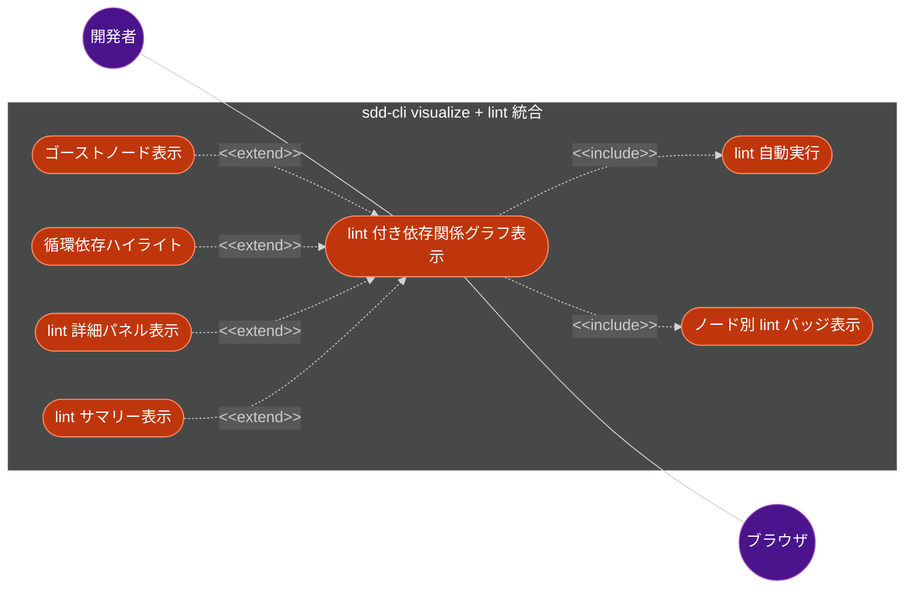

# 依存関係可視化における lint エラー表示機能 要求仕様書

## 概要

`sdd-cli visualize` の Web View に `sdd-cli lint` の検出結果を統合表示する機能を提供する。visualize コマンド実行時に lint を自動実行し、ノード単位のエラー/警告バッジ、未解決依存のゴーストノード、循環依存エッジのハイライト、詳細パネルへの lint 情報追加、コントロールバーの lint サマリーを Web View 上に表示する。これにより、ドキュメント品質の問題を依存関係グラフと一体的に把握できるようにする。

---

# 1. 要求図の読み方

## 1.1. 要求タイプ

- **requirement**: 一般的な要求（ユーザー要求）
- **functionalRequirement**: 機能要求
- **designConstraint**: 設計制約（非機能要求含む）

## 1.2. リスクレベル

- **High**: 高リスク（実装が複雑、ビジネスクリティカル）
- **Medium**: 中リスク（重要だが代替可能）
- **Low**: 低リスク（実装が単純）

## 1.3. 検証方法

- **Test**: テストによる検証
- **Demonstration**: デモンストレーションによる検証
- **Inspection**: インスペクション（レビュー）による検証

## 1.4. 関係タイプ

- **contains**: 包含関係（親要求が子要求を含む）
- **derives**: 派生関係（要求から別の要求が導出される）
- **traces**: トレース関係（要求間の追跡可能性）

---

# 2. 要求一覧

## 2.1. ユースケース図（概要）

## 2.2. ユースケース図（詳細）

### lint 統合グラフ表示

| Actor | Use Case | Description |
|:------|:------------------|:---------------------------------------------------|
| 開発者 | lint 付き依存関係グラフ表示 (UC1) | `sdd-cli visualize` 実行時に lint を自動実行し、結果をグラフに統合表示する |
| - | lint 自動実行 (UC2) | visualize コマンド内で lint チェックを実行し、結果を JSON に含める |
| - | ノード別 lint バッジ表示 (UC3) | エラー/警告のあるノードに視覚的なバッジと枠線色を適用する |
| - | ゴーストノード表示 (UC4) | 未解決依存の参照先を破線枠のゴーストノードとして表示する |
| - | 循環依存ハイライト (UC5) | 循環依存に含まれるエッジを赤色でハイライトする |
| - | lint 詳細パネル表示 (UC6) | ノードクリック時の詳細パネルに lint issue リストを表示する |
| ブラウザ | lint サマリー表示 (UC7) | コントロールバーに全体の lint エラー数・警告数を表示する |

## 2.3. 機能一覧（テキスト形式）

- lint 自動実行
    - visualize コマンド実行時に lint チェックを内部的に実行
    - lint 結果を JSON データに `lintIssues` フィールドとして追加
    - lint コアロジックを `commands/lint.py` から抽出してモジュール化
- ノード別 lint バッジ表示
    - エラーのあるノード: 赤枠線 + タイトルに `[E:N]` バッジ
    - 警告のあるノード: 黄枠線 + タイトルに `[W:N]` バッジ
    - エラーと警告の両方がある場合: エラー優先（赤枠線）+ `[E:N W:M]` バッジ
- ゴーストノード表示
    - `unresolved-dependency` ルールで検出された未解決参照をゴーストノードとして表示
    - 破線枠、薄い背景色のノードスタイル
    - 参照元ノードからゴーストノードへ `--x` エッジで接続
    - ゴーストノード数の上限設定（表示崩れ防止）
- 循環依存ハイライト
    - `circular-dependency` ルールで検出されたサイクルのエッジを赤色で表示
    - Mermaid `linkStyle` によるスタイル適用
- lint 詳細パネル表示
    - ノードクリック時の既存詳細パネルに lint セクションを追加
    - 各 issue の severity、rule、message を表示
- lint サマリー表示
    - コントロールバーに `N errors / M warnings` バッジを表示
    - lint issue がゼロの場合はバッジを非表示
- テーマ対応
    - Light/Dark テーマの両方で lint 関連スタイルが適切に表示される

---

# 3. 要求図（SysML Requirements Diagram）

## 3.1. 全体要求図

> **注意**: Mermaid `requirementDiagram` の構文制約により、図中の ID はアンダースコア形式（`UR_001`）を使用しています。ドキュメント内の正式な要求 ID はハイフン形式（`UR-001`）です。

```mermaid
%%{init: {'theme': 'dark'}}%%
requirementDiagram
    requirement Lint_Visualization {
        id: UR_001
        text: "開発者は Web View 上で lint エラー/警告を視覚的に確認できる"
        risk: high
        verifymethod: demonstration
    }

    requirement Lint_Node_Feedback {
        id: UR_002
        text: "開発者はノード単位で lint 問題の有無と詳細を確認できる"
        risk: medium
        verifymethod: demonstration
    }

    requirement Lint_Summary {
        id: UR_003
        text: "開発者はプロジェクト全体の lint 状況を一目で把握できる"
        risk: low
        verifymethod: demonstration
    }

    functionalRequirement Auto_Lint {
        id: FR_001
        text: "visualize コマンド実行時に lint を自動実行し結果を JSON に含める"
        risk: medium
        verifymethod: test
    }

    functionalRequirement Node_Badge {
        id: FR_002
        text: "エラー/警告のあるノードにバッジと枠線色を表示する"
        risk: medium
        verifymethod: test
    }

    functionalRequirement Ghost_Node {
        id: FR_003
        text: "未解決依存をゴーストノードとして表示する"
        risk: medium
        verifymethod: test
    }

    functionalRequirement Cycle_Highlight {
        id: FR_004
        text: "循環依存エッジを赤色でハイライトする"
        risk: high
        verifymethod: test
    }

    functionalRequirement Detail_Panel_Lint {
        id: FR_005
        text: "ノード詳細パネルに lint issue リストを表示する"
        risk: low
        verifymethod: demonstration
    }

    functionalRequirement Summary_Badge {
        id: FR_006
        text: "コントロールバーに lint サマリーバッジを表示する"
        risk: low
        verifymethod: demonstration
    }

    functionalRequirement Lint_Core_Extract {
        id: FR_007
        text: "lint コアロジックを commands/lint.py から抽出しモジュール化する"
        risk: medium
        verifymethod: test
    }

    designConstraint Theme_Support {
        id: NFR_001
        text: "Light/Dark テーマ両方で lint スタイルが適切に表示される"
        risk: low
        verifymethod: demonstration
    }

    designConstraint Layout_Resilience {
        id: NFR_002
        text: "大量エラー時でも表示崩れしないレイアウト耐性を持つ"
        risk: medium
        verifymethod: demonstration
    }

    designConstraint Backward_Compat {
        id: NFR_003
        text: "既存の visualize/lint コマンドの後方互換性を維持する"
        risk: medium
        verifymethod: test
    }

    Lint_Visualization - contains -> Auto_Lint
    Lint_Visualization - contains -> Node_Badge
    Lint_Visualization - contains -> Ghost_Node
    Lint_Visualization - contains -> Cycle_Highlight
    Lint_Node_Feedback - contains -> Detail_Panel_Lint
    Lint_Summary - contains -> Summary_Badge
    Auto_Lint - derives -> Lint_Core_Extract
    Node_Badge - derives -> Auto_Lint
    Ghost_Node - derives -> Auto_Lint
    Cycle_Highlight - derives -> Auto_Lint
    Detail_Panel_Lint - derives -> Auto_Lint
    Summary_Badge - derives -> Auto_Lint
    Theme_Support - traces -> Node_Badge
    Theme_Support - traces -> Ghost_Node
    Layout_Resilience - traces -> Ghost_Node
    Layout_Resilience - traces -> Node_Badge
    Backward_Compat - traces -> Auto_Lint
    Backward_Compat - traces -> Lint_Core_Extract
```

---

# 4. 要求の詳細説明

## 4.1. ユーザー要求

### UR-001: Web View 上での lint エラー/警告の視覚的確認

開発者は `sdd-cli visualize` コマンドを実行するだけで、依存関係グラフ上に lint チェック結果が自動的に反映された状態で表示される。エラーのあるノードは赤枠線、警告のあるノードは黄枠線で表示され、未解決依存はゴーストノード、循環依存は赤色エッジで視覚的にフィードバックされる。

| 項目 | 値 |
|:--|:--|
| ID | UR-001 |
| 優先度 | Must |
| リスク | High |

**検証方法:** デモンストレーションによる検証

### UR-002: ノード単位の lint 問題の確認

開発者はグラフ上のノードをクリックすることで、そのドキュメントに関連する lint issue の一覧（severity, rule, message）を詳細パネルで確認できる。ノードタイトルのバッジ（`[E:N W:M]` 形式）により、クリックせずとも問題の有無と件数を把握できる。

| 項目 | 値 |
|:--|:--|
| ID | UR-002 |
| 優先度 | Should |
| リスク | Medium |

**検証方法:** デモンストレーションによる検証

### UR-003: プロジェクト全体の lint 状況の一目把握

開発者はコントロールバーの lint サマリーバッジ（`N errors / M warnings`）により、プロジェクト全体の lint 状況を一目で把握できる。問題がない場合はバッジが表示されず、グラフ領域を圧迫しない。

| 項目 | 値 |
|:--|:--|
| ID | UR-003 |
| 優先度 | Could |
| リスク | Low |

**検証方法:** デモンストレーションによる検証

## 4.2. 機能要求

### FR-001: lint 自動実行と JSON 統合

visualize コマンド実行時に、lint コアロジック（`run_lint_issues`）を内部的に呼び出し、lint 結果を JSON データの `lintIssues` フィールドに追加する。`lintIssues` は `file_path` をキーとした辞書形式で、各ファイルに関連する lint issue のリストを格納する。

**含まれる機能:**

- lint コアロジックを共有可能なモジュールに配置し、lint コマンドと visualize コマンドの両方から呼び出し可能にする
- グラフ JSON データに `lintIssues` フィールド（file_path をキーとした辞書形式）を追加する
- lint 実行に失敗してもグラフ表示には影響しない（lint issue が空として扱う）

**検証方法:** テストによる検証

| 項目 | 値 |
|:--|:--|
| ID | FR-001 |
| 派生元 | UR-001 |
| 優先度 | Must |
| リスク | Medium |

### FR-002: ノード別 lint バッジと枠線表示

lint issue が存在するノードに対して、Mermaid のノードスタイルを動的に変更する。

**含まれる機能:**

- エラーノード: `stroke:#d32f2f,stroke-width:3px` + タイトルに `[E:N]` を付加
- 警告ノード: `stroke:#f9a825,stroke-width:2px` + タイトルに `[W:N]` を付加
- エラーと警告の両方がある場合: エラー優先（赤枠線）+ `[E:N W:M]` バッジ
- バッジはノードタイトルの末尾に最小限のテキストで表示（ノードサイズ膨張を抑制）

**検証方法:** テストによる検証

| 項目 | 値 |
|:--|:--|
| ID | FR-002 |
| 派生元 | UR-001, UR-002 |
| 優先度 | Must |
| リスク | Medium |

### FR-003: 未解決依存のゴーストノード表示

`unresolved-dependency` ルールで検出された未解決の `depends-on` 参照先を、通常ノードとは視覚的に区別されたゴーストノードとしてグラフに追加する。

**含まれる機能:**

- ゴーストノードスタイル: 破線枠（`stroke-dasharray:5`）、薄い背景色
- 参照元ノードからゴーストノードへのエッジ: `--x`（クロスエッジ）
- ゴーストノード数の上限: 最大 10 個（超過時は `+N more unresolved` テキストノードで集約）
- ゴーストノードの ID は `ghost-{未解決ID}` 形式

**検証方法:** テストによる検証

| 項目 | 値 |
|:--|:--|
| ID | FR-003 |
| 派生元 | UR-001 |
| 優先度 | Should |
| リスク | Medium |

### FR-004: 循環依存エッジのハイライト

`circular-dependency` ルールで検出されたサイクルに含まれるエッジを赤色でハイライト表示する。

**含まれる機能:**

- lint 結果から循環パスを抽出し、該当エッジのインデックスを特定
- Mermaid `linkStyle` ディレクティブで赤色（`stroke:#d32f2f,stroke-width:3px`）を適用
- 既存の通常エッジスタイルとの共存

**検証方法:** テストによる検証

| 項目 | 値 |
|:--|:--|
| ID | FR-004 |
| 派生元 | UR-001 |
| 優先度 | Should |
| リスク | High |

### FR-005: ノード詳細パネルへの lint 情報追加

既存のノード詳細パネル（File Path, Directory, Feature ID, Links, Parent）に lint セクションを追加する。

**含まれる機能:**

- lint issue が存在する場合のみセクションを表示する（issue がない場合はセクション自体を非表示）
- 各 issue の表示: severity アイコン（エラー: 赤丸、警告: 黄丸）+ rule + message

**検証方法:** デモンストレーションによる検証

| 項目 | 値 |
|:--|:--|
| ID | FR-005 |
| 派生元 | UR-002 |
| 優先度 | Should |
| リスク | Low |

### FR-006: コントロールバーの lint サマリーバッジ

コントロールバーに lint の全体サマリーを表示するバッジを追加する。

**含まれる機能:**

- `N errors / M warnings` 形式のバッジ表示
- エラー数が 0 より大きい場合: 赤背景
- 警告のみの場合: 黄背景
- lint issue がゼロの場合: バッジ非表示
- バッジはコントロールバーに集約し、グラフ領域を圧迫しない

**検証方法:** デモンストレーションによる検証

| 項目 | 値 |
|:--|:--|
| ID | FR-006 |
| 派生元 | UR-003 |
| 優先度 | Could |
| リスク | Low |

### FR-007: lint コアロジックのモジュール化

`commands/lint.py` に埋め込まれている lint チェックロジック（`run_lint`）を `linter/core.py` に抽出し、visualize コマンドからも再利用可能にする。

**含まれる機能:**

- lint チェックロジックを独立したモジュールとして分離し、visualize コマンドと lint コマンドの両方から再利用可能にする
- 既存の `sdd-cli lint` コマンドの動作に影響を与えない

**検証方法:** テストによる検証

| 項目 | 値 |
|:--|:--|
| ID | FR-007 |
| 派生元 | FR-001 |
| 優先度 | Must |
| リスク | Medium |

## 4.3. 設計制約（非機能要求）

### NFR-001: Light/Dark テーマ対応

lint 関連のスタイル（エラー赤、警告黄、ゴーストノード、循環依存ハイライト）は、既存の Light/Dark テーマ切替に対応し、両テーマで視認性を確保する。

**検証方法:** デモンストレーションによる検証

| 項目 | 値 |
|:--|:--|
| ID | NFR-001 |
| 優先度 | Must |
| リスク | Low |

### NFR-002: 表示崩れ耐性

大量の lint エラーが存在する場合でも、グラフの表示が崩れないレイアウト耐性を持つ。ゴーストノード数の上限設定、バッジ表示の最小化、lint サマリーのコントロールバー集約により実現する。

**検証方法:** デモンストレーションによる検証

| 項目 | 値 |
|:--|:--|
| ID | NFR-002 |
| 優先度 | Should |
| リスク | Medium |

### NFR-003: 後方互換性の維持

既存の `sdd-cli visualize` コマンドの動作（オプション、出力形式、サーバー起動）および `sdd-cli lint` コマンドの動作に変更を加えない。lint 統合は Web View の表示拡張として実装し、JSON データ構造は `lintIssues` フィールドの追加のみとする。

**検証方法:** テストによる検証

| 項目 | 値 |
|:--|:--|
| ID | NFR-003 |
| 優先度 | Must |
| リスク | Medium |

---

# 5. 制約事項

## 5.1. 技術的制約

- Python 3.9〜3.13 互換性を維持する
- フロントエンドは Mermaid.js CDN 以外の外部依存を使用しない（既存制約の維持）
- Mermaid.js のスタイル機能（`style`, `classDef`, `linkStyle`）の制約内で視覚的表現を実現する
- lint 実行の追加的なパフォーマンスオーバーヘッドは visualize コマンド全体の 20% 以内に収める

## 5.2. ビジネス的制約

- 既存の `sdd-cli lint` コマンドと `sdd-cli visualize` コマンドの後方互換性を維持する
- lint コアロジックの抽出は、既存の lint コマンドのテストを壊さない形で行う
- Web View の表示は Mermaid.js の flowchart 記法で実現可能な範囲に限定する

---

# 6. 前提条件

- `sdd-cli lint` コマンドが実装済みであること（document-lint PRD）
- `sdd-cli visualize` コマンドが実装済みであること（dependency-visualization PRD）
- `.sdd/` ディレクトリが存在し、ドキュメントが YAML frontmatter 形式に従っていること
- ブラウザおよび CDN へのネットワーク接続が可能であること

---

# 7. スコープ外

以下は本 PRD のスコープ外とします：

- lint エラーの自動修正（fix）機能
- `--no-lint` オプションによる lint 無効化（将来オプションとして検討）
- lint ルールの Web View 上でのカスタマイズ
- lint 結果のリアルタイム更新（ファイル変更監視）
- lint エラーからドキュメントエディタへのジャンプ機能
- lint ルールの追加・拡張（document-lint PRD のスコープ）

---

# 8. 要求サマリー

| カテゴリ | 件数 |
|:--|:--|
| ユーザー要求（UR） | 3 |
| 機能要求（FR） | 7 |
| 非機能要求（NFR） | 3 |
| **合計** | **13** |

| 優先度 | 件数 |
|:--|:--|
| Must | 5 |
| Should | 5 |
| Could | 2 |

---

# 9. 用語集

| 用語 | 定義 |
|:--|:--|
| lint issue | lint チェックで検出されたドキュメント品質の問題。severity（error/warning）、rule、file_path、message を持つ |
| ゴーストノード | `depends-on` で参照されているが実際にはインデックスに存在しない未解決依存を表す仮想ノード。破線枠で表示される |
| lint サマリー | プロジェクト全体の lint エラー数と警告数の集計。コントロールバーにバッジとして表示される |
| lint バッジ | ノードタイトルに付加される `[E:N]` や `[W:M]` 形式の短いテキスト。エラー数/警告数を示す |
| 循環依存ハイライト | `circular-dependency` ルールで検出された循環パスに含まれるエッジを赤色で強調表示すること |
| lintIssues | グラフ JSON データに追加される lint 結果フィールド。file_path をキーとした辞書形式 |
| lint コアロジック | `commands/lint.py` から `linter/core.py` に抽出された lint チェック実行の中核関数群 |
