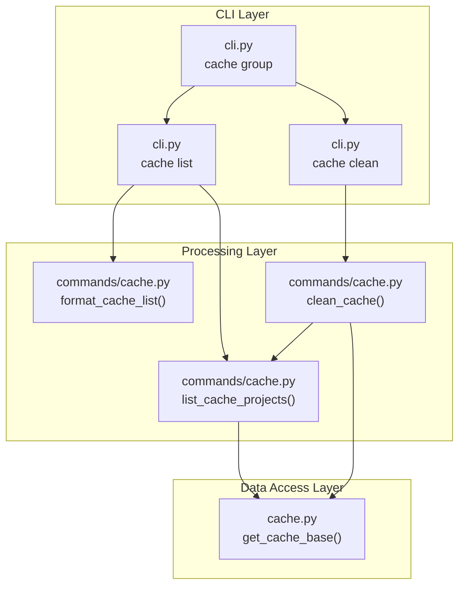

# キャッシュ管理機能

**ドキュメント種別:** 技術設計書 (Design Doc)
**SDDフェーズ:** Plan (計画/設計)
**最終更新日:** 2026-02-23
**関連 Spec:** [cache-management_spec.md](cache-management_spec.md)
**関連 PRD:** [cache-management.md](../requirement/cache-management.md)

---

# 1. 実装ステータス

**ステータス:** 🟢 実装済み

## 1.1. 実装進捗

| モジュール/機能 | ステータス | 備考 |
|:-------------|:---------|:-----|
| cli.py (cache コマンドグループ定義) | 🟢 | Click Group + list/clean サブコマンド |
| commands/cache.py (list_cache_projects) | 🟢 | ディレクトリ走査・メタデータ読み込み・サイズ計算 |
| commands/cache.py (format_cache_list) | 🟢 | text 形式フォーマット |
| commands/cache.py (list_cache_projects_formatted) | 🟢 | text/json 統一出力 |
| commands/cache.py (clean_cache) | 🟢 | --all/--project/--dry-run 対応 |

---

# 2. 設計目標

1. **レイヤー分離**: CLI → commands/cache → cache.py の単方向依存を維持する（CONSTITUTION A-002）
2. **最小依存**: ランタイム依存は Click のみ。json, shutil, pathlib, fnmatch は標準ライブラリを使用する（CONSTITUTION A-003）
3. **Python 3.9-3.13 互換**: すべてのモジュールで Python 3.9 互換構文を使用する（CONSTITUTION T-001）
4. **パス安全性**: ファイルパス操作は pathlib.Path を使用し、パストラバーサル攻撃を防止する（CONSTITUTION T-003）
5. **テスタビリティ**: `get_cache_base` をモック可能に設計し、ファイルシステム依存のテストを容易にする（CONSTITUTION D-002）
6. **エラー耐性**: 個別ディレクトリの削除失敗でも全体処理を継続する

---

# 3. 技術スタック

| 領域 | 採用技術 | 選定理由 |
|:----|:--------|:--------|
| CLI フレームワーク | Click >= 8.1.0 | コマンドグループ・サブコマンドの宣言的記述が容易 |
| キャッシュベース | cache.py (get_cache_base) | XDG 準拠のキャッシュパス生成。既存モジュールを活用 |
| JSON 処理 | json (stdlib) | metadata.json 読み込み・json 形式出力 |
| ディレクトリ削除 | shutil (stdlib) | rmtree による再帰的ディレクトリ削除 |
| パターンマッチ | fnmatch (stdlib) | ワイルドカードパターンによるプロジェクト名フィルタ |
| パス操作 | pathlib (stdlib) | 安全なパス構築・ディレクトリ走査 |
| 日時処理 | datetime (stdlib) | st_mtime からの ISO 8601 変換 |

---

# 4. アーキテクチャ

## 4.1. システム構成図



## 4.2. モジュール分割

| モジュール名 | 責務 | 依存関係 | 配置場所 |
|:-----------|:-----|:--------|:--------|
| `cli.py` (cache グループ) | Click グループ・サブコマンド定義 | `commands/cache` | `src/sdd_cli/cli.py` |
| `commands/cache.py` | キャッシュ走査・フォーマット・削除 | `cache` (get_cache_base) | `src/sdd_cli/commands/cache.py` |
| `cache.py` (get_cache_base) | XDG キャッシュベースパスの取得 | なし | `src/sdd_cli/cache.py` |

---

# 5. データモデル

## 5.1. キャッシュディレクトリ構造

```
~/.cache/sdd-cli/
├── my-project.a1b2c3d4/
│   ├── index.db
│   └── metadata.json
├── other-project.e5f6g7h8/
│   ├── index.db
│   └── metadata.json
```

## 5.2. metadata.json スキーマ

```json
{
  "document_count": 42,
  "indexed_at": "2026-02-23T10:30:00",
  "root": "/path/to/project"
}
```

## 5.3. list_cache_projects() の戻り値

```python
[
    {
        "name": "my-project",
        "hash": "a1b2c3d4",
        "directory": "/home/user/.cache/sdd-cli/my-project.a1b2c3d4",
        "size_bytes": 1048576,
        "size_mb": 1.0,
        "last_modified": "2026-02-23T10:30:00",
        "document_count": 42,
        "indexed_at": "2026-02-23T10:30:00",
        "project_root": "/path/to/project",
    }
]
```

---

# 6. インターフェース定義

## 6.1. list_cache_projects 関数

```python
def list_cache_projects() -> list[dict]:
    """全キャッシュプロジェクトの情報を取得する。

    ~/.cache/sdd-cli/ 配下を走査し、{name}.{hash} 形式のディレクトリから
    プロジェクト情報を抽出する。

    ドットを含まないディレクトリやファイルはスキップする。
    metadata.json が存在しない/不正な場合はデフォルト値を使用する。
    last_modified 降順でソートして返す。
    """
    ...
```

## 6.2. format_cache_list 関数

```python
def format_cache_list(projects: list[dict]) -> str:
    """キャッシュ一覧を text 形式にフォーマットする。

    空リスト時は "No cached projects found." を返す。
    プロジェクト数・合計サイズのサマリーを先頭に表示し、
    各プロジェクトの詳細を番号付きリストで出力する。
    """
    ...
```

## 6.3. clean_cache 関数

```python
from typing import Optional

def clean_cache(
    project_pattern: Optional[str] = None,
    all_projects: bool = False,
    dry_run: bool = False,
) -> str:
    """キャッシュディレクトリを削除する。

    --all: 全プロジェクトを削除
    --project: fnmatch パターンに一致するプロジェクトのみ削除
    --dry-run: 削除をシミュレーションし結果を表示

    いずれも未指定時は "Please specify --all or --project <pattern>" を返す。
    削除中のエラーは記録して処理を継続する。
    サマリーには削除数・解放サイズ・エラー一覧を含む。
    """
    ...
```

---

# 7. 非機能要件実現方針

| 要件 | 実現方針 |
|:-----|:--------|
| NFR-001 エラー耐性 | `shutil.rmtree` を try/except で囲み、エラーを errors リストに記録して処理継続。サマリーでエラー一覧表示 |
| NFR-002 XDG 準拠 | `cache.get_cache_base()` が返す `~/.cache/sdd-cli/` パスに依存。環境変数 `XDG_CACHE_HOME` は `cache.py` 側で考慮 |
| NFR-003 不在時の安全な動作 | `cache_base.exists()` チェック後、一覧は空リスト、削除は "No cache directory found." メッセージ |
| NFR-004 metadata.json パース失敗 | try/except で JSON パースエラーをキャッチし、空辞書として扱う。`get()` で安全にデフォルト値取得 |
| T-003 パス安全性 | `pathlib.Path` でパス構築。`cache_base.iterdir()` でディレクトリ走査。ユーザー入力パスの直接使用なし |

---

# 8. テスト戦略

| テストレベル | 対象 | カバレッジ目標 |
|:-----------|:-----|:-----------|
| ユニットテスト | list_cache_projects()、format_cache_list()、clean_cache() | 80% 以上 |
| 統合テスト | CLI → list/clean パイプライン | 主要パスカバー |
| エッジケース | キャッシュ不在、metadata.json 不在/不正、削除エラー、パターン不一致 | 境界値網羅 |
| 多バージョン | Python 3.9, 3.11, 3.13 × Ubuntu, macOS | 全通過 |

---

# 9. 設計判断

## 9.1. 決定事項

| 決定事項 | 選択肢 | 決定内容 | 理由 |
|:--------|:------|:--------|:-----|
| 削除の安全性 | 確認プロンプト / --dry-run / --force | --dry-run | CLI First (B-002)。非対話的実行を優先 |
| パターンマッチ | 完全一致 / 正規表現 / fnmatch | fnmatch | 標準ライブラリ。シェルユーザーに馴染みのある記法 |
| 削除対象単位 | ファイル単位 / ディレクトリ単位 | ディレクトリ単位 | キャッシュの一貫性を保つため。部分削除は整合性リスクあり |
| エラー時の動作 | 即座に中断 / 継続してサマリー | 継続してサマリー | 複数プロジェクトの一括操作で 1 件の失敗が全体を止めないよう |
| ソート方式 | 名前順 / サイズ順 / 更新日順 | 更新日降順 | 直近で使用したプロジェクトを上位に表示 |
| 出力形式 | text のみ / text + json | text + json | B-002 CLI First に準拠。マシンフレンドリーな JSON と人間可読な text |
| metadata.json 不在時 | エラー / デフォルト値 | デフォルト値 | metadata.json は任意。不在でも基本情報（名前・サイズ・更新日）は提供可能 |

## 9.2. 未解決の課題

| 課題 | 影響度 | 対応方針 |
|:-----|:------|:--------|
| XDG_CACHE_HOME 環境変数によるカスタムキャッシュパス | Low | cache.py 側で対応。commands/cache.py は get_cache_base() に依存 |
| キャッシュの自動有効期限管理（TTL） | Low | スコープ外。将来的に --max-age オプションの追加を検討 |

---

# 10. 変更履歴

## v1.0 (2026-02-23)

**初版作成**

- 全モジュールの設計を記載
- CONSTITUTION.md v1.0.0 に準拠
- PRD cache-management.md の UR/FR/NFR を全カバー
