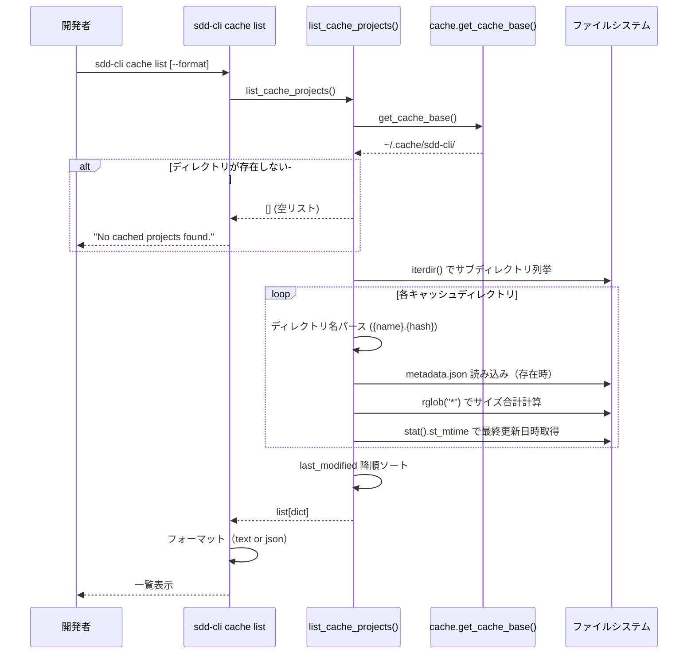
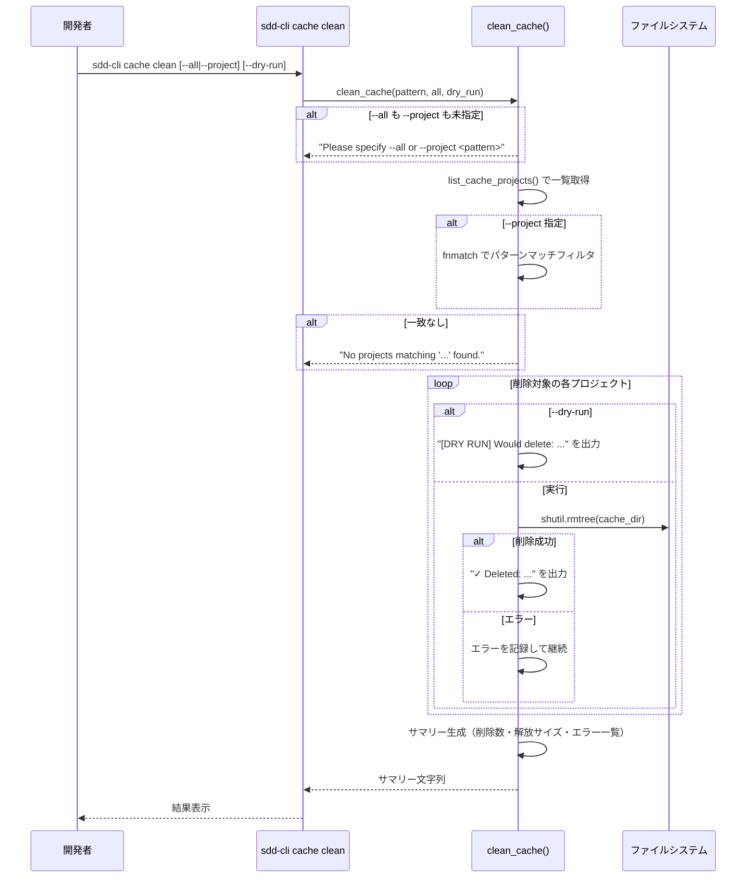

# キャッシュ管理機能

**ドキュメント種別:** 抽象仕様書 (Spec)
**SDDフェーズ:** Specify (仕様化)
**最終更新日:** 2026-02-23
**関連 Design Doc:** [cache-management_design.md](cache-management_design.md)
**関連 PRD:** [cache-management.md](../requirement/cache-management.md)

---

# 1. 背景

sdd-cli では `sdd-cli index` によりプロジェクト別の SQLite FTS5 インデックスが `~/.cache/sdd-cli/{project-name}.{hash}/` に生成される。開発中に複数プロジェクトのインデックスが蓄積されるため、キャッシュの状況確認と不要なキャッシュの削除手段が必要である。

本機能は `sdd-cli cache list` と `sdd-cli cache clean` の 2 つのサブコマンドとして、キャッシュの一覧表示と安全な削除を提供する。

---

# 2. 概要

本機能は `sdd-cli cache` コマンドグループとして実装され、以下の管理機能を提供する:

1. **キャッシュ一覧表示** (`sdd-cli cache list`): プロジェクト名・サイズ・ドキュメント数・最終更新日時の一覧
2. **キャッシュ削除** (`sdd-cli cache clean`): 全削除（`--all`）/ パターンマッチ削除（`--project`）
3. **安全な削除操作**: ドライラン（`--dry-run`）、オプション未指定時のエラー、エラー耐性

---

# 3. 要求定義

## 3.1. 機能要件 (Functional Requirements)

| ID | 要件 | 優先度 | 根拠 |
|:------|:-----|:------|:-----|
| FR-001 | `~/.cache/sdd-cli/` 配下のキャッシュディレクトリを走査する | Must | UR-001: キャッシュ一覧の基盤 |
| FR-002 | `metadata.json` からドキュメント数・プロジェクトルートを読み込む | Must | UR-001: キャッシュ詳細情報の取得 |
| FR-003 | キャッシュディレクトリの合計サイズを計算する | Must | UR-001: ディスク使用量の把握 |
| FR-004 | `last_modified` 降順でプロジェクト一覧をソートする | Must | UR-001: 最新順の表示 |
| FR-005 | text 形式でプロジェクト名・サイズ・ドキュメント数等を整形出力する | Must | UR-001: 人間可読な一覧表示 |
| FR-006 | json 形式で構造化データを出力する | Must | UR-001: 他ツールとの連携 |
| FR-007 | `--all` で全キャッシュプロジェクトを削除する | Must | UR-002: 一括削除 |
| FR-008 | `--project` で fnmatch ワイルドカードによるパターンマッチ削除する | Must | UR-002: 選択的削除 |
| FR-009 | `--dry-run` で実際には削除せず削除対象を表示する | Must | UR-003: 安全な確認手段 |
| FR-010 | `shutil.rmtree` でキャッシュディレクトリを再帰的に削除する | Must | UR-002: 完全な削除 |
| FR-011 | 削除数と解放サイズのサマリーを表示する | Must | UR-002: 結果の報告 |
| FR-012 | `--all` と `--project` のいずれも指定されていない場合にエラーメッセージを返す | Must | UR-003: 誤操作の防止 |
| FR-013 | パターンに一致するプロジェクトがない場合に通知メッセージを返す | Must | UR-003: ユーザーへのフィードバック |

## 3.2. 非機能要件 (Non-Functional Requirements)

| ID | カテゴリ | 要件 | 目標値 |
|:------|:--------|:-----|:------|
| NFR-001 | 堅牢性 | 削除中のエラーでも残りの処理を継続し、エラー一覧を最後に表示する | テストによる検証 |
| NFR-002 | 互換性 | XDG Base Directory 仕様に準拠したキャッシュパスを使用する | `cache.get_cache_base()` 依存 |
| NFR-003 | 堅牢性 | `~/.cache/sdd-cli/` が存在しない場合に安全に空リスト/メッセージを返す | テストによる検証 |
| NFR-004 | 堅牢性 | `metadata.json` パース失敗時にデフォルト値で処理を継続する | テストによる検証 |

---

# 4. API

## 4.1. CLI インターフェース

| コマンド | 引数/オプション | 型 | デフォルト | 説明 |
|:--------|:-------------|:---|:---------|:-----|
| `sdd-cli cache list` | `--format` | Choice[text, json] | text | 出力形式 |
| `sdd-cli cache clean` | `--all` | bool | False | 全プロジェクト削除 |
| | `--project` | str | なし | fnmatch パターンによる選択的削除 |
| | `--dry-run` | bool | False | 削除のシミュレーション表示 |

## 4.2. モジュール API

| パッケージ | モジュール | メンバー | 概要 |
|:---------|:---------|:--------|:-----|
| commands | cache | `list_cache_projects() -> list[dict]` | 全キャッシュプロジェクトの情報取得 |
| commands | cache | `format_cache_list(projects) -> str` | text 形式のフォーマット |
| commands | cache | `list_cache_projects_formatted(output_format) -> str` | フォーマット済み一覧取得 |
| commands | cache | `clean_cache(project_pattern, all_projects, dry_run) -> str` | キャッシュ削除実行 |

## 4.3. 型定義

```python
# list_cache_projects() の戻り値の各要素
{
    "name": str,            # プロジェクト名
    "hash": str,            # SHA-256 ハッシュ（先頭 8 文字）
    "directory": str,       # キャッシュディレクトリの絶対パス
    "size_bytes": int,      # 合計サイズ（バイト）
    "size_mb": float,       # 合計サイズ（MB、小数点以下 2 桁）
    "last_modified": str,   # ISO 8601 形式の最終更新日時
    "document_count": int,  # インデックス済みドキュメント数
    "indexed_at": str,      # インデックス日時
    "project_root": str,    # プロジェクトルートパス
}
```

---

# 5. 用語集

| 用語 | 説明 |
|:-----|:-----|
| キャッシュディレクトリ | `~/.cache/sdd-cli/{project-name}.{hash}/` 形式のプロジェクト別インデックス保存先 |
| XDG Base Directory | Linux/macOS のディレクトリ配置標準仕様。キャッシュは `~/.cache/` に配置 |
| fnmatch | Python 標準ライブラリのファイル名パターンマッチモジュール。`*`, `?`, `[seq]` をサポート |
| metadata.json | キャッシュディレクトリ内に保存されるインデックスメタ情報ファイル（日時・ドキュメント数・ルートパス） |
| ドライラン | 実際の操作を行わず、実行結果をシミュレーション表示する動作モード |
| shutil.rmtree | Python 標準ライブラリのディレクトリ再帰削除関数 |
| SHA-256 ハッシュ | プロジェクトパスから生成される一意識別子。先頭 8 文字を使用 |

---

# 6. 使用例

```bash
# キャッシュ一覧表示
sdd-cli cache list

# JSON 形式で一覧表示
sdd-cli cache list --format json

# 全キャッシュ削除（ドライラン）
sdd-cli cache clean --all --dry-run

# 全キャッシュ削除（実行）
sdd-cli cache clean --all

# パターンマッチ削除
sdd-cli cache clean --project "my-project*"

# パターンマッチ削除（ドライラン）
sdd-cli cache clean --project "old-*" --dry-run
```

---

# 7. 振る舞い図

## 7.1. キャッシュ一覧表示フロー



## 7.2. キャッシュ削除フロー



---

# 8. 制約事項

- キャッシュディレクトリの命名規則は `{project-name}.{hash}` 形式に固定されており、ドット（`.`）を含まないディレクトリ名は無視される
- ディレクトリ名は `rsplit(".", 1)` でパースされるため、プロジェクト名にドットが含まれていてもハッシュ部分が正しく分離される
- fnmatch パターンマッチはプロジェクト名（ハッシュを除く部分）に対してのみ適用される
- キャッシュディレクトリの構造は `cache.py` の `get_cache_dir()` が生成する形式と一致している必要がある
- ファイルパス操作は `pathlib.Path` を使用し、パストラバーサル攻撃を防止する必要がある (T-003 準拠)
- AI-SDD Workflow プラグインとの互換性を維持する必要がある (B-001 準拠)

---

## PRD Reference

- Corresponding PRD: `.sdd/requirement/cache-management.md`
- Covered Requirements: UR-001, UR-002, UR-003, FR-001, FR-002, FR-003, FR-004, FR-005, FR-006, FR-007, FR-008, FR-009, FR-010, FR-011, FR-012, FR-013, NFR-001, NFR-002, NFR-003, NFR-004
