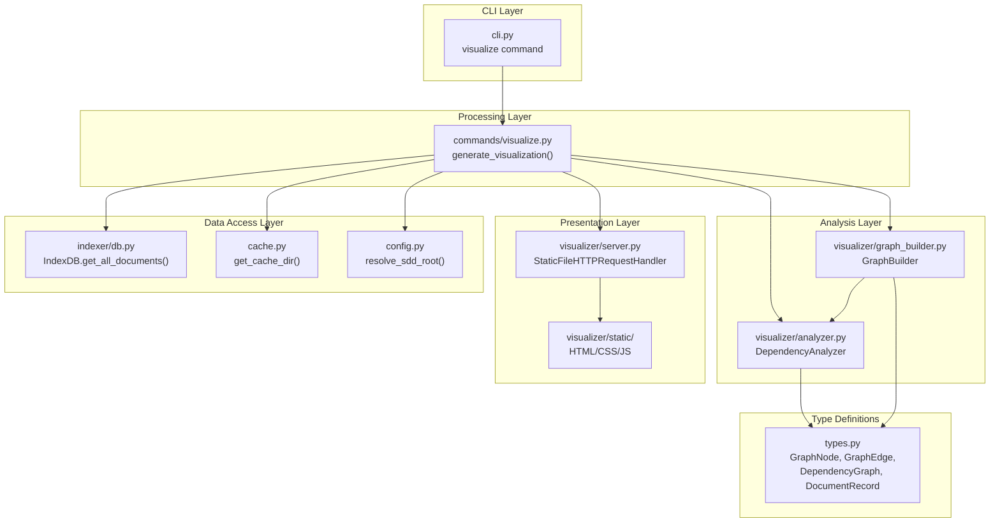

# 依存関係可視化機能

**ドキュメント種別:** 技術設計書 (Design Doc)
**SDDフェーズ:** Plan (計画/設計)
**最終更新日:** 2026-02-23
**関連 Spec:** [dependency-visualization_spec.md](dependency-visualization_spec.md)
**関連 PRD:** [dependency-visualization.md](../requirement/dependency-visualization.md)

---

# 1. 実装ステータス

**ステータス:** 🟢 実装済み

## 1.1. 実装進捗

| モジュール/機能 | ステータス | 備考 |
|:-------------|:---------|:-----|
| cli.py (visualize コマンド定義) | 🟢 | Click デコレータによるオプション定義 |
| commands/visualize.py | 🟢 | generate_visualization() + _build_graph_data() + _write_graph_file() |
| visualizer/analyzer.py | 🟢 | DependencyAnalyzer クラス（4 種の依存関係分析） |
| visualizer/graph_builder.py | 🟢 | GraphBuilder クラス（Single View + Split View） |
| visualizer/server.py | 🟢 | StaticFileHTTPRequestHandler + start_server() |
| visualizer/static/ | 🟢 | HTML/CSS/JS ビューアファイル |
| types.py (GraphNode, GraphEdge, DependencyGraph) | 🟢 | TypedDict 型定義 |

---

# 2. 設計目標

1. **レイヤー分離**: CLI → commands/visualize → visualizer/ (analyzer, graph_builder, server) の単方向依存を維持する（CONSTITUTION A-002）
2. **最小依存**: ランタイム依存は Click のみ。HTTP サーバー、JSON 処理は標準ライブラリを使用する（CONSTITUTION A-003）
3. **Python 3.9-3.13 互換**: `importlib.resources` の互換処理を含むすべてのモジュールで Python 3.9 互換を維持する（CONSTITUTION T-001）
4. **パス安全性**: ファイルパス操作は pathlib.Path を使用し、パストラバーサル攻撃を防止する（CONSTITUTION T-003）
5. **テスタビリティ**: Analyzer, GraphBuilder を独立してテスト可能に設計する（CONSTITUTION D-002）
6. **関心の分離**: 分析 (analyzer) → グラフ構築 (graph_builder) → 配信 (server) の 3 段階パイプラインとして分離する

---

# 3. 技術スタック

| 領域 | 採用技術 | 選定理由 |
|:----|:--------|:--------|
| CLI フレームワーク | Click >= 8.1.0 | コマンドオプション・Choice 型の宣言的記述が容易 |
| 依存関係分析 | 独自実装 (analyzer.py) | ドメイン固有のルールが必要で汎用ライブラリでは対応困難 |
| グラフデータ構築 | 独自実装 (graph_builder.py) | DependencyGraph TypedDict ベースの軽量構造 |
| HTTP サーバー | http.server + socketserver (stdlib) | ゼロ依存。ローカル配信用途に十分 |
| グラフレンダリング | Mermaid.js v10 (CDN) | フローチャート記法で依存グラフを表現。CDN で配信 |
| JSON 処理 | json (stdlib) | グラフデータの JSON シリアライズ |
| パス操作 | pathlib (stdlib) | 安全なパス構築 |
| リソース管理 | importlib.resources (stdlib) | パッケージ内静的ファイルへのアクセス |

---

# 4. アーキテクチャ

## 4.1. システム構成図



## 4.2. モジュール分割

| モジュール名 | 責務 | 依存関係 | 配置場所 |
|:-----------|:-----|:--------|:--------|
| `cli.py` (visualize コマンド) | Click オプション定義、ファイル出力処理 | `commands/visualize` | `src/sdd_cli/cli.py` |
| `commands/visualize.py` | 可視化オーケストレーション、JSON 構築 | `cache`, `config`, `indexer/db`, `visualizer/*`, `types` | `src/sdd_cli/commands/visualize.py` |
| `visualizer/analyzer.py` | 4 種の依存関係分析、エッジ重複排除、推移的エッジ除去 | `types` | `src/sdd_cli/visualizer/analyzer.py` |
| `visualizer/graph_builder.py` | グラフ構築、フィルタ、ドキュメント分類、CONSTITUTION ノード付与 | `types`, `visualizer/analyzer` | `src/sdd_cli/visualizer/graph_builder.py` |
| `visualizer/server.py` | HTTP サーバー起動、静的ファイル配信、インメモリ JSON 配信 | なし（stdlib のみ） | `src/sdd_cli/visualizer/server.py` |
| `visualizer/static/` | HTML/CSS/JS ビューアファイル | Mermaid.js CDN | `src/sdd_cli/visualizer/static/` |

---

# 5. データモデル

## 5.1. 依存関係分析の出力

```python
# DependencyAnalyzer.analyze() の戻り値
dependencies: list[tuple[str, str, str]]
# (source_path, target_path, link_type)
# link_type: "explicit" | "implicit" | "link"
```

## 5.2. 依存関係タイプ定数

```python
FILE_TYPE_REQUIREMENT = "requirement"
FILE_TYPE_SPEC = "spec"
FILE_TYPE_DESIGN = "design"
FILE_TYPE_TASK = "task"

TYPE_HIERARCHY = [FILE_TYPE_REQUIREMENT, FILE_TYPE_SPEC, FILE_TYPE_DESIGN, FILE_TYPE_TASK]

EDGE_EXPLICIT = "explicit"
EDGE_IMPLICIT = "implicit"
EDGE_LINK = "link"
EDGE_CONSTITUTION = "constitution"
```

## 5.3. グラフ JSON 出力構造

```json
{
  "title": "SDD Dependency Graph",
  "subtitle": "Interactive dependency graph visualization",
  "nodes": [
    {
      "id": "requirement/document-indexing.md",
      "title": "ドキュメントインデックス機能",
      "directory": "requirement",
      "file_type": "requirement",
      "feature_id": "document-indexing",
      "links": []
    }
  ],
  "edges": [
    {
      "source": "specification/document-indexing_spec.md",
      "target": "requirement/document-indexing.md",
      "type": "implicit"
    }
  ]
}
```

---

# 6. インターフェース定義

## 6.1. commands/visualize モジュール

```python
from pathlib import Path
from typing import Optional

def generate_visualization(
    root: Path,
    output: Path,
    filter_dir: Optional[str] = None,
    feature_id: Optional[str] = None,
) -> None:
    """可視化を実行し、HTML ビューアを起動する。

    インデックス未存在時は自動で build_index() を実行する。
    ドキュメントが 0 件の場合は ValueError を発生させる。
    """
    ...
```

## 6.2. DependencyAnalyzer クラス

```python
from pathlib import Path
from sdd_cli.types import DocumentRecord

class DependencyAnalyzer:
    def __init__(self, documents: list[DocumentRecord], root: Path):
        """ドキュメントリストと SDD ルートで初期化する。

        内部的に O(1) ルックアップ用の辞書を構築する。
        """
        ...

    def analyze(self) -> list[tuple[str, str, str]]:
        """全依存関係を分析し (source, target, link_type) のリストを返す。

        分析順序:
        1. Explicit: depends_on frontmatter
        2. Implicit: TYPE_HIERARCHY に基づく暗黙依存
        3. Parent-Child: parent_feature_id による親子関係
        4. Link: task ファイルの相対リンク（leaf targets のみ）

        後処理:
        - _deduplicate_edges(): explicit > implicit > link の優先度で重複排除
        - _remove_transitive_link_edges(): 推移的 link エッジの除去
        """
        ...

    def resolve_link(self, source_path: str, link: str) -> Optional[str]:
        """相対 Markdown リンクをドキュメントパスに解決する。"""
        ...
```

## 6.3. GraphBuilder クラス

```python
from typing import Optional
from sdd_cli.types import DependencyGraph, DocumentRecord

class GraphBuilder:
    def __init__(
        self,
        documents: list[DocumentRecord],
        dependencies: list[tuple[str, str, str]],
        analyzer: "DependencyAnalyzer",
    ):
        ...

    def build_dependency_graph(
        self,
        filter_dir: Optional[str] = None,
        feature_id: Optional[str] = None,
    ) -> DependencyGraph:
        """Single View 用のグラフを構築する。

        フィルタ適用後、_build_graph_from_docs() でグラフ化し、
        _attach_constitution() で CONSTITUTION ノードを付与する。
        """
        ...

    def build_split_dependency_graphs(
        self,
        filter_dir: Optional[str] = None,
    ) -> tuple[DependencyGraph, DependencyGraph]:
        """Split View 用の 2 つのグラフ（PRD-based, direct）を構築する。

        _classify_documents() で 2 パス分類を実行し、
        それぞれに _attach_constitution() を適用する。
        """
        ...
```

## 6.4. start_server 関数

```python
def start_server(json_data: dict[str, bytes], port: int = 8000) -> None:
    """ローカル HTTP サーバーを起動しブラウザを開く。

    ポート使用中は自動インクリメント（最大 10 回試行）。
    Ctrl+C でサーバーを正常終了する。
    """
    ...
```

---

# 7. 非機能要件実現方針

| 要件 | 実現方針 |
|:-----|:--------|
| NFR-001 Mermaid.js CDN | HTML ビューアから CDN 経由で Mermaid.js v10 を読み込み。ブラウザ側でレンダリング |
| NFR-002 Python 互換 | `importlib.resources` の Python 3.9 互換処理。`__path__` → `resources.files()` → `pkg_resources` のフォールバック |
| NFR-003 フロントエンド外部依存なし | HTML/CSS/JS はバニラ実装。Mermaid.js CDN のみ例外 |
| NFR-004 テーマ対応 | `localStorage` にテーマ設定を永続化。`prefers-color-scheme` をデフォルト値。ノード色はファイルタイプ別 |
| NFR-005 ズーム・パン | マウスホイール/ボタンズーム（30%〜400%、ステップ 20%）、ドラッグパン、キーボードショートカット |
| NFR-006 ノード詳細 | ノードクリックでオーバーレイパネル表示（File Path, Directory, Feature ID, Links, Parent） |
| NFR-007 インメモリ JSON | 3 種のグラフ JSON（dependency-graph, prd-based-graph, direct-graph）を dict[str, bytes] で保持 |
| NFR-008 エラーハンドリング | ドキュメント 0 件で ValueError、Ctrl+C で `httpd.serve_forever()` を正常終了 |
| T-003 パス安全性 | `pathlib.Path` でパス構築。`resolve()` で正規化。相対リンク解決時に `relative_to()` でバリデーション |

---

# 8. テスト戦略

| テストレベル | 対象 | カバレッジ目標 |
|:-----------|:-----|:-----------|
| ユニットテスト | DependencyAnalyzer（4 種の依存関係、重複排除、推移的エッジ除去） | 80% 以上 |
| ユニットテスト | GraphBuilder（Single/Split View、フィルタ、分類、CONSTITUTION ノード） | 80% 以上 |
| 統合テスト | generate_visualization() パイプライン | 主要パスカバー |
| エッジケース | ドキュメント 0 件、フィルタ結果 0 件、ポート使用中、leaf targets | 境界値網羅 |
| 多バージョン | Python 3.9, 3.11, 3.13 × Ubuntu, macOS | 全通過 |

---

# 9. 設計判断

## 9.1. 決定事項

| 決定事項 | 選択肢 | 決定内容 | 理由 |
|:--------|:------|:--------|:-----|
| 依存関係の種別 | 2 種 / 4 種 / 多種 | 4 種（explicit, implicit, parent-child, link） | 実際の SDD ワークフローの関係を適切にモデル化 |
| グラフレンダリング | D3.js / Mermaid.js / Cytoscape.js | Mermaid.js v10 CDN | テキストベースでシンプル。フローチャート記法が直感的 (A-003 準拠) |
| HTTP サーバー | Flask / FastAPI / http.server | http.server (stdlib) | ゼロ依存。ローカル配信のみの用途に十分 (A-003 準拠) |
| 分類アルゴリズム | 1 パス / 2 パス | 2 パス分類 | design は spec の分類に依存するため、先に spec を分類する必要がある |
| エッジ方向 | parent→child / child→parent | child→parent（下流→上流） | 全エッジを統一的に「依存先を指す」方向に統一 |
| CONSTITUTION ノード | グラフに含めない / 常に含める | 常に含める | ドキュメント体系の最上位であることを視覚的に示す |
| ポート戦略 | 固定 / 自動インクリメント / ランダム | 自動インクリメント（8000〜8009） | 予測可能なポートで使いやすく、10 ポートで十分 |
| JSON 配信方式 | ファイルベース / インメモリ | インメモリ | ファイル I/O 不要でクリーンアップの手間がない |

## 9.2. 未解決の課題

| 課題 | 影響度 | 対応方針 |
|:-----|:------|:--------|
| 循環依存の検出・警告 | Medium | 現状未実装。将来的に warning 表示の追加を検討 |
| 大規模プロジェクトでのグラフ可読性 | Medium | Mermaid.js のレイアウト制約に依存。ノード数制限やサブグラフ分割を検討 |
| オフライン環境での Mermaid.js 利用 | Low | CDN 必須。オフライン対応はパッケージ同梱を検討 |

---

# 10. 変更履歴

## v1.0 (2026-02-23)

**初版作成**

- 全モジュールの設計を記載
- CONSTITUTION.md v1.0.0 に準拠
- PRD dependency-visualization.md の UR/FR/NFR を全カバー
