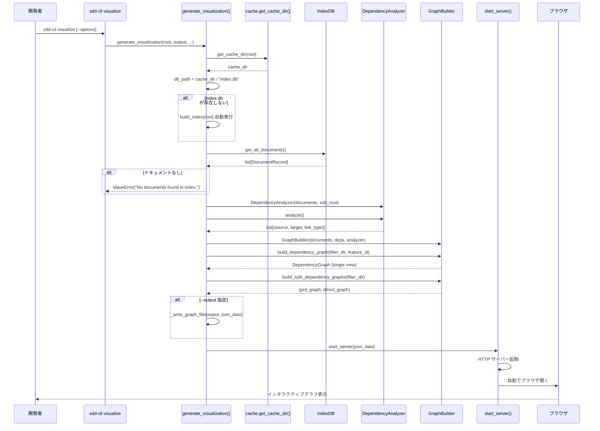
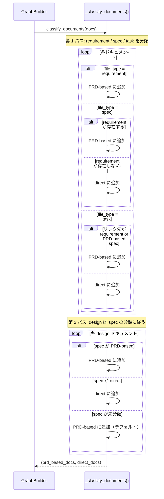

# 依存関係可視化機能

**ドキュメント種別:** 抽象仕様書 (Spec)
**SDDフェーズ:** Specify (仕様化)
**最終更新日:** 2026-02-23
**関連 Design Doc:** [dependency-visualization_design.md](dependency-visualization_design.md)
**関連 PRD:** [dependency-visualization.md](../requirement/dependency-visualization.md)

---

# 1. 背景

AI-SDD Workflow では、`.sdd/` 配下に PRD・仕様書・設計書・タスクログが蓄積され、ドキュメント間には暗黙的・明示的な依存関係が存在する。これらの依存関係を理解することは、変更影響の把握やドキュメント体系の網羅性確認に不可欠である。

`sdd-cli index` で構築されたインデックスを活用し、ドキュメント間の依存関係を分析・グラフ化し、インタラクティブな HTML ビューアで可視化する機能を提供する。

---

# 2. 概要

本機能は `sdd-cli visualize` コマンドとして実装され、以下の可視化機能を提供する:

1. **依存関係分析**: 4 種の依存関係（explicit / implicit / parent-child / link）を自動推定
2. **グラフデータ構築**: ノード・エッジの構造化データ構築、フィルタ適用、CONSTITUTION.md ノード付与
3. **ドキュメント分類**: PRD-based / direct の 2 グループへの分類（Split View）
4. **HTML ビューア**: ローカル HTTP サーバーによる Mermaid.js ベースのインタラクティブグラフ表示
5. **グラフ JSON 出力**: `--output` によるファイルエクスポート
6. **インデックス自動構築**: 未構築時の自動 `build_index()` 実行

---

# 3. 要求定義

## 3.1. 機能要件 (Functional Requirements)

| ID | 要件 | 優先度 | 根拠 |
|:------|:-----|:------|:-----|
| FR-001 | 4 種の依存関係（explicit / implicit / parent-child / link）を分析する | Must | UR-001: 依存関係可視化の中核機能 |
| FR-002 | frontmatter `depends_on` フィールドから明示的依存を抽出する | Must | UR-001: explicit 依存の検出 |
| FR-003 | ファイルタイプ順序（requirement -> spec -> design）で暗黙依存を推定する | Must | UR-001: implicit 依存の推定 |
| FR-004 | `parent_feature_id` による親子依存を推定する | Must | UR-001: parent-child 依存の推定 |
| FR-005 | task ファイルの Markdown 相対リンクから依存を抽出する | Must | UR-001: link 依存の検出 |
| FR-006 | 同一ノードペア間のエッジを優先度（explicit > implicit > link）で重複排除する | Must | UR-001: グラフの簡潔化 |
| FR-007 | 推移的に到達可能な link エッジを冗長として除去する | Must | UR-001: グラフの簡潔化 |
| FR-008 | ノードとエッジの構造化グラフデータを構築する | Must | UR-001: グラフデータの提供 |
| FR-009 | `--filter-dir` でディレクトリタイプによるフィルタを適用する | Must | UR-001: グラフのフィルタリング |
| FR-010 | `--feature-id` で feature ID によるフィルタを適用する | Must | UR-001: グラフのフィルタリング |
| FR-011 | CONSTITUTION.md ノードを追加しトップレベルノードから constitution エッジを生成する | Must | UR-001: CONSTITUTION の位置づけ明示 |
| FR-012 | task からのリンクは最深ノード（leaf targets）のみを保持する | Must | UR-001: グラフの簡潔化 |
| FR-013 | ローカル HTTP サーバーを起動し Mermaid.js ビューアを配信する | Must | UR-002: インタラクティブ表示 |
| FR-014 | サーバー起動後にブラウザを自動で開く | Should | UR-002: ユーザビリティ向上 |
| FR-015 | ポート 8000 が使用中なら自動インクリメントする（最大 10 回試行） | Must | UR-002: ポート競合の回避 |
| FR-016 | requirement の有無で PRD-based / direct にドキュメントを分類する | Must | UR-004: Split View の分類基盤 |
| FR-017 | requirement を持つ feature のドキュメントを PRD-based に分類する | Must | UR-004: PRD-based 分類 |
| FR-018 | requirement を持たない feature のドキュメントを direct に分類する | Must | UR-004: direct 分類 |
| FR-019 | design ドキュメントは対応する spec の分類に従う | Must | UR-004: 分類の一貫性 |
| FR-020 | `--output` オプションでグラフ JSON をファイル出力する | Must | UR-003: エクスポート機能 |
| FR-021 | インデックスが存在しない場合に自動で build_index を実行する | Must | UR-001: ユーザビリティ向上 |

## 3.2. 非機能要件 (Non-Functional Requirements)

| ID | カテゴリ | 要件 | 目標値 |
|:------|:--------|:-----|:------|
| NFR-001 | 互換性 | Mermaid.js v10 CDN を使用してグラフをレンダリングする | CDN: cdn.jsdelivr.net/npm/mermaid@10 |
| NFR-002 | 互換性 | Python 3.9〜3.13 で動作する | CI マトリックスで検証 |
| NFR-003 | 依存性 | フロントエンドは Mermaid.js CDN 以外の外部依存なしで動作する | バニラ CSS/JS |
| NFR-004 | UX | ダーク/ライトテーマの切替に対応する | localStorage に永続化 |
| NFR-005 | UX | ズーム（30%〜400%）・パン・キーボードショートカットに対応する | demonstration 検証 |
| NFR-006 | UX | ノードクリックによる詳細表示を提供する | demonstration 検証 |
| NFR-007 | パフォーマンス | 3 種のグラフデータをインメモリで保持し HTTP リクエスト時に直接応答する | ファイル I/O なし |
| NFR-008 | 堅牢性 | インデックスにドキュメントが存在しない場合は ValueError を発生させ Ctrl+C でサーバーを正常終了する | エラーメッセージ表示 |

---

# 4. API

## 4.1. CLI インターフェース

| コマンド | 引数/オプション | 型 | デフォルト | 説明 |
|:--------|:-------------|:---|:---------|:-----|
| `sdd-cli visualize` | `--root` | Path | カレントディレクトリ | プロジェクトルートディレクトリ |
| | `--output` | Path | なし | グラフ JSON 出力先ファイルパス |
| | `--filter-dir` | Choice[requirement, specification, task] | なし | ディレクトリタイプフィルタ |
| | `--feature-id` | str | なし | feature ID フィルタ |

## 4.2. モジュール API

| パッケージ | モジュール | メンバー | 概要 |
|:---------|:---------|:--------|:-----|
| commands | visualize | `generate_visualization(root, output, filter_dir, feature_id) -> None` | 可視化実行・サーバー起動 |
| visualizer | analyzer | `DependencyAnalyzer(documents, root)` | 依存関係分析クラス |
| visualizer | analyzer | `DependencyAnalyzer.analyze() -> list[tuple[str, str, str]]` | 全依存関係の分析 |
| visualizer | graph_builder | `GraphBuilder(documents, dependencies, analyzer)` | グラフ構築クラス |
| visualizer | graph_builder | `GraphBuilder.build_dependency_graph(filter_dir, feature_id) -> DependencyGraph` | Single View グラフ構築 |
| visualizer | graph_builder | `GraphBuilder.build_split_dependency_graphs(filter_dir) -> tuple[DependencyGraph, DependencyGraph]` | Split View グラフ構築 |
| visualizer | server | `start_server(json_data, port) -> None` | HTTP サーバー起動 |

## 4.3. 型定義

```python
from typing import Optional, TypedDict

class GraphNode(TypedDict):
    id: str
    title: str
    directory: str
    file_type: str
    feature_id: str
    links: list[str]

class GraphEdge(TypedDict):
    source: str
    target: str
    type: str

class DependencyGraph(TypedDict):
    nodes: list[GraphNode]
    edges: list[GraphEdge]

class DocumentRecord(TypedDict):
    file_path: str
    file_name: str
    directory: str
    file_type: str
    title: str
    feature_id: str
    parent_feature_id: Optional[str]
    tags: list[str]
    depends_on: list[str]
    links: list[str]
```

---

# 5. 用語集

| 用語 | 説明 |
|:-----|:-----|
| TYPE_HIERARCHY | ドキュメントタイプの階層順序。requirement -> spec -> design -> task |
| explicit 依存 | frontmatter `depends_on` フィールドで明示的に宣言された依存関係 |
| implicit 依存 | ファイルタイプ順序と feature_id の一致により自動推定される依存関係 |
| parent-child 依存 | ディレクトリネストによる親子関係に基づく依存 |
| link 依存 | Markdown 本文中の相対リンクから推定される依存関係（task ファイルのみ） |
| constitution エッジ | トップレベルノードから CONSTITUTION.md への暗黙エッジ |
| leaf targets | 依存チェーンにおいて最も下流（最深）のノード。祖先ノードは除去される |
| PRD-based | requirement ドキュメントを持つ feature に属するドキュメント群 |
| direct | requirement を持たず、CONSTITUTION から直接派生するドキュメント群 |
| GraphNode | グラフのノード。id, title, directory, file_type, feature_id, links を持つ |
| GraphEdge | グラフのエッジ。source, target, type を持つ |
| DependencyGraph | ノードとエッジの集合からなるグラフデータ構造 |
| Mermaid.js | テキストベースのダイアグラム描画ライブラリ。フローチャート記法で依存グラフを表現 |

---

# 6. 使用例

```bash
# 依存関係グラフを表示（ブラウザで開く）
sdd-cli visualize

# ディレクトリタイプでフィルタ
sdd-cli visualize --filter-dir requirement

# feature ID でフィルタ
sdd-cli visualize --feature-id document-indexing

# グラフ JSON をファイルに出力
sdd-cli visualize --output graph.json

# フィルタとファイル出力の組み合わせ
sdd-cli visualize --filter-dir specification --output spec-graph.json
```

---

# 7. 振る舞い図

## 7.1. 依存関係可視化フロー



## 7.2. ドキュメント分類フロー（Split View）



---

# 8. 制約事項

- HTTP サーバーは Python 標準ライブラリの `http.server` と `socketserver` を使用する（外部 WSGI/ASGI フレームワーク不使用）
- Mermaid.js のレンダリングはブラウザ側で行うため、CDN へのネットワーク接続が必要
- `importlib.resources` の API が Python 3.9 と 3.10 以降で異なるため互換処理が必要
- ポート 8000〜8009 がすべて使用中の場合はサーバー起動に失敗する
- TYPE_HIERARCHY（requirement -> spec -> design -> task）の順序は固定
- ファイルパス操作は `pathlib.Path` を使用し、パストラバーサル攻撃を防止する必要がある (T-003 準拠)
- AI-SDD Workflow プラグインとの互換性を維持する必要がある (B-001 準拠)

---

## PRD Reference

- Corresponding PRD: `.sdd/requirement/dependency-visualization.md`
- Covered Requirements: UR-001, UR-002, UR-003, UR-004, FR-001, FR-002, FR-003, FR-004, FR-005, FR-006, FR-007, FR-008, FR-009, FR-010, FR-011, FR-012, FR-013, FR-014, FR-015, FR-016, FR-017, FR-018, FR-019, FR-020, FR-021, NFR-001, NFR-002, NFR-003, NFR-004, NFR-005, NFR-006, NFR-007, NFR-008
