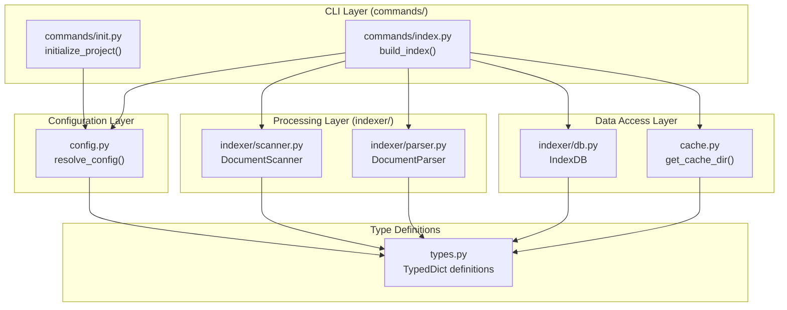

# ドキュメントインデックス機能

**ドキュメント種別:** 技術設計書 (Design Doc)
**SDDフェーズ:** Plan (計画/設計)
**最終更新日:** 2026-02-23
**関連 Spec:** [document-indexing_spec.md](document-indexing_spec.md)
**関連 PRD:** [document-indexing.md](../requirement/document-indexing.md)

---

# 1. 実装ステータス

**ステータス:** 🟢 実装済み

## 1.1. 実装進捗

| モジュール/機能              | ステータス | 備考                                 |
|:---------------------------|:---------|:-------------------------------------|
| config.py                  | 🟢       | 設定解決・JSON バリデーション           |
| cache.py                   | 🟢       | XDG キャッシュディレクトリ管理           |
| types.py                   | 🟢       | TypedDict 型定義                      |
| commands/init.py           | 🟢       | プロジェクト初期化コマンド              |
| commands/index.py          | 🟢       | インデックス構築コマンド                |
| indexer/scanner.py         | 🟢       | ドキュメントスキャン                    |
| indexer/parser.py          | 🟢       | frontmatter パース                    |
| indexer/db.py              | 🟢       | SQLite FTS5 インデックス管理           |

---

# 2. 設計目標

1. **レイヤー分離**: CLI → 処理層 → データ層の単方向依存を維持する（CONSTITUTION A-002）
2. **最小依存**: ランタイム依存を Click + python-frontmatter に限定する（CONSTITUTION A-003）
3. **Python 3.9-3.13 互換**: すべてのモジュールで Python 3.9 互換構文を使用する（CONSTITUTION T-001）
4. **SQL セーフティ**: すべての SQLite クエリをパラメータ化する（CONSTITUTION T-002）
5. **テスタビリティ**: 各モジュールを独立してテスト可能に設計する（CONSTITUTION D-002）

---

# 3. 技術スタック

| 領域                | 採用技術                   | 選定理由                                         |
|:-------------------|:--------------------------|:------------------------------------------------|
| CLI フレームワーク   | Click >= 8.1.0            | コマンドグループ・オプション定義の宣言的記述が容易     |
| YAML パーサー        | python-frontmatter >= 1.0 | Markdown frontmatter 解析の標準ライブラリ           |
| 全文検索エンジン     | SQLite FTS5 (stdlib)      | ゼロコンフィグ・組み込みDB。trigram で日本語対応     |
| ハッシュ             | hashlib (stdlib)          | SHA-256 によるプロジェクト識別。標準ライブラリ       |
| パス操作             | pathlib (stdlib)          | 安全なパス構築。パストラバーサル防止                 |
| JSON                | json (stdlib)             | 設定ファイル・メタデータの読み書き                   |
| ビルドシステム        | Hatchling + uv           | モダン Python パッケージング。PEP 621 準拠           |
| Linter              | Ruff                     | E/F/W/I/UP/B/SIM/RUF ルール。行長 120 文字          |
| 型チェック            | mypy                     | check_untyped_defs 有効。段階的導入                 |
| テスト               | pytest                   | フィクスチャ・パラメタライズ対応                     |

---

# 4. アーキテクチャ

## 4.1. システム構成図



## 4.2. モジュール分割

| モジュール名            | 責務                                         | 依存関係                        | 配置場所                        |
|:-----------------------|:--------------------------------------------|:-------------------------------|:-------------------------------|
| `types.py`             | TypedDict 型定義の一元管理                    | なし                            | `src/sdd_cli/types.py`         |
| `config.py`            | 設定ファイル読み込み・優先度解決                | `types`                        | `src/sdd_cli/config.py`        |
| `cache.py`             | XDG キャッシュディレクトリ管理                  | `types`                        | `src/sdd_cli/cache.py`         |
| `indexer/scanner.py`   | `.sdd/` 配下の Markdown ファイルスキャン        | `types`                        | `src/sdd_cli/indexer/scanner.py`|
| `indexer/parser.py`    | frontmatter パース・メタデータ抽出              | `types`                        | `src/sdd_cli/indexer/parser.py` |
| `indexer/db.py`        | SQLite FTS5 インデックス管理                   | `types`                        | `src/sdd_cli/indexer/db.py`    |
| `commands/init.py`     | `sdd-cli init` コマンド実装                    | `config`                       | `src/sdd_cli/commands/init.py` |
| `commands/index.py`    | `sdd-cli index` コマンド実装                   | `config`, `cache`, `indexer/*` | `src/sdd_cli/commands/index.py`|

---

# 5. データモデル

## 5.1. SQLite テーブル構造

### documents_fts (FTS5 仮想テーブル)

```sql
CREATE VIRTUAL TABLE documents_fts USING fts5(
    file_path,
    title,
    content,
    tokenize='trigram'
);
```

### documents_meta (メタデータテーブル)

```sql
CREATE TABLE documents_meta (
    file_path TEXT PRIMARY KEY,
    file_name TEXT NOT NULL,
    directory TEXT NOT NULL,
    file_type TEXT,
    feature_id TEXT,
    parent_feature_id TEXT,
    tags TEXT,          -- JSON array として格納
    depends_on TEXT,    -- JSON array として格納
    links TEXT          -- JSON array として格納
);
CREATE INDEX idx_feature_id ON documents_meta(feature_id);
```

## 5.2. Python 型定義

```python
from typing import List, TypedDict

class DocumentInfo(TypedDict):
    file_path: str
    file_name: str
    directory: str

class ScanResult(DocumentInfo):
    full_path: str

class ParsedDocument(TypedDict):
    title: str
    feature_id: str
    file_type: str
    parent_feature_id: str
    tags: List[str]
    depends_on: List[str]
    content: str
    links: List[str]

class SDDDirectories(TypedDict):
    requirement: str
    specification: str
    task: str

class SDDConfig(TypedDict):
    root: str
    lang: str
    directories: SDDDirectories
```

---

# 6. インターフェース定義

## 6.1. config モジュール

```python
from pathlib import Path
from sdd_cli.types import SDDConfig

def load_config_file(project_root: Path) -> dict:
    """
    .sdd-config.json を読み込み dict として返す。
    ファイル未存在時は空 dict を返す。
    不正 JSON の場合は ValueError を発生させる。
    """
    ...

def resolve_config(project_root: Path) -> SDDConfig:
    """
    環境変数 > .sdd-config.json > デフォルト値の優先度で設定を解決する。
    環境変数: SDD_ROOT, SDD_REQUIREMENT_DIR, SDD_SPECIFICATION_DIR, SDD_TASK_DIR
    """
    ...

def resolve_sdd_root(project_root: Path) -> Path:
    """SDD ルートディレクトリの Path を返す。"""
    ...
```

## 6.2. cache モジュール

```python
from pathlib import Path

def get_cache_base() -> Path:
    """~/.cache/sdd-cli を返す。"""
    ...

def get_project_hash(project_root: Path) -> str:
    """プロジェクト絶対パスの SHA-256 先頭 8 文字を返す。"""
    ...

def get_cache_dir(project_root: Path) -> Path:
    """~/.cache/sdd-cli/{project-name}.{hash}/ を作成して返す。"""
    ...
```

## 6.3. indexer モジュール

```python
from pathlib import Path
from typing import List
from sdd_cli.types import ScanResult, ParsedDocument, DocumentInfo, SDDDirectories

class DocumentScanner:
    def __init__(self, root: Path, directories: SDDDirectories) -> None: ...
    def scan_all(self) -> List[ScanResult]: ...
    def scan_directory(self, directory: str) -> List[ScanResult]: ...

class DocumentParser:
    @staticmethod
    def parse(file_path: Path, directory: str, rel_path: str) -> ParsedDocument: ...

class IndexDB:
    def __init__(self, db_path: Path) -> None: ...
    def clear(self) -> None: ...
    def index_document(self, doc_info: DocumentInfo, parsed_data: ParsedDocument) -> None: ...
    def __enter__(self) -> "IndexDB": ...
    def __exit__(self, *args) -> None: ...
```

---

# 7. 非機能要件実現方針

| 要件             | 実現方針                                                                |
|:----------------|:-----------------------------------------------------------------------|
| NFR-001 互換性   | `Union[X, Y]` 構文使用。`importlib.resources` は try/except で互換処理    |
| NFR-002 依存性   | `pyproject.toml` の dependencies を Click + python-frontmatter に制限     |
| NFR-003 進捗表示 | `build_index` 内でカウンタを管理し、10 件ごとに `click.echo` で進捗出力    |
| NFR-004 出力抑制 | `--quiet` フラグを `build_index` に伝播し、`click.echo` の呼び出しを制御   |
| NFR-005 堅牢性   | `DocumentParser.parse` を try/except で囲み、失敗時はスキップ＆警告出力    |
| NFR-006 エラー   | `resolve_sdd_root` で `sdd_root.exists()` を検証、不在時は `click.ClickException` |
| NFR-007 テスト   | conftest.py にフィクスチャ、tests/helpers.py にヘルパー関数。CI マトリックスで検証 |

---

# 8. テスト戦略

| テストレベル    | 対象                                        | カバレッジ目標 |
|:-------------|:--------------------------------------------|:-------------|
| ユニットテスト | config, cache, scanner, parser, db 各モジュール | 80% 以上      |
| 統合テスト     | build_index (Scanner → Parser → DB パイプライン) | 主要パスカバー |
| エッジケース   | 不正 JSON、frontmatter なし、隠しファイル、パース失敗 | 境界値網羅   |
| 多バージョン   | Python 3.9, 3.11, 3.13 × Ubuntu, macOS       | 全通過        |

### テスト構成

```
tests/
├── conftest.py       # フィクスチャ（tmp_path, sample fixtures）
├── helpers.py        # write_md(), sample_doc_info(), sample_parsed_data()
├── test_config.py    # config モジュールのテスト
├── test_cache.py     # cache モジュールのテスト
├── test_scanner.py   # scanner モジュールのテスト
├── test_parser.py    # parser モジュールのテスト
├── test_db.py        # db モジュールのテスト
└── test_cli.py       # CLI 統合テスト
```

---

# 9. 設計判断

## 9.1. 決定事項

| 決定事項                     | 選択肢                                  | 決定内容                    | 理由                                                          |
|:---------------------------|:----------------------------------------|:--------------------------|:-------------------------------------------------------------|
| 全文検索エンジン              | SQLite FTS5 / Whoosh / Elasticsearch     | SQLite FTS5              | 外部依存ゼロ。Python 標準 sqlite3 で利用可能（A-003 準拠）       |
| FTS5 トークナイザー           | unicode61 / trigram / porter             | trigram                  | 日本語を含む多言語対応。部分文字列検索が可能                      |
| frontmatter パーサー          | python-frontmatter / PyYAML 手動解析      | python-frontmatter       | 堅牢な frontmatter 解析。エッジケース対応済み（A-001 準拠）       |
| CLI フレームワーク             | Click / argparse / Typer                  | Click                    | コマンドグループ・デコレータベースの宣言的記述                     |
| キャッシュ配置                 | プロジェクト内 / XDG / 固定パス            | XDG Base Directory       | プラットフォーム標準。プロジェクトディレクトリの汚染を回避          |
| プロジェクト識別               | フルパス / ハッシュ / UUID                 | SHA-256 先頭 8 文字       | パスの衝突リスクを低減しつつ、ディレクトリ名を短く保つ             |
| インデックス更新方式           | 差分更新 / 全クリア＆再構築                | 全クリア＆再構築           | 実装の単純性。ドキュメント数が限定的なため性能問題なし             |
| DocumentParser の設計          | インスタンスメソッド / staticmethod        | 全 staticmethod          | 状態を持たない純粋関数設計。テスト容易性が高い                    |
| メタデータ格納方式             | JSON カラム / 正規化テーブル               | JSON 文字列カラム          | tags/depends_on/links は可変長リスト。JOIN 不要で単純             |

## 9.2. 未解決の課題

| 課題                        | 影響度 | 対応方針                                                      |
|:---------------------------|:------|:-------------------------------------------------------------|
| インクリメンタル更新未対応     | Low   | 将来的に変更ファイルのみ再インデックスする方式を検討              |
| FTS5 trigram のメモリ使用量   | Low   | 大規模プロジェクト（数千ファイル）での検証が必要                  |
| Python 3.9 サポート継続       | Low    | 3.9 は 2025-10 で EOL だが CI マトリックスで継続サポート中。将来的に 3.10+ 移行時に `X \| Y` 構文等の最新記法を採用可能 |

---

# 10. 変更履歴

## v1.0 (2026-02-23)

**初版作成**

- 全モジュールの設計を記載
- CONSTITUTION.md v1.0.0 に準拠
- PRD document-indexing.md の UR/FR/NFR を全カバー
