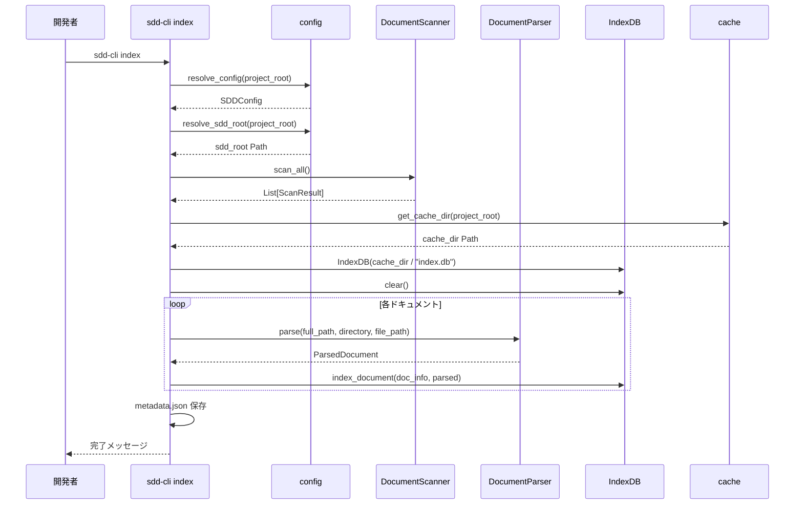
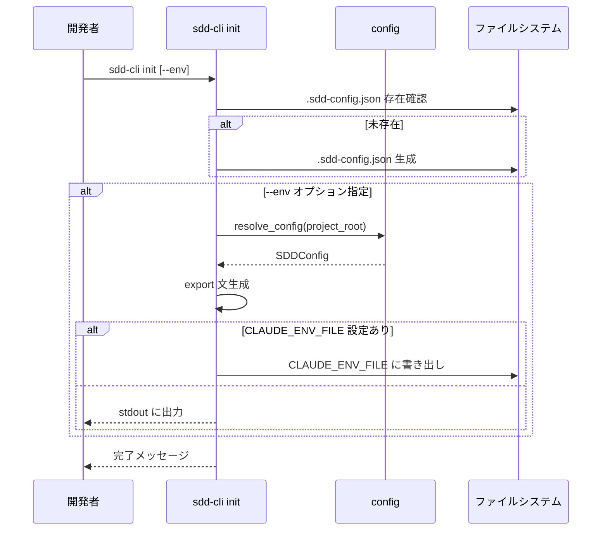
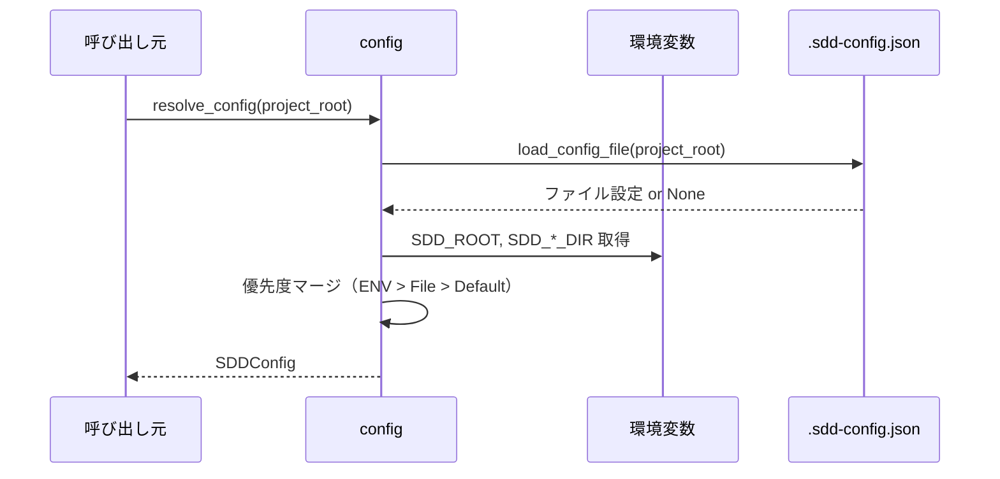

# ドキュメントインデックス機能

**ドキュメント種別:** 抽象仕様書 (Spec)
**SDDフェーズ:** Specify (仕様化)
**最終更新日:** 2026-02-23
**関連 Design Doc:** [document-indexing_design.md](document-indexing_design.md)
**関連 PRD:** [document-indexing.md](../requirement/document-indexing.md)

---

# 1. 背景

AI-SDD (AI-driven Specification-Driven Development) Workflow では `.sdd/` 配下に PRD（requirement）、抽象仕様書（specification）、技術設計書（specification）、タスクログ（task）の各ドキュメントが蓄積される。プロジェクトが成長するにつれ、これらのドキュメントを横断的に参照・検索する必要性が高まる。

sdd-cli のドキュメントインデックス機能は、`.sdd/` 配下の Markdown ドキュメントをスキャン・パースし、SQLite FTS5 (Full-Text Search 5) によるインデックスを構築することで、後続の検索機能（document-search）や依存関係可視化機能（dependency-visualization）の基盤を提供する。

# 2. 概要

本機能は以下の 2 つの CLI コマンドを通じてドキュメントインデックス機能を提供する:

1. **プロジェクト初期化** (`sdd-cli init`): SDD プロジェクトの設定ファイルを生成し、環境を整備する
2. **インデックス構築** (`sdd-cli index`): `.sdd/` 配下のドキュメントをスキャン・パースし、全文検索インデックスを構築する

本仕様書は「何を実現するか」に焦点を当て、技術的な実装詳細は含めない。

# 3. 要求定義

## 3.1. 機能要件 (Functional Requirements)

### プロジェクト初期化

| ID     | 要件                                                         | 優先度    | 根拠                              |
|:-------|:-------------------------------------------------------------|:---------|:----------------------------------|
| FR-001 | `sdd-cli init` で `.sdd-config.json` を生成する               | Must     | UR-001: プロジェクト初期化の基本機能 |
| FR-002 | `--env` オプションで `SDD_*` 環境変数の export 文を出力する     | Should   | CI/CD 環境での利用を想定            |
| FR-003 | `CLAUDE_ENV_FILE` が設定されている場合、当該ファイルに書き出す   | Should   | AI-SDD プラグインとの連携           |

### 設定管理

| ID     | 要件                                                         | 優先度    | 根拠                              |
|:-------|:-------------------------------------------------------------|:---------|:----------------------------------|
| FR-004 | 環境変数 > `.sdd-config.json` > デフォルト値の優先度で設定解決 | Must     | UR-003: 柔軟な設定管理             |
| FR-005 | `.sdd-config.json` の JSON フォーマット妥当性を検証する         | Must     | 不正な設定ファイルの早期検出         |

### ドキュメントスキャン

| ID     | 要件                                                         | 優先度    | 根拠                              |
|:-------|:-------------------------------------------------------------|:---------|:----------------------------------|
| FR-006 | requirement/specification/task ディレクトリの `.md` を再帰スキャン | Must  | UR-002: インデックス化の入力        |
| FR-007 | task ディレクトリでは `index.md` と `tasks.md` のみ対象        | Must     | task ディレクトリの一時的性質に配慮   |
| FR-008 | `.` で始まる隠しファイルをスキャン対象から除外                    | Must     | 設定ファイル等の誤取り込み防止       |

### ドキュメントパース

| ID     | 要件                                                             | 優先度    | 根拠                                  |
|:-------|:-----------------------------------------------------------------|:---------|:--------------------------------------|
| FR-009 | frontmatter から title/feature_id/file_type/tags/depends_on/links を抽出 | Must | UR-002: メタデータによる検索精度向上    |
| FR-010 | feature_id を frontmatter またはファイル名から推定                  | Must     | frontmatter 未設定ドキュメントへの対応  |
| FR-011 | file_type をパス・ファイル名・ディレクトリから推定                   | Must     | ドキュメント分類の自動化               |
| FR-012 | parent_feature_id をディレクトリネスト階層から推定                   | Should   | 階層構造プロジェクトへの対応            |
| FR-013 | fenced code block とインラインコードを除去した検索用コンテンツを生成  | Must     | コードブロックによる検索ノイズ除去      |
| FR-014 | `[text](path.md)` 形式の相対リンクを抽出                          | Must     | 依存関係分析の入力データ               |

### FTS5 インデックス登録

| ID     | 要件                                                         | 優先度    | 根拠                                |
|:-------|:-------------------------------------------------------------|:---------|:------------------------------------|
| FR-015 | SQLite FTS5 全文検索テーブルにドキュメントを登録                 | Must     | UR-002: 全文検索の基盤               |
| FR-016 | メタデータテーブルに構造化データを登録                            | Must     | フィルタリング検索の基盤             |
| FR-017 | インデックス構築時に既存データをクリアして再構築                   | Must     | データ整合性の保証                   |
| FR-018 | metadata.json に日時・ドキュメント数・ルートパスを保存             | Should   | インデックス状態の可視化             |

### キャッシュディレクトリ管理

| ID     | 要件                                                         | 優先度    | 根拠                                |
|:-------|:-------------------------------------------------------------|:---------|:------------------------------------|
| FR-019 | XDG Base Directory 準拠のプロジェクト別キャッシュ生成            | Must     | UR-004: プロジェクト間の干渉防止     |
| FR-020 | プロジェクトパスの SHA-256 先頭 8 文字でキャッシュを一意識別      | Must     | ディレクトリ名衝突の回避             |

## 3.2. 非機能要件 (Non-Functional Requirements)

| ID      | カテゴリ   | 要件                                               | 目標値               |
|:--------|:----------|:---------------------------------------------------|:--------------------|
| NFR-001 | 互換性     | Python 3.9〜3.13 で動作する                          | CI マトリックスで検証 |
| NFR-002 | 依存性     | ランタイム依存は Click + python-frontmatter のみ      | 2 パッケージ以下      |
| NFR-003 | UX        | インデックス構築時に進捗を表示する                      | 10 件ごとに表示       |
| NFR-004 | UX        | `--quiet` で全出力を抑制できる                         | 完全抑制              |
| NFR-005 | 堅牢性     | パース失敗時にスキップして残りを継続する                  | 全ファイル処理完了    |
| NFR-006 | エラー処理 | SDD ルート不在時に明確なエラーメッセージを返す            | 1 行のエラー文        |
| NFR-007 | テスト戦略 | ユニットテスト + 統合テストでカバレッジ 80% 以上を維持     | 80% 以上 (CI で検証)  |

# 4. API

## 4.1. CLI コマンド

| コマンド         | サブコマンド | オプション                | 概要                                    |
|:----------------|:-----------|:------------------------|:----------------------------------------|
| `sdd-cli`       | `init`     | `--root`, `--env`       | SDD プロジェクト初期化・設定ファイル生成    |
| `sdd-cli`       | `index`    | `--root`, `--quiet`     | ドキュメントインデックス構築               |

## 4.2. モジュール公開 API

| pkg (ディレクトリ名) | class (ファイル名)  | member                                    | 概要                                        |
|:-------------------|:-------------------|:------------------------------------------|:--------------------------------------------|
| `sdd_cli`          | `config`           | `load_config_file(project_root)`          | `.sdd-config.json` を読み込み設定を返す       |
| `sdd_cli`          | `config`           | `resolve_config(project_root)`            | 優先度に基づき設定を解決する                   |
| `sdd_cli`          | `config`           | `resolve_sdd_root(project_root)`          | SDD ルートディレクトリの Path を返す           |
| `sdd_cli`          | `cache`            | `get_cache_dir(project_root)`             | プロジェクト別キャッシュディレクトリを返す       |
| `sdd_cli`          | `cache`            | `get_project_hash(project_root)`          | プロジェクトパスの SHA-256 ハッシュを返す       |
| `sdd_cli.indexer`  | `scanner`          | `DocumentScanner(root, directories)`      | スキャナーを初期化する                         |
| `sdd_cli.indexer`  | `scanner`          | `DocumentScanner.scan_all()`              | 全ディレクトリをスキャンし結果リストを返す       |
| `sdd_cli.indexer`  | `scanner`          | `DocumentScanner.scan_directory(dir)`     | 特定ディレクトリをスキャンする                  |
| `sdd_cli.indexer`  | `parser`           | `DocumentParser.parse(path, dir, rel)`    | ドキュメントをパースしメタデータを返す           |
| `sdd_cli.indexer`  | `db`               | `IndexDB(db_path)`                        | インデックスDB を初期化する                     |
| `sdd_cli.indexer`  | `db`               | `IndexDB.index_document(doc, parsed)`     | ドキュメントをインデックスに登録する             |
| `sdd_cli.indexer`  | `db`               | `IndexDB.clear()`                         | 全インデックスデータをクリアする                 |
| `sdd_cli.commands` | `init`             | `initialize_project(root, env)`           | プロジェクトを初期化する                        |
| `sdd_cli.commands` | `index`            | `build_index(root, quiet)`                | インデックスを構築する                          |

## 4.3. 型定義

```python
class DocumentInfo(TypedDict):
    file_path: str       # SDD ルートからの相対パス
    file_name: str       # ファイル名
    directory: str       # ディレクトリ種別 (requirement/specification/task)

class ScanResult(DocumentInfo):
    full_path: str       # ファイルの絶対パス

class ParsedDocument(TypedDict):
    title: str                        # ドキュメントタイトル
    feature_id: str                   # 機能ID
    file_type: str                    # ファイル種別 (requirement/spec/design/task)
    parent_feature_id: str            # 親機能ID
    tags: list[str]                   # タグリスト
    depends_on: list[str]             # 依存先リスト
    content: str                      # コードブロック除去後のコンテンツ
    links: list[str]                  # 相対リンクリスト

class SDDDirectories(TypedDict):
    requirement: str
    specification: str
    task: str

class SDDConfig(TypedDict):
    root: str
    lang: str
    directories: SDDDirectories
```

# 5. 用語集

| 用語                | 説明                                                          |
|:-------------------|:--------------------------------------------------------------|
| SDD                | Specification-Driven Development。仕様駆動開発                  |
| FTS5               | Full-Text Search 5。SQLite の全文検索拡張モジュール              |
| trigram tokenizer  | 3 文字ずつの部分文字列に分割するトークナイザー。日本語検索に有効   |
| frontmatter        | Markdown ファイル先頭の `---` で囲まれた YAML メタデータ領域      |
| XDG Base Directory | Linux/macOS のディレクトリ配置標準仕様                           |
| feature_id         | ドキュメントが属する機能を識別する ID                             |
| file_type          | ドキュメントの分類（requirement/spec/design/task）               |
| parent_feature_id  | 階層構造における親機能の feature_id                               |

# 6. 使用例

```python
from pathlib import Path
from sdd_cli.config import resolve_config, resolve_sdd_root
from sdd_cli.cache import get_cache_dir
from sdd_cli.indexer.scanner import DocumentScanner
from sdd_cli.indexer.parser import DocumentParser
from sdd_cli.indexer.db import IndexDB

project_root = Path(".")

# 設定を解決
config = resolve_config(project_root)
sdd_root = resolve_sdd_root(project_root)

# ドキュメントをスキャン
scanner = DocumentScanner(sdd_root, config["directories"])
results = scanner.scan_all()

# キャッシュディレクトリにインデックスDBを作成
cache_dir = get_cache_dir(project_root)
db = IndexDB(cache_dir / "index.db")
db.clear()

# 各ドキュメントをパース＆インデックス登録
for scan_result in results:
    parsed = DocumentParser.parse(
        Path(scan_result["full_path"]),
        scan_result["directory"],
        scan_result["file_path"],
    )
    db.index_document(scan_result, parsed)
```

# 7. 振る舞い図

## 7.1. インデックス構築フロー



## 7.2. プロジェクト初期化フロー



## 7.3. 設定解決フロー



# 8. 制約事項

- SQLite FTS5 の trigram tokenizer を使用するため、SQLite 3.9.0 以上が必要
- `importlib.resources` の API が Python 3.9 と 3.10 以降で異なるため互換処理が必要
- AI-SDD Workflow プラグインとの互換性を維持する（`.sdd/` ディレクトリ構造の規約準拠）
- インクリメンタルインデックス更新は本仕様のスコープ外（常に全クリア＆再構築）

---

## PRD Reference

- 対応 PRD: [.sdd/requirement/document-indexing.md](../requirement/document-indexing.md)
- カバーする要求: UR-001, UR-002, UR-003, UR-004, FR-001〜FR-020, NFR-001〜NFR-006
