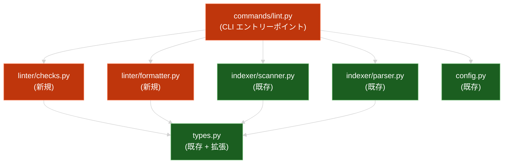

# document-lint

**ドキュメント種別:** 技術設計書 (Design Doc)
**SDDフェーズ:** Plan (計画/設計)
**最終更新日:** 2026-03-02
**関連 Spec:** [document-lint_spec.md](document-lint_spec.md)
**関連 PRD:** [document-lint.md](../requirement/document-lint.md)

---

# 1. 実装ステータス

**ステータス:** 🟢 実装完了

| モジュール/機能 | ステータス | 備考 |
|:--|:--|:--|
| `commands/lint.py` | 🟢 | CLI サブコマンド定義 + run_lint オーケストレーション |
| `linter/checks.py` | 🟢 | 4 種類のチェックロジック（循環依存・リンク検証・必須フィールド・ID整合性） |
| `linter/formatter.py` | 🟢 | テキスト/JSON 出力フォーマッター |
| `linter/__init__.py` | 🟢 | パッケージ初期化 |
| テスト | 🟢 | ユニットテスト 26 件 + 統合テスト 12 件（全 38 件パス） |

---

# 2. 設計目標

1. **既存アーキテクチャとの整合** — 既存の commands/ → indexer/ → types.py のレイヤードアーキテクチャに従い、`commands/lint.py` → `linter/` の単方向依存フローを維持する
2. **既存モジュールの再利用** — `DocumentScanner` と `DocumentParser` を直接再利用し、ファイルスキャンとフロントマッタパースのコードを重複させない
3. **インデックス非依存** — SQLite インデックスに依存せず、ファイルシステムから直接スキャンして動作する。`sdd-cli index` の事前実行を不要とする
4. **拡張性** — 新しいチェックルールの追加が関数の追加のみで完結する設計とする

---

# 3. 技術スタック

| 領域 | 採用技術 | 選定理由 |
|:--|:--|:--|
| CLI | Click | 既存コマンドと統一。`cli.py` の `main` グループに追加 |
| フロントマッタ解析 | python-frontmatter（既存） | `DocumentParser` 経由で再利用 |
| ファイルスキャン | `DocumentScanner`（既存） | `.sdd/` 配下の `.md` ファイル収集を再利用 |
| 循環検出 | Python 標準ライブラリ（再帰 DFS） | 外部依存不要。小規模グラフに十分な性能 |
| JSON 出力 | Python 標準ライブラリ `json` | 外部依存不要 |

---

# 4. アーキテクチャ

## 4.1. システム構成図



## 4.2. モジュール分割

| モジュール名 | 責務 | 依存関係 | 配置場所 |
|:--|:--|:--|:--|
| `commands/lint.py` | CLI サブコマンド定義。スキャン→パース→チェック→フォーマットのオーケストレーション | Scanner, Parser, checks, formatter, config | `src/sdd_cli/commands/lint.py` |
| `linter/__init__.py` | パッケージ初期化 | なし | `src/sdd_cli/linter/__init__.py` |
| `linter/checks.py` | 4 種類の静的解析ロジック（各チェックは独立した関数） | types | `src/sdd_cli/linter/checks.py` |
| `linter/formatter.py` | 検出結果のテキスト/JSON フォーマット | types, json | `src/sdd_cli/linter/formatter.py` |

## 4.3. レイヤー配置

```
commands/lint.py          # CLI layer (presentation)
    ↓
linter/checks.py          # Processing layer (application)
linter/formatter.py        # Processing layer (application)
    ↓
indexer/scanner.py         # Processing layer (既存、再利用)
indexer/parser.py          # Processing layer (既存、再利用)
    ↓
types.py                   # Type definitions (no dependencies)
config.py                  # Configuration layer
```

---

# 5. データモデル

```python
from typing import Optional

class LintIssue(TypedDict):
    severity: str          # "error" | "warning"
    rule: str              # "circular-dependency" | "broken-link" | ...
    file_path: str         # 相対パス
    line: Optional[int]    # 行番号（リンク検証時のみ）
    message: str           # 問題の説明
    details: Optional[str] # 追加情報

class LintResult(TypedDict):
    issues: list           # list[LintIssue]
    error_count: int
    warning_count: int
    files_checked: int
```

`LintIssue` と `LintResult` は `types.py` に追加する。

---

# 6. インターフェース定義

## 6.1. commands/lint.py

```python
@main.command()
@click.option("--root", type=click.Path(exists=True), default=".")
@click.option("--json", "json_output", is_flag=True, default=False)
@click.option("--quiet", is_flag=True, default=False)
def lint(root: str, json_output: bool, quiet: bool) -> None:
    """ドキュメントの静的解析を実行する。"""
    output, has_errors = run_lint(Path(root), json_output, quiet)
    click.echo(output)
    if has_errors:
        raise SystemExit(1)

def run_lint(root: Path, json_output: bool, quiet: bool) -> tuple[str, bool]:
    """lint のコアロジック。テスト可能なエントリーポイント。

    処理フロー:
    1. DocumentScanner.scan_all() でファイル一覧を取得
    2. task/ ディレクトリのファイルを除外
    3. DocumentParser.parse() で各ファイルをパース → ParsedDocument リスト
       - YAML パースエラーは yaml-parse-error として error 報告し、該当ファイルはスキップ
       - フロントマッタなしのファイルはスキップ（lint 対象外）
    4. ParsedDocument から DocumentRecord 相当のデータを構築
    5. 4 種類のチェックを実行（parsed_docs も check_id_integrity に渡す）
    6. LintResult を構築し、format_issues でフォーマット
    7. quiet=True かつ問題 0 件の場合は空文字列を返す

    Returns:
        tuple[str, bool]: (フォーマット済み出力, error レベルの問題が存在するか)
    """
    ...
```

## 6.2. linter/checks.py

```python
def check_circular_dependencies(
    documents: list[DocumentRecord],
) -> list[LintIssue]:
    """depends-on フィールドの循環依存を検出する。

    documents から depends_on を収集して有向グラフを構築し、
    DFS で循環を検出する。
    """
    ...

def check_broken_links(
    documents: list[DocumentRecord],
    sdd_root: Path,
) -> list[LintIssue]:
    """Markdown 内の相対リンクのリンク先存在を検証する。

    documents の links フィールド（パーサーが抽出済み）を使用し、
    各リンク先ファイルの存在を確認する。
    外部 URL（http/https）とアンカーリンク（#）はスキップする。
    """
    ...

def check_required_fields(
    documents: list[DocumentRecord],
) -> list[LintIssue]:
    """ドキュメントタイプに応じた必須フィールドの欠落を検出する。

    各ドキュメントの type フィールドに基づき、必須フィールドの
    存在と値の妥当性を検証する。
    """
    ...

def check_id_integrity(
    documents: list[DocumentRecord],
    parsed_docs: list[ParsedDocument],
) -> list[LintIssue]:
    """要求 ID の一意性と参照整合性を検証する。

    - id フィールドの重複検出
    - depends-on に記載された ID のドキュメントが存在しない場合を
      unresolved-dependency として warning 報告
    - parsed_docs の content フィールドから要求 ID パターン
      （UR-xxx, FR-xxx, NFR-xxx）を正規表現で抽出し、
      requirement/ 内の定義との整合性を確認する
    - コードブロック内のパターンは除外する
    """
    ...
```

## 6.3. linter/formatter.py

```python
def format_issues(
    result: LintResult,
    json_output: bool,
) -> str:
    """LintResult をテキストまたは JSON 形式にフォーマットする。"""
    ...
```

---

# 7. 非機能要件実現方針

| 要件 | 実現方針 |
|:--|:--|
| NFR-001: 5 秒以内 | ファイルシステム直接スキャン。SQLite を経由しないためオーバーヘッドが小さい。`DocumentParser.parse()` は frontmatter のみ解析し、FTS 不要 |
| NFR-002: 既存モジュール再利用 | `DocumentScanner.scan_all()` と `DocumentParser.parse()` を直接利用。パース結果の `depends_on`, `links`, `id`, `type`, `status` 等のフィールドをそのままチェックに使用 |
| パストラバーサル防止 | リンク検証時に `resolve()` 後のパスが `sdd_root` 配下であることを確認。外部パスへのリンクは error として報告 |

---

# 8. テスト戦略

| テストレベル | 対象 | カバレッジ目標 |
|:--|:--|:--|
| ユニットテスト | `linter/checks.py` の各チェック関数 | 80%+ |
| ユニットテスト | `linter/formatter.py` のフォーマット関数 | 80%+ |
| 統合テスト | `commands/lint.py` の `run_lint()` | 主要パス |
| CLI テスト | Click テストランナーによる CLI 実行 | 主要パス |

**テストアプローチ:**

- `DocumentRecord` の辞書を直接構築してチェック関数に渡す（ファイル不要）
- `tmp_path` フィクスチャで `.sdd/` 構造を一時的に構築してリンク検証をテスト
- `conftest.py` に lint 用フィクスチャを追加
- 既存の `helpers.py` の `write_md()`, `sample_doc_info()`, `sample_parsed_data()` を活用

---

# 9. 設計判断

## 9.1. 決定事項

| 決定事項 | 選択肢 | 決定内容 | 理由 |
|:--|:--|:--|:--|
| チェック結果のデータ構造 | (A) 辞書 (B) TypedDict (C) dataclass | TypedDict | 既存の types.py パターンに統一。Python 3.9 互換を維持 |
| チェックの実行方式 | (A) クラスベース (B) 関数ベース | 関数ベース | 各チェックはステートレスであり、関数で十分。既存の parser.py のパターンに倣う |
| インデックス DB の利用 | (A) DB を利用 (B) 直接スキャン | 直接スキャン | `sdd-cli index` の事前実行を不要とするため。lint は独立した操作として設計 |
| 新規パッケージの配置 | (A) indexer/ に追加 (B) 新規 linter/ パッケージ | 新規 linter/ パッケージ | 責務が異なる（indexer はインデックス構築、linter は検証）。A-002 レイヤー分離原則に従う |
| リンク検証の対象 | (A) パーサー抽出済みリンク (B) 再度正規表現で抽出 | パーサー抽出済みリンク | `DocumentParser._extract_links()` が既に相対リンクを抽出しているため再利用。ただし行番号は ParsedDocument に含まれないため、壊れたリンク検出時に再スキャンして行番号を特定する |
| 循環検出アルゴリズム | (A) DFS (B) トポロジカルソート (C) Kahn's algorithm | DFS | 循環パスの報告が容易。小規模グラフ（〜100 ノード）で十分な性能 |
| 要求 ID 抽出のデータソース | (A) ParsedDocument 保持 (B) DocumentRecord に content 追加 (C) ファイル再読み込み | ParsedDocument 保持 | types.py の変更不要。run_lint で ParsedDocument リストを保持し check_id_integrity に渡す |
| フロントマッタなしの扱い | (A) スキップ (B) warning (C) error | スキップ | AI-SDD リファレンスで「フロントマッタなしは valid」と定義されている。YAML 構文エラーのみ error |
| task ディレクトリの lint 対象 | (A) 含めない (B) 含める (C) リンク検証のみ | 含めない | task/ は一時的なチケットログであり、フロントマッタの品質管理対象外 |
| --quiet の動作 | (A) 問題 0 件で抑制 (B) サマリーのみ (C) error のみ表示 | 問題 0 件で抑制 | 問題がある場合は全件出力し、問題なしの場合のみ出力を抑制。CI での利用を考慮 |
| depends-on 未解決 ID の報告先 | (A) check_id_integrity (B) check_circular_dependencies (C) 両方 | check_id_integrity | orphan-reference / unresolved-dependency の責務として一元管理。循環検出は未解決 ID を無視してグラフ構築 |

## 9.2. 未解決の課題

| 課題 | 影響度 | 対応方針 |
|:--|:--|:--|
| 要求 ID 参照の抽出精度 | 中 | spec/design の本文から `UR-xxx`, `FR-xxx`, `NFR-xxx` パターンを正規表現で抽出する。コードブロック内のパターンは除外する |
| `--fix` オプションの将来対応 | 低 | 本バージョンではスコープ外。チェック関数の戻り値に修正提案情報を含めることで将来の拡張に備える |
