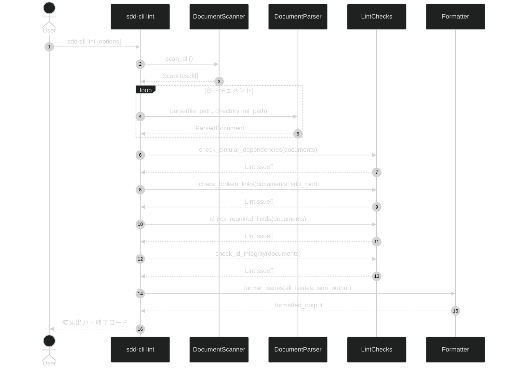

# document-lint

**ドキュメント種別:** 抽象仕様書 (Spec)
**SDDフェーズ:** Specify (仕様化)
**最終更新日:** 2026-03-02
**関連 Design Doc:** [document-lint_design.md](document-lint_design.md)
**関連 PRD:** [document-lint.md](../requirement/document-lint.md)

---

# 1. 背景

AI-SDD ワークフローでは `.sdd/` 配下に複数のドキュメント（PRD, spec, design, task）が管理され、`depends-on` による依存関係、Markdown リンクによる相互参照、YAML フロントマッタによるメタデータ管理が行われる。ドキュメントが増加するにつれ、循環依存、壊れたリンク、必須フィールドの欠落、要求 ID の参照不整合といった構造的問題が発生しやすくなる。

現状ではこれらの問題を手動で確認するか、個別のレビューエージェント（prd-reviewer, spec-reviewer）に依存している。CLI コマンドとして統合的な静的解析を提供することで、ローカル開発と CI/CD パイプラインの両方でドキュメント品質を継続的に担保する。

# 2. 概要

`sdd-cli lint` コマンドは、`.sdd/` 配下の `requirement/` および `specification/` ディレクトリのドキュメントに対して以下の4種類の静的解析を実行し、検出した問題を重大度付きで報告する。`task/` ディレクトリは一時的なチケットログであるため lint 対象外とする。

1. **循環依存検出** — `depends-on` フィールドの依存関係グラフから循環を検出
2. **リンク検証** — Markdown 内の相対リンクのリンク先存在を検証
3. **必須フィールド検証** — ドキュメントタイプに応じた YAML フロントマッタの必須フィールドを検証
4. **ID 整合性検証** — 要求 ID の一意性とドキュメント間の参照整合性を検証

各解析は独立して実行可能であり、結果はテキストまたは JSON 形式で出力される。error レベルの問題が検出された場合は非ゼロ終了コードを返す。

# 3. 要求定義

## 3.1. 機能要件 (Functional Requirements)

| ID | 要件 | 優先度 | PRD参照 |
|:--|:--|:--|:--|
| FR-001 | `depends-on` フィールドの循環依存を検出できること | 必須 | PRD FR-001 |
| FR-002 | Markdown 内の相対リンクの存在を検証できること | 必須 | PRD FR-002 |
| FR-003 | ドキュメントタイプに応じた必須フィールドの欠落を検出できること | 推奨 | PRD FR-003 |
| FR-004 | 要求 ID の一意性と参照整合性を検証できること | 推奨 | PRD FR-004 |
| FR-005 | 解析結果をテキスト形式と JSON 形式で出力できること | 必須 | PRD FR-005 |
| FR-006 | error レベルの問題検出時に終了コード 1 を返すこと | 必須 | PRD FR-006 |

## 3.2. 非機能要件 (Non-Functional Requirements)

| ID | カテゴリ | 要件 | 目標値 |
|:--|:--|:--|:--|
| NFR-001 | 性能 | 100 ファイル規模のプロジェクトで全解析が完了すること | 5 秒以内 |
| NFR-002 | 保守性 | 既存のスキャン・パース・依存関係分析ロジックを再利用すること | コード重複最小化 |

# 4. API

## 4.1. CLI インターフェース

| コマンド | オプション | 概要 |
|:--|:--|:--|
| `sdd-cli lint` | `--root PATH` | 解析対象のプロジェクトルート（デフォルト: カレントディレクトリ） |
| | `--json` | 結果を JSON 形式で出力 |
| | `--quiet` | 問題が 0 件（error/warning ともになし）の場合に出力を抑制。問題がある場合は通常通り全件出力する |

## 4.2. 公開 API

| pkg | module | function | 概要 |
|:--|:--|:--|:--|
| sdd_cli.commands | lint | `run_lint(root, json_output, quiet) -> tuple[str, bool]` | lint コマンドのエントリーポイント。全チェックを実行し、(出力文字列, エラー有無) を返す |
| sdd_cli.linter | checks | `check_circular_dependencies(documents) -> list[LintIssue]` | 循環依存を検出する |
| sdd_cli.linter | checks | `check_broken_links(documents, sdd_root) -> list[LintIssue]` | 壊れたリンクを検出する |
| sdd_cli.linter | checks | `check_required_fields(documents) -> list[LintIssue]` | 必須フィールドの欠落を検出する |
| sdd_cli.linter | checks | `check_id_integrity(documents, parsed_docs) -> list[LintIssue]` | ID 整合性を検証する。`parsed_docs` は `ParsedDocument` のリストで本文の `content` フィールドから要求 ID を抽出する |
| sdd_cli.linter | formatter | `format_issues(result, json_output) -> str` | LintResult をフォーマットする |

## 4.3. データモデル

### LintIssue

解析で検出された個別の問題を表す。

| フィールド | 型 | 説明 |
|:--|:--|:--|
| `severity` | `str` | 重大度。`"error"` または `"warning"` |
| `rule` | `str` | 検出ルール名（例: `"circular-dependency"`, `"broken-link"`） |
| `file_path` | `str` | 問題のあるファイルの相対パス |
| `line` | `Optional[int]` | 問題のある行番号（リンク検証時のみ） |
| `message` | `str` | 問題の説明メッセージ |
| `details` | `Optional[str]` | 追加情報（循環パス、リンク先パス等） |

### LintResult

全チェックの実行結果を集約する。

| フィールド | 型 | 説明 |
|:--|:--|:--|
| `issues` | `list[LintIssue]` | 検出された全問題のリスト |
| `error_count` | `int` | error レベルの問題数 |
| `warning_count` | `int` | warning レベルの問題数 |
| `files_checked` | `int` | 検査対象ファイル数 |

### ルール定義

| ルール名 | 重大度 | 説明 |
|:--|:--|:--|
| `circular-dependency` | error | `depends-on` の循環依存 |
| `broken-link` | error | リンク先ファイルが存在しない |
| `missing-required-field` | warning | 必須フィールドの欠落 |
| `invalid-field-value` | warning | フィールド値が許容値外 |
| `duplicate-id` | error | ドキュメント ID の重複 |
| `orphan-reference` | warning | 参照先の要求 ID が存在しない |
| `unresolved-dependency` | warning | `depends-on` に記載された ID のドキュメントが存在しない |
| `yaml-parse-error` | error | YAML フロントマッタの構文エラー |

### ドキュメントタイプ別必須フィールド

| ドキュメントタイプ | 必須フィールド |
|:--|:--|
| `prd` | `id`, `title`, `type`, `status`, `created`, `updated` |
| `spec` | `id`, `title`, `type`, `status`, `created`, `updated` |
| `design` | `id`, `title`, `type`, `status`, `created`, `updated`, `impl-status` |

### status フィールドの許容値

| ドキュメントタイプ | 許容値 |
|:--|:--|
| `prd` / `spec` / `design` | `draft`, `active`, `review`, `approved`, `deprecated` |

### impl-status フィールドの許容値（design のみ）

`not-implemented`, `in-progress`, `implemented`

### フロントマッタの存在に関する扱い

| 状態 | 扱い |
|:--|:--|
| フロントマッタなし | lint 対象外としてスキップする（AI-SDD リファレンスに準拠: フロントマッタなしのドキュメントは valid） |
| YAML 構文エラー | `yaml-parse-error` ルールで error として報告する |

### lint 対象ディレクトリ

| ディレクトリ | 対象 |
|:--|:--|
| `requirement/` | 対象 |
| `specification/` | 対象 |
| `task/` | **対象外**（一時的なチケットログのため） |

# 5. 用語集

| 用語 | 説明 |
|:--|:--|
| 循環依存 | 依存関係グラフにおいて A → B → C → A のように循環している状態 |
| 壊れたリンク | リンク先ファイルが存在しない Markdown 相対リンク |
| LintIssue | 静的解析で検出された個別の問題を表すデータ構造 |
| ルール | 個別の検証ロジックを識別する名前（`circular-dependency` 等） |

# 6. 使用例

```python
# CLI からの実行
# $ sdd-cli lint
# $ sdd-cli lint --json
# $ sdd-cli lint --root /path/to/project --quiet

# プログラム的な利用
from sdd_cli.commands.lint import run_lint

result = run_lint(root=Path("."), json_output=False, quiet=False)
print(result)
```

**テキスト出力例:**

```
Linting .sdd/ ...

ERROR circular-dependency .sdd/requirement/a.md
  Circular dependency detected: a.md → b.md → a.md

ERROR broken-link .sdd/specification/auth_spec.md:42
  Link target does not exist: ../requirement/missing.md

WARNING missing-required-field .sdd/specification/old_design.md
  Required field 'impl-status' is missing for document type 'design'

WARNING orphan-reference .sdd/specification/auth_spec.md
  Referenced requirement ID 'FR-099' not found in requirement/

Found 2 errors, 2 warnings in 15 files
```

**JSON 出力例:**

```json
{
  "issues": [
    {
      "severity": "error",
      "rule": "circular-dependency",
      "file_path": ".sdd/requirement/a.md",
      "line": null,
      "message": "Circular dependency detected: a.md → b.md → a.md",
      "details": "a.md → b.md → a.md"
    }
  ],
  "error_count": 2,
  "warning_count": 2,
  "files_checked": 15
}
```

# 7. 振る舞い図



# 8. 制約事項

- Python 3.9〜3.13 互換であること
- 外部ランタイム依存を追加しないこと（Click, python-frontmatter のみ使用）
- ファイルパス操作はプロジェクトルート（`.sdd/` ディレクトリ）配下に限定し、パストラバーサルを防止すること
- lint はインデックス（SQLite DB）に依存せず、ファイルシステムから直接スキャン・パースして動作すること

---

## PRD 整合性確認

| チェック項目 | 結果 |
|:--|:--|
| PRD 機能要求（FR-001〜FR-006）のカバレッジ | 全 6 件カバー済み |
| PRD 非機能要求（NFR-001〜NFR-002）の反映 | 全 2 件反映済み |
| 用語の一貫性 | PRD と統一済み |
