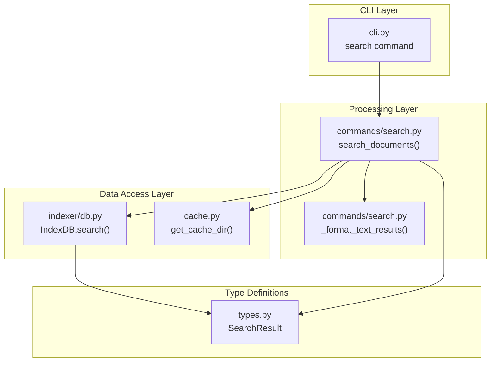

# ドキュメント検索機能

**ドキュメント種別:** 技術設計書 (Design Doc)
**SDDフェーズ:** Plan (計画/設計)
**最終更新日:** 2026-03-12
**関連 Spec:** [document-search_spec.md](document-search_spec.md)
**関連 PRD:** [document-search.md](../requirement/document-search.md)

---

# 1. 実装ステータス

**ステータス:** 🟢 実装完了

## 1.1. 実装進捗

| モジュール/機能 | ステータス | 備考 |
|:-------------|:---------|:-----|
| cli.py (search コマンド定義) | 🟢 | `--filter`/`--or`/`--parent` 追加済み |
| commands/search.py | 🟢 | フィルタ DSL・親子トラバーサル対応済み。`_parse_filter()` 追加 |
| indexer/db.py (search メソッド) | 🟢 | DSL/OR/regex/parent 全対応済み |
| indexer/db.py (REGEXP UDF) | 🟢 | `conn.create_function("REGEXP", 2, _regexp_func)` で実装済み |
| indexer/db.py (get_descendants) | 🟢 | Python 反復クエリで実装済み |
| types.py (FilterCondition) | 🟢 | `MatchOp` + `FilterCondition` TypedDict 追加済み |
| types.py (SearchResult 拡張) | 🟢 | id/type/status/created/updated/category フィールド実装済み |

---

# 2. 設計目標

1. **レイヤー分離**: CLI → commands/search → indexer/db の単方向依存を維持する（CONSTITUTION A-002）
2. **最小依存**: 検索機能のランタイム依存は Click のみ。SQLite は標準ライブラリを使用する（CONSTITUTION A-003）
3. **Python 3.9-3.13 互換**: すべてのモジュールで Python 3.9 互換構文を使用する（CONSTITUTION T-001）
4. **SQL セーフティ**: すべての SQLite クエリをパラメータ化し、SQL インジェクションを防止する（CONSTITUTION T-002）
5. **パス安全性**: ファイルパス操作は pathlib.Path を使用し、パストラバーサル攻撃を防止する（CONSTITUTION T-003）
6. **テスタビリティ**: 各モジュールを独立してテスト可能に設計する（CONSTITUTION D-002）
7. **フィルタ DSL 拡張性**: `--filter "field:op:value"` 構文で任意のメタデータフィールドへの完全一致・部分一致・正規表現マッチを提供する（FR-014〜017）
8. **論理演算子サポート**: `--or` フラグで異なるフィールド間も含む OR 結合を実現する（FR-015）
9. **正規表現 UDF**: SQLite の REGEXP 演算子を Python `re.search()` で実装し DB 接続時に登録する（FR-017）
10. **親子再帰トラバーサル**: Python 側の反復クエリで `parent_feature_id` チェーンを辿り全子孫を収集する（FR-016）

---

# 3. 技術スタック

| 領域 | 採用技術 | 選定理由 |
|:----|:--------|:--------|
| CLI フレームワーク | Click >= 8.1.0 | コマンドオプション・Choice 型の宣言的記述が容易 |
| 全文検索エンジン | SQLite FTS5 (stdlib) | ゼロコンフィグ・組み込み DB。trigram で日本語対応 |
| JSON 処理 | json (stdlib) | 検索結果の JSON 出力・タグのパース |
| パス操作 | pathlib (stdlib) | 安全なパス構築。パストラバーサル防止 |

---

# 4. アーキテクチャ

## 4.1. システム構成図



## 4.2. モジュール分割

| モジュール名 | 責務 | 依存関係 | 配置場所 |
|:-----------|:-----|:--------|:--------|
| `cli.py` (search コマンド) | Click オプション定義（`--filter`/`--or`/`--parent` 追加）、ファイル出力処理 | `commands/search` | `src/sdd_cli/cli.py` |
| `commands/search.py` | 検索実行、インデックス存在確認、フォーマット | `cache`, `indexer/db`, `types` | `src/sdd_cli/commands/search.py` |
| `indexer/db.py` (search メソッド) | FTS5 クエリ構築・実行、フィルタ DSL 処理、タグ JSON パース | `types` | `src/sdd_cli/indexer/db.py` |
| `indexer/db.py` (REGEXP UDF) | Python `re.search()` を SQLite の REGEXP 演算子として登録 | `re` (stdlib) | `src/sdd_cli/indexer/db.py` |
| `indexer/db.py` (get_descendants) | `parent_feature_id` を再帰的に辿り全子孫 feature_id を返す | `types` | `src/sdd_cli/indexer/db.py` |
| `types.py` (FilterCondition) | フィルタ DSL の構造体 TypedDict 定義 | なし | `src/sdd_cli/types.py` |
| `types.py` (SearchResult) | 検索結果の TypedDict 定義（拡張フィールド追加） | なし | `src/sdd_cli/types.py` |

---

# 5. データモデル

## 5.1. 検索クエリの SQL 構造

### クエリ指定時（FTS5 MATCH）

```sql
SELECT
    fts.file_path, fts.file_name, fts.directory, fts.file_type,
    fts.title, fts.feature_id,
    meta.parent_feature_id, meta.tags,
    meta.id, meta.type, meta.status, meta.created, meta.updated, meta.category,
    snippet(documents_fts, 7, '...', '...', '', 50) as snippet,
    rank
FROM documents_fts fts
LEFT JOIN documents_meta meta ON fts.file_path = meta.file_path
WHERE documents_fts MATCH ?
  [AND fts.feature_id = ?]
  [AND fts.tags LIKE ?]
  [AND fts.directory = ?]
ORDER BY rank
LIMIT ?
```

### クエリなし時（全件取得）

```sql
SELECT
    fts.file_path, fts.file_name, fts.directory, fts.file_type,
    fts.title, fts.feature_id,
    meta.parent_feature_id, meta.tags,
    meta.id, meta.type, meta.status, meta.created, meta.updated, meta.category,
    substr(fts.content, 1, 150) as snippet
FROM documents_fts fts
LEFT JOIN documents_meta meta ON fts.file_path = meta.file_path
WHERE 1=1
  [AND fts.feature_id = ?]
  [AND fts.tags LIKE ?]
  [AND fts.directory = ?]
ORDER BY fts.file_path
LIMIT ?
```

## 5.3. フィルタ DSL SQL パターン（AND 結合）

```sql
-- op=exact: 完全一致
WHERE meta.status = ?

-- op=contains: 部分一致
WHERE meta.status LIKE ?   -- 値は "%value%"

-- op=regex: 正規表現（Python UDF）
WHERE REGEXP(meta.feature_id, ?)  -- REGEXP(pattern, value)
```

## 5.4. フィルタ DSL SQL パターン（OR 結合）

```sql
-- --or フラグ指定時（異なるフィールド間も可）
WHERE (meta.type = ? OR meta.directory = ?)

-- FTS5 クエリとの組み合わせ
WHERE documents_fts MATCH ?
  AND (meta.type = ? OR meta.status = ?)
```

## 5.5. 親子再帰トラバーサル（Python 側実装）

```python
def get_descendants(feature_id: str) -> set[str]:
    visited = set()
    queue = [feature_id]
    while queue:
        current = queue.pop()
        if current in visited:
            continue
        visited.add(current)
        # SELECT feature_id FROM documents_meta WHERE parent_feature_id = ?
        children = _get_children(current)
        queue.extend(children)
    return visited - {feature_id}  # 自身は除外
```

## 5.6. Python 型定義

```python
from typing import Literal, Optional, TypedDict

MatchOp = Literal["exact", "contains", "regex"]

class FilterCondition(TypedDict):
    field: str
    op: MatchOp
    value: str

class SearchResult(TypedDict):
    file_path: str
    file_name: str
    directory: str
    file_type: str
    title: str
    feature_id: str
    parent_feature_id: Optional[str]
    tags: list[str]
    id: Optional[str]
    type: Optional[str]
    status: Optional[str]
    created: Optional[str]
    updated: Optional[str]
    category: Optional[str]
    snippet: Optional[str]
```

---

# 6. インターフェース定義

## 6.1. search モジュール

```python
from pathlib import Path
from typing import Optional

def search_documents(
    root: Path,
    query: Optional[str] = None,
    feature_id: Optional[str] = None,
    tag: Optional[str] = None,
    directory: Optional[str] = None,
    filters: Optional[list[FilterCondition]] = None,
    or_operator: bool = False,
    parent: Optional[str] = None,
    output_format: str = "text",
    limit: int = 10,
) -> str:
    """検索を実行し、フォーマット済み文字列を返す。

    インデックス未存在時は ValueError を発生させる。
    """
    ...

def _format_text_results(
    results: list[SearchResult],
    query: Optional[str],
) -> str:
    """検索結果を text 形式にフォーマットする。

    結果なし時は "No results found." を返す。
    snippet 内の改行はスペースに置換する。
    """
    ...
```

## 6.2. IndexDB メソッド

```python
def search(
    self,
    query: Optional[str] = None,
    feature_id: Optional[str] = None,
    tag: Optional[str] = None,
    directory: Optional[str] = None,
    filters: Optional[list[FilterCondition]] = None,
    or_operator: bool = False,
    parent: Optional[str] = None,
    limit: int = 10,
) -> list[SearchResult]:
    """FTS5 検索を実行し結果リストを返す。

    クエリ指定時: FTS5 MATCH + snippet() + rank ソート
    クエリなし時: WHERE 1=1 + substr() + file_path ソート
    tags の JSON パース失敗時は空リスト [] にフォールバック。
    parent 指定時は get_descendants() で全子孫を収集してから検索する。
    """
    ...

def get_descendants(self, feature_id: str) -> set[str]:
    """parent_feature_id チェーンを反復的に辿り全子孫の feature_id セットを返す。

    自身の feature_id は含まない。対象が存在しない場合は空セットを返す。
    """
    ...
```

---

# 7. 非機能要件実現方針

| 要件 | 実現方針 |
|:-----|:--------|
| NFR-001 FTS5 依存 | SQLite FTS5 trigram tokenizer を使用。CI マトリックスで Python 3.9/3.11/3.13 × Ubuntu/macOS で検証 |
| NFR-002 Python 互換 | `list[SearchResult]` 等は Python 3.9 でも動作する TypedDict ベース。`Optional[X]` 構文を使用 |
| NFR-003 XDG 準拠 | `cache.get_cache_dir(root)` でプロジェクト別キャッシュパスを取得。document-indexing と同一のキャッシュを参照 |
| NFR-004 エラー処理 | `SDDGroup` カスタムクラスで例外をキャッチし `Error: {message}` 形式で stderr 出力、終了コード 1 |
| NFR-005 最小依存 | ランタイム依存は Click のみ。json, sqlite3, pathlib は標準ライブラリ |
| NFR-006 テスト | ユニットテスト + CLI 統合テスト。カバレッジ 80% 以上目標 (D-002 準拠) |
| T-002 SQL 安全性 | すべての SQL クエリで `?` パラメータプレースホルダーを使用。文字列補間は一切行わない |
| T-003 パス安全性 | `pathlib.Path` を使用。キャッシュパスは `get_cache_dir()` で安全に生成 |

---

# 8. テスト戦略

| テストレベル | 対象 | カバレッジ目標 |
|:-----------|:-----|:-----------|
| ユニットテスト | search_documents(), _format_text_results(), IndexDB.search() | 80% 以上 |
| 統合テスト | CLI → search_documents → IndexDB パイプライン | 主要パスカバー |
| エッジケース | インデックス未構築、結果なし、クエリなし、JSON パース失敗、ファイル出力 | 境界値網羅 |
| 多バージョン | Python 3.9, 3.11, 3.13 × Ubuntu, macOS | 全通過 |

---

# 9. 設計判断

## 9.1. 決定事項

| 決定事項 | 選択肢 | 決定内容 | 理由 |
|:--------|:------|:--------|:-----|
| 検索エンジン | FTS5 / 独自実装 / 外部ライブラリ | FTS5 | 外部依存ゼロ。document-indexing と同一 DB を共有 (A-003 準拠) |
| スニペット生成 | FTS5 snippet() / 独自切り出し | FTS5 snippet() | FTS5 組み込み関数で効率的。マッチ箇所を正確に抽出 |
| クエリなし時の挙動 | エラー / 全件取得 | 全件取得 | フィルタのみ検索のユースケースを自然にサポート |
| ソート方式 | rank ソート / file_path ソート / 日時ソート | クエリ有→rank、クエリ無→file_path | 検索意図に応じた最適なソート方式 |
| タグフィルタ方式 | 完全一致 / LIKE 部分一致 / JSON 配列検索 | LIKE 部分一致 | FTS5 テーブル内のスペース区切り文字列に対して柔軟なマッチング |
| 出力形式 | text のみ / text + json / text + json + csv | text + json | B-002 CLI First に準拠。マシンフレンドリーな JSON と人間可読な text |
| エラーハンドリング | ValueError / click.ClickException | ValueError | SDDGroup が統一的にキャッチして stderr 出力 |
| text 出力のスニペット改行 | 保持 / スペース置換 | スペース置換 | 1 行表示でターミナル出力の可読性を向上 |
| 正規表現実装方式 | SQLite REGEXP 拡張 / Python UDF / Python 側フィルタ | Python UDF (`conn.create_function`) | 標準ライブラリ `re` のみで実現。DB 接続時に登録しクエリ内で呼び出せる (A-001, A-003 準拠) |
| OR 演算子スコープ | 同一フィールド内のみ / 異なるフィールド間も可 | 異なるフィールド間も可 | `(cond1 OR cond2)` の SQL WHERE 句として自然に表現可能。柔軟性が高い |
| 親子トラバーサル実装 | SQLite 再帰 CTE / Python 反復クエリ | Python 反復クエリ | Python 3.9 互換性を維持しつつシンプルな実装。ドキュメント数はコードベース規模なため性能上問題なし (T-001 準拠) |
| 正規表現適用フィールド | メタデータのみ / 全フィールド | メタデータフィールドのみ | コンテンツへの regex 適用はインデックス走査になりパフォーマンスリスクが高い。メタデータは件数が少なく許容範囲 |

## 9.2. 未解決の課題

| 課題 | 影響度 | 対応方針 |
|:-----|:------|:--------|
| FTS5 MATCH クエリ構文バリデーション未対応 | Medium | 不正なクエリは SQLite のランタイムエラーとなる。将来的にバリデーション層の追加を検討 |
| タグ LIKE フィルタの短いタグ名での意図しないマッチ | Low | 完全一致への変更は JSON 配列検索が必要で複雑。現状維持 |

---

# 10. 変更履歴

## v1.1 (2026-03-12)

**フィルタ DSL・論理演算子・親子トラバーサル・正規表現マッチ追加**

- FR-014: `--filter "field:op:value"` DSL 構文の設計を追加
- FR-015: `--or` フラグによる OR 結合設計を追加
- FR-016: `--parent` による再帰トラバーサル設計を追加（Python 反復クエリ方式）
- FR-017: Python UDF（`conn.create_function`）による REGEXP 実装設計を追加
- FR-018: 不正正規表現パターンのエラーハンドリング設計を追加
- Section 4.2: cli.py / db.py / types.py のモジュール分割表を更新
- Section 5: フィルタ DSL SQL パターン・再帰トラバーサル疑似コードを追加
- Section 6: `search_documents()` / `IndexDB.search()` / `get_descendants()` のシグネチャを更新
- Section 9: 正規表現実装方式・OR スコープ・親子トラバーサル方式の設計判断を追記

## v1.0 (2026-02-23)

**初版作成**

- 全モジュールの設計を記載
- CONSTITUTION.md v1.0.0 に準拠
- PRD document-search.md の UR/FR/NFR を全カバー
