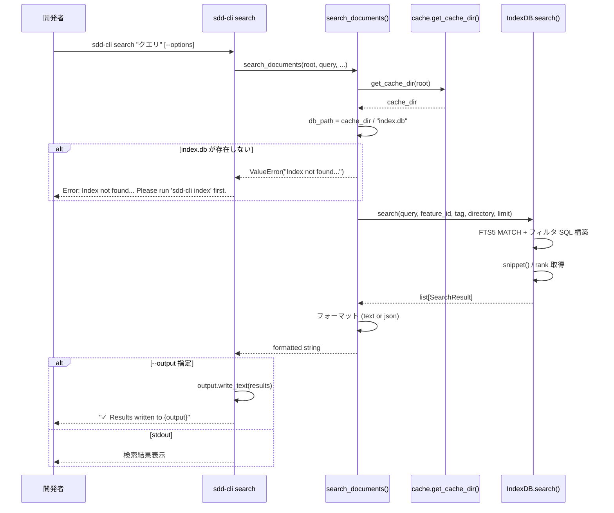
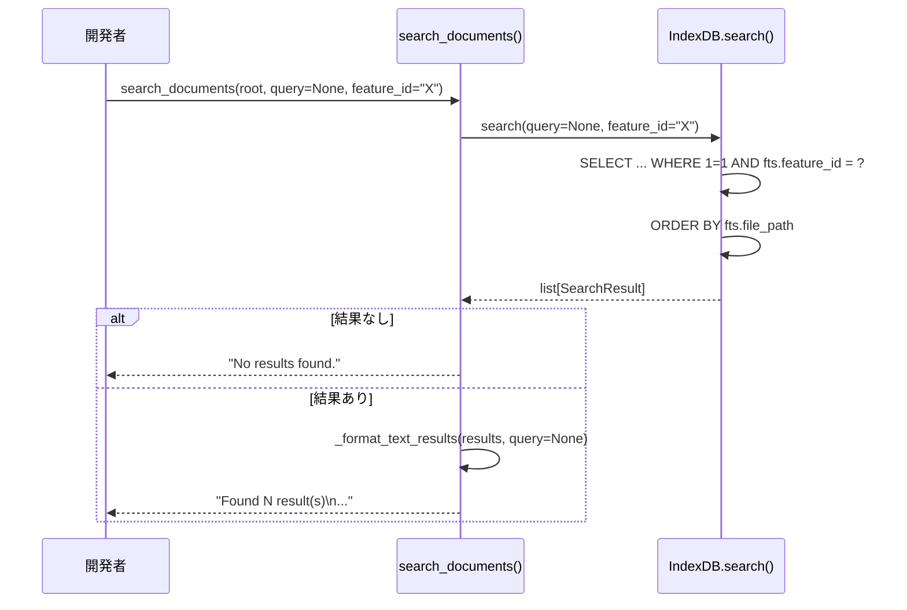

# ドキュメント検索機能

**ドキュメント種別:** 抽象仕様書 (Spec)
**SDDフェーズ:** Specify (仕様化)
**最終更新日:** 2026-02-23
**関連 Design Doc:** [document-search_design.md](document-search_design.md)
**関連 PRD:** [document-search.md](../requirement/document-search.md)

---

# 1. 背景

AI-SDD Workflow (AI-driven Specification-Driven Development) では、`.sdd/` 配下に PRD・仕様書・設計書・タスクログなど多数の Markdown ドキュメントが蓄積される。開発者がこれらのドキュメントから必要な情報を迅速に見つけるためには、全文検索とフィルタリングの手段が不可欠である。

`sdd-cli index` コマンドで構築された SQLite FTS5 (Full-Text Search 5) インデックスを活用し、CLI から効率的にドキュメントを検索できる機能を提供する。

---

# 2. 概要

本機能は `sdd-cli search` コマンドとして実装され、以下の検索機能を提供する:

1. **全文検索**: FTS5 MATCH によるキーワード検索（trigram tokenizer で日本語対応）
2. **フィルタ検索**: feature_id / tag / directory によるメタデータ絞り込み
3. **柔軟な出力**: text（人間可読）/ json（プログラム連携用）形式での結果出力
4. **明確なエラーハンドリング**: インデックス未構築時・結果なし時の適切なメッセージ

クエリなしでのフィルタのみ検索にも対応し、複数フィルタは AND 条件で結合される。

---

# 3. 要求定義

## 3.1. 機能要件 (Functional Requirements)

| ID | 要件 | 優先度 | 根拠 |
|:------|:-----|:------|:-----|
| FR-001 | FTS5 MATCH でクエリ文字列にマッチするドキュメントを検索する | Must | UR-001: 全文検索の中核機能 |
| FR-002 | FTS5 snippet() でマッチ箇所の前後文脈付きスニペットを 50 文字で生成する | Must | UR-001: 検索結果の可読性向上 |
| FR-003 | クエリ指定時は FTS5 rank によるスコア順でソートする | Must | UR-001: 関連度の高い結果を上位表示 |
| FR-004 | `--feature-id` で feature_id 完全一致フィルタを適用する | Must | UR-002: 特定機能に関連するドキュメント抽出 |
| FR-005 | `--tag` でタグ部分一致フィルタ（LIKE）を適用する | Must | UR-002: タグベースのドキュメント絞り込み |
| FR-006 | `--dir` でディレクトリタイプフィルタを適用する（requirement/specification/task） | Must | UR-002: ドキュメント種別での絞り込み |
| FR-007 | クエリなし時は FTS5 MATCH を使わず全件取得しフィルタのみ適用する | Must | UR-002: フィルタのみ検索のサポート |
| FR-008 | text 形式で件数・タイトル・パス・feature_id・タグ・スニペットを出力する | Must | UR-003: 人間可読な検索結果表示 |
| FR-009 | `--format json` で JSON 形式の検索結果を出力する | Must | UR-003: 他ツールとのパイプ連携 |
| FR-010 | `--output` でファイルに結果を書き出す | Must | UR-003: ファイル出力サポート |
| FR-011 | `--limit` で結果件数の上限を設定する（デフォルト 10） | Must | UR-003: 結果量の制御 |
| FR-012 | インデックス DB が存在しない場合に明確なエラーメッセージを返す | Must | UR-004: 未構築時のユーザーガイダンス |
| FR-013 | タグの JSON 文字列を json.loads() でパースし Python リストとして返却する | Must | UR-003: 構造化されたタグデータの提供 |

## 3.2. 非機能要件 (Non-Functional Requirements)

| ID | カテゴリ | 要件 | 目標値 |
|:------|:--------|:-----|:------|
| NFR-001 | 互換性 | FTS5 trigram tokenizer 依存。SQLite 3.9.0 以上が必要 | CI マトリックスで検証 |
| NFR-002 | 互換性 | Python 3.9〜3.13 で動作する | CI マトリックスで検証 |
| NFR-003 | 互換性 | XDG Base Directory 準拠のキャッシュパスを使用する | document-indexing のキャッシュを参照 |
| NFR-004 | 堅牢性 | SDDGroup による統一エラーハンドリング | Error: {message} 形式で stderr 出力 |
| NFR-005 | 依存性 | ランタイム依存は click のみ。SQLite は標準ライブラリを使用 | pyproject.toml で検証 |
| NFR-006 | テスト | ユニットテスト + 統合テストでカバレッジ 80% 以上を維持する | CI で検証 (D-002 準拠) |

---

# 4. API

## 4.1. CLI インターフェース

| コマンド | 引数/オプション | 型 | デフォルト | 説明 |
|:--------|:-------------|:---|:---------|:-----|
| `sdd-cli search` | `QUERY` | str (任意) | なし | 全文検索クエリ |
| | `--root` | Path | カレントディレクトリ | プロジェクトルートディレクトリ |
| | `--feature-id` | str | なし | feature_id 完全一致フィルタ |
| | `--tag` | str | なし | タグ部分一致フィルタ |
| | `--dir` | Choice[requirement, specification, task] | なし | ディレクトリタイプフィルタ |
| | `--format` | Choice[text, json] | text | 出力形式 |
| | `--output` | Path | なし | 出力先ファイルパス |
| | `--limit` | int | 10 | 結果件数上限 |

## 4.2. モジュール API

| パッケージ | モジュール | メンバー | 概要 |
|:---------|:---------|:--------|:-----|
| commands | search | `search_documents(root, query, feature_id, tag, directory, output_format, limit) -> str` | 検索実行・結果フォーマット |
| indexer | db | `IndexDB.search(query, feature_id, tag, directory, limit) -> list[SearchResult]` | FTS5 検索クエリの実行 |

## 4.3. 型定義

```python
from typing import Optional, TypedDict

class SearchResult(TypedDict):
    file_path: str
    file_name: str
    directory: str
    file_type: str
    title: str
    feature_id: str
    parent_feature_id: Optional[str]
    tags: list[str]
    snippet: Optional[str]
```

---

# 5. 用語集

| 用語 | 説明 |
|:-----|:-----|
| FTS5 | Full-Text Search 5。SQLite の全文検索拡張モジュール |
| trigram tokenizer | 3 文字ずつの部分文字列に分割するトークナイザー。日本語検索に有効 |
| MATCH | FTS5 の全文検索演算子。クエリ文字列との一致を判定する |
| snippet | FTS5 の snippet() 関数が生成する、マッチ箇所の前後文脈付き抜粋テキスト |
| rank | FTS5 が算出する検索結果のスコア値。値が小さいほど関連度が高い |
| feature_id | ドキュメントが属する機能を識別する ID |
| SearchResult | 検索結果を表す TypedDict 型 |
| XDG Base Directory | Linux/macOS のディレクトリ配置標準仕様 |

---

# 6. 使用例

```bash
# キーワードで全文検索
sdd-cli search "ログイン機能"

# feature_id でフィルタ
sdd-cli search --feature-id user-login

# 複数条件の組み合わせ
sdd-cli search "認証" --tag security --dir specification

# JSON 形式で出力
sdd-cli search "API" --format json

# ファイルに出力
sdd-cli search "設計" --output results.txt

# 結果件数を制限
sdd-cli search "テスト" --limit 5

# フィルタのみ（クエリなし）
sdd-cli search --dir requirement --feature-id document-indexing
```

---

# 7. 振る舞い図

## 7.1. 全文検索フロー



## 7.2. フィルタ検索フロー（クエリなし）



---

# 8. 制約事項

- SQLite FTS5 の trigram tokenizer を使用するため、SQLite 3.9.0 以上が必要
- FTS5 MATCH クエリの構文は SQLite の仕様に依存する（不正な構文はランタイムエラーとなる）
- tags の LIKE フィルタはスペース区切り文字列に対する部分一致のため、短いタグ名で意図しないマッチが発生する可能性がある
- 検索対象は `sdd-cli index` で事前にインデックス構築されたドキュメントに限定される
- ファイルパス操作は `pathlib.Path` を使用し、パストラバーサル攻撃を防止する必要がある (T-003 準拠)
- すべての SQL クエリはパラメータ化クエリ（`?` プレースホルダー）を使用し、SQL インジェクションを防止する必要がある (T-002 準拠)
- AI-SDD Workflow プラグインとの互換性を維持する必要がある (B-001 準拠)

---

## PRD Reference

- Corresponding PRD: `.sdd/requirement/document-search.md`
- Covered Requirements: UR-001, UR-002, UR-003, UR-004, FR-001, FR-002, FR-003, FR-004, FR-005, FR-006, FR-007, FR-008, FR-009, FR-010, FR-011, FR-012, FR-013, NFR-001, NFR-002, NFR-003, NFR-004, NFR-005
