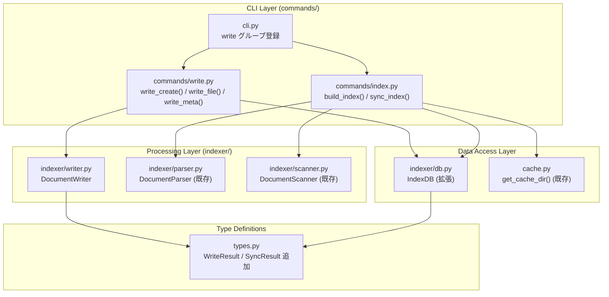

# ドキュメント書き込み機能

**ドキュメント種別:** 技術設計書 (Design Doc)
**SDDフェーズ:** Plan (計画/設計)
**最終更新日:** 2026-03-12
**関連 Spec:** [document-write_spec.md](document-write_spec.md)
**関連 PRD:** [document-write.md](../requirement/document-write.md)

---

# 1. 実装ステータス

**ステータス:** 🔴 未実装

## 1.1. 実装進捗

| モジュール/機能                  | ステータス | 備考                                        |
|:-------------------------------|:---------|:--------------------------------------------|
| types.py (WriteResult/SyncResult) | 🔴     | TypedDict 型追加                              |
| indexer/writer.py               | 🔴       | DocumentWriter クラス新規作成                  |
| indexer/db.py (file_mtime 拡張)  | 🔴       | file_mtime カラム追加 + remove_document/get_indexed_mtimes |
| commands/write.py               | 🔴       | write create/file/meta サブコマンド新規作成     |
| commands/index.py (incremental) | 🔴       | --incremental フラグ + sync_index() 追加       |
| cli.py (write グループ登録)       | 🔴       | write コマンドグループ登録                      |
| tests/test_write.py             | 🔴       | write/incremental 機能のテスト作成             |

---

# 2. 設計目標

1. **レイヤー分離維持**: 既存の `commands/ → indexer/ → db` 単方向依存を Write 機能でも踏襲する（CONSTITUTION A-002）
2. **最小依存**: 新規ランタイム依存の追加なし。python-frontmatter/pathlib/tempfile の標準的活用（CONSTITUTION A-003）
3. **Python 3.9-3.13 互換**: `match` 文・`X | Y` 型構文不使用、`tempfile` は標準ライブラリ（CONSTITUTION T-001）
4. **アトミック書き込み**: 同ディレクトリへの `NamedTemporaryFile` + `Path.replace()` でクラッシュ安全を確保（CONSTITUTION T-003）
5. **パストラバーサル防止**: ユーザー入力パスを SDD ルート内に限定し `resolve()` で正規化検証（CONSTITUTION T-003）
6. **後方互換性**: `sdd-cli index`（フラグなし）は既存の全 rebuild 動作を変更しない（CONSTITUTION B-002）
7. **テスタビリティ**: `DocumentWriter` は `sdd_root: Path` を依存注入で受け取り、tmp_path フィクスチャでテスト可能にする（CONSTITUTION D-002）

---

# 3. 技術スタック

| 領域                 | 採用技術                     | 選定理由                                                    |
|:-------------------|:---------------------------|:----------------------------------------------------------|
| CLI フレームワーク    | Click >= 8.1.0 （既存）       | 既存コマンドと統一。Click Group による write サブコマンド構成   |
| frontmatter 操作    | python-frontmatter >= 1.0 （既存） | frontmatter 解析済み。`frontmatter.dumps()` で安全な再シリアライズが可能 |
| アトミック書き込み    | tempfile (stdlib)            | `NamedTemporaryFile(delete=False)` + `Path.replace()` でアトミック write |
| パス操作             | pathlib (stdlib)             | 既存方針踏襲。OS 差異吸収                                    |
| 時刻取得             | os.stat / pathlib.stat (stdlib) | `Path.stat().st_mtime` で mtime 取得                     |
| データ型定義          | TypedDict (stdlib typing)    | 既存 types.py パターンに従い `WriteResult`, `SyncResult` を追加 |

---

# 4. アーキテクチャ

## 4.1. システム構成図



## 4.2. モジュール分割

| モジュール名               | 責務                                                         | 依存関係                              | 配置場所                         |
|:-------------------------|:------------------------------------------------------------|:-------------------------------------|:--------------------------------|
| `types.py` (拡張)         | `WriteResult`, `SyncResult` TypedDict 追加                   | 依存なし                              | `src/sdd_cli/types.py`          |
| `indexer/writer.py` (新規) | ファイル作成・書き込み・frontmatter 更新のビジネスロジック       | `types.py`, `python-frontmatter`     | `src/sdd_cli/indexer/writer.py` |
| `indexer/db.py` (拡張)    | `file_mtime` カラム追加, `remove_document()`, `get_indexed_mtimes()` | `types.py` (既存)              | `src/sdd_cli/indexer/db.py`     |
| `commands/write.py` (新規) | Click サブコマンド定義（create/file/meta）                    | `writer.py`, `db.py`, `cache.py`, `config.py` | `src/sdd_cli/commands/write.py` |
| `commands/index.py` (拡張) | `--incremental` フラグ追加, `sync_index()` 関数追加           | `scanner.py`, `parser.py`, `db.py`, `cache.py` | `src/sdd_cli/commands/index.py` |
| `cli.py` (拡張)            | `write` コマンドグループを `main` に登録                       | `commands/write.py`                  | `src/sdd_cli/cli.py`            |

---

# 5. データモデル

## 5.1. IndexDB スキーマ拡張

`documents_meta` テーブルに `file_mtime REAL` カラムを追加する。

```sql
-- 既存テーブルへのマイグレーション（既存 DB への互換対応）
ALTER TABLE documents_meta ADD COLUMN file_mtime REAL;
-- ※ SQLite は IF NOT EXISTS をサポートしないため例外キャッチで対応
```

既存 `_create_tables()` の `CREATE TABLE IF NOT EXISTS` にも `file_mtime REAL` を追加し、新規 DB では最初から含める。

## 5.2. IndexDB 追加メソッド

```python
def remove_document(self, file_path: str) -> None:
    """documents_fts と documents_meta から指定パスのエントリを削除"""

def get_indexed_mtimes(self) -> dict[str, float]:
    """DB に記録されている {file_path: file_mtime} の辞書を返す"""
    # file_mtime が NULL のエントリは -1.0 として返す（常に再インデックス対象）
```

`index_document()` に `file_mtime: Optional[float] = None` 引数を追加し、`documents_meta` の `file_mtime` カラムに記録する。

## 5.3. DocumentWriter クラス設計

```
indexer/writer.py
└── class DocumentWriter
    ├── __init__(self, sdd_root: Path)
    ├── create(type, feature_id, title, parent=None) -> WriteResult
    ├── write_file(rel_path, content, force=False) -> WriteResult
    └── update_meta(rel_path, set_fields, add_tags, remove_tags, add_deps, remove_deps) -> WriteResult
```

**`create()` の処理フロー:**

1. `type` と `feature_id`（+ `parent`）からファイルパスを決定
2. `sdd_root / rel_path` の存在確認 → 存在すれば `ValueError`
3. テンプレート参照（`sdd_root / "PRD_TEMPLATE.md"` 等）または内蔵ミニマルテンプレートから frontmatter 生成
4. アトミック書き込み（`tempfile` + `Path.replace()`）
5. `WriteResult` 返却

**`write_file()` の処理フロー:**

1. `sdd_root / rel_path` の存在確認
   - 存在 + `force=False` → `ValueError`
2. 親ディレクトリを `mkdir(parents=True, exist_ok=True)` で作成
3. アトミック書き込み
4. `WriteResult` 返却

**`update_meta()` の処理フロー:**

1. `sdd_root / rel_path` の存在確認 → 存在しなければ `ValueError`
2. `frontmatter.load()` でファイルを読み込む
3. `set_fields` で `post.metadata[key] = value` を設定
4. `add_tags` / `remove_tags` で `post.metadata["tags"]` リストを編集
5. `add_deps` / `remove_deps` で `post.metadata["depends-on"]` リストを編集
6. `frontmatter.dumps(post)` でシリアライズ
7. アトミック書き込み
8. `WriteResult` 返却

## 5.4. パス生成ルール

| type          | --parent なし                                      | --parent `{parent}` あり                                    |
|:-------------|:--------------------------------------------------|:----------------------------------------------------------|
| `spec`        | `specification/{feature-id}_spec.md`              | `specification/{parent}/{feature-id}_spec.md`             |
| `design`      | `specification/{feature-id}_design.md`            | `specification/{parent}/{feature-id}_design.md`           |
| `requirement` | `requirement/{feature-id}.md`                     | `requirement/{parent}/{feature-id}.md`                    |
| `task`        | `task/{feature-id}/tasks.md`                      | `task/{feature-id}/tasks.md` （`--parent` は無視）          |

## 5.5. 内蔵ミニマルテンプレートとテンプレート参照

テンプレート参照の優先度:

1. `sdd_root / "SPECIFICATION_TEMPLATE.md"`（spec/design 用）
2. `sdd_root / "PRD_TEMPLATE.md"`（requirement 用）
3. 存在しない場合: 内蔵ミニマルテンプレートを使用

内蔵ミニマルテンプレート（frontmatter のみ生成）:

| type          | 生成される frontmatter フィールド                                              |
|:-------------|:----------------------------------------------------------------------------|
| `spec`        | `id: spec-{feature_id}`, `title`, `type: spec`, `status: draft`, `created`, `updated`, `tags: []`, `depends-on: []` |
| `design`      | `id: design-{feature_id}`, `title`, `type: design`, `status: draft`, `impl-status: not-implemented`, `created`, `updated`, `tags: []`, `depends-on: []` |
| `requirement` | `id: prd-{feature_id}`, `title`, `type: prd`, `status: draft`, `created`, `updated`, `tags: []`, `depends-on: []` |
| `task`        | `id: task-{feature_id}`, `title`, `type: task`, `status: draft`, `created`, `updated` |

---

# 6. インターフェース定義

## 6.1. commands/write.py Click コマンド定義

```python
@click.group()
def write():
    """SDD ドキュメントを作成・更新するコマンド群。"""

@write.command("create")
@click.argument("doc_type", metavar="TYPE",
                type=click.Choice(["requirement", "spec", "design", "task"]))
@click.option("--feature-id", required=True, help="機能識別子")
@click.option("--title", required=True, help="ドキュメントタイトル")
@click.option("--parent", default=None, help="親 feature-id（階層構造時）")
@root_option
@click.option("--format", "output_format", type=click.Choice(["text", "json"]),
              default="text")
def write_create(doc_type, feature_id, title, parent, root, output_format):
    ...

@write.command("file")
@click.argument("rel_path")
@click.option("--content", default=None, help="書き込む内容（省略時は stdin）")
@click.option("--force", is_flag=True, default=False, help="既存ファイルへの上書き許可")
@root_option
@click.option("--format", "output_format", type=click.Choice(["text", "json"]),
              default="text")
def write_file(rel_path, content, force, root, output_format):
    ...

@write.command("meta")
@click.argument("rel_path")
@click.option("--set", "set_fields", multiple=True, help="key=value 形式でフィールドを更新")
@click.option("--add-tag", "add_tags", multiple=True, help="タグを追加")
@click.option("--remove-tag", "remove_tags", multiple=True, help="タグを削除")
@click.option("--add-dep", "add_deps", multiple=True, help="depends-on に追加")
@click.option("--remove-dep", "remove_deps", multiple=True, help="depends-on から削除")
@root_option
@click.option("--format", "output_format", type=click.Choice(["text", "json"]),
              default="text")
def write_meta(rel_path, set_fields, add_tags, remove_tags, add_deps, remove_deps,
               root, output_format):
    ...
```

## 6.2. commands/index.py 拡張

```python
# 既存 build_index() はそのまま維持（後方互換）

def sync_index(root: Path, quiet: bool = False) -> SyncResult:
    """差分インデックス更新。変更ファイルのみ再インデックスし SyncResult を返す。"""

# cli.py の index コマンドに --incremental フラグを追加
# @click.option("--incremental", is_flag=True, default=False, ...)
```

## 6.3. アトミック書き込みユーティリティ

`indexer/writer.py` 内のプライベート関数として実装:

```python
def _atomic_write(path: Path, content: str) -> None:
    """同ディレクトリへの .tmp ファイル作成 + Path.replace() によるアトミック書き込み。
    Windows でも Path.replace() が利用可能なためクロスプラットフォーム互換。"""
    path.parent.mkdir(parents=True, exist_ok=True)
    tmp = path.parent / (path.name + ".tmp")
    tmp.write_text(content, encoding="utf-8")
    tmp.replace(path)  # アトミックな rename
```

---

# 7. 非機能要件実現方針

| 要件                          | 実現方針                                                                          |
|:-----------------------------|:--------------------------------------------------------------------------------|
| Python 3.9 互換               | `match` 文不使用。`Optional[X]` 記法。`tempfile` / `pathlib` は全バージョンで利用可能 |
| アトミック書き込み              | 同ディレクトリに `.tmp` ファイルを作成後 `Path.replace()` で rename。同一ファイルシステム上での操作で atomic が保証される |
| パストラバーサル防止            | `rel_path` を受け取った際に `(sdd_root / rel_path).resolve()` が `sdd_root.resolve()` の配下であることを確認。範囲外の場合は `ValueError` |
| SQL インジェクション防止        | 全クエリをパラメータ化 (`?` プレースホルダー)。`remove_document()`, `get_indexed_mtimes()` も同様 |
| 後方互換性                    | `build_index()` の引数・動作を変更しない。`--incremental` は新規フラグ追加のみ            |
| ファイル削除非対応              | `write` コマンド群ではファイル削除機能を提供しない。ファイル削除が必要な場合はシェルで直接操作する |
| インデックス未構築時の自動同期スキップ | `commands/write.py` での自動差分更新時、インデックス DB（`index.db`）が存在しない場合は警告メッセージのみ出力しエラーとしない |

---

# 8. テスト戦略

| テストレベル    | 対象                              | 戦略                                                      |
|:------------|:----------------------------------|:---------------------------------------------------------|
| ユニットテスト  | `DocumentWriter.create()`         | `tmp_path` フィクスチャ利用。各 type のパス生成・frontmatter 生成を検証 |
| ユニットテスト  | `DocumentWriter.write_file()`     | 新規/既存ファイル・`--force` フラグ・stdin の入力パターンを検証     |
| ユニットテスト  | `DocumentWriter.update_meta()`    | `--set`, `--add-tag`, `--remove-tag`, `--add-dep`, `--remove-dep` の各オプションを検証 |
| ユニットテスト  | `IndexDB.remove_document()`       | 削除後に検索結果からエントリが消えることを確認                    |
| ユニットテスト  | `IndexDB.get_indexed_mtimes()`    | mtime の記録と取得を検証                                    |
| 統合テスト    | `sync_index()` (incremental)      | 追加/更新/削除の各シナリオで SyncResult の件数を検証           |
| CLI テスト   | `sdd-cli write create/file/meta`  | `CliRunner` を使用したエンドツーエンドテスト                    |
| CLI テスト   | `sdd-cli index --incremental`     | `CliRunner` でフラグ動作・出力メッセージを検証                  |

テストファイル配置:
- `tests/test_write.py`: write コマンド全般
- `tests/test_db.py`: IndexDB の拡張メソッド（既存ファイルに追加）

---

# 9. 設計判断

## 9.1. 決定事項

| 決定事項                          | 選択肢                                          | 決定内容                                        | 理由                                                                  |
|:--------------------------------|:-----------------------------------------------|:----------------------------------------------|:---------------------------------------------------------------------|
| コンテンツ編集の粒度              | ①ファイル全体 ②セクション置換 ③追記              | ファイル全体（`write file`）のみ                  | セクション置換は Markdown 構造への強い依存が必要で壊れやすい。LLM は完全な Markdown を提供できる |
| frontmatter 更新ライブラリ        | ①python-frontmatter ②手動 YAML 操作            | python-frontmatter を使用                       | `frontmatter.load()` → `frontmatter.dumps()` で本文を保護した安全な更新が可能 |
| アトミック書き込み実装             | ①tempfile.NamedTemporaryFile ②同ディレクトリ .tmp | 同ディレクトリ `.tmp` + `Path.replace()`        | 同一 FS でアトミックな rename が保証される。Windows でも `Path.replace()` が利用可能 |
| 差分検出方式                      | ①mtime ②ファイルハッシュ ③DB フラグ             | mtime（`file_mtime REAL` カラム）               | ハッシュは計算コスト高。mtime は stat() 一回で取得可能で十分な精度         |
| 自動差分更新の実装場所             | ①DocumentWriter 内 ②commands/ レイヤー          | `commands/write.py` で Writer 実行後に sync_index を呼ぶ | Writer は DB 操作を知る必要がない。レイヤー分離の維持                    |
| write コマンドグループの配置       | ①cli.py に直接定義 ②commands/write.py に分離    | `commands/write.py` に分離し `cli.py` で登録    | 既存コマンドの分離パターンに従う（A-002 レイヤー分離）                     |

## 9.2. 未解決の課題

| 課題                                         | 影響度 | 対応方針                                                      |
|:--------------------------------------------|:------|:------------------------------------------------------------|
| `sdd-cli index --incremental` の `--format json` 対応 | 低   | PRD FR-019 では text/json 両形式を要求しているが、LLM エージェントが結果を解析するユースケースは現時点で想定が薄く、実装コストに対して効果が低い。初期リリースでは text のみ実装し、json 対応は v0.2 以降で改めて検討する（spec FR-019 の Should 優先度による意図的スコープ縮小） |
| テンプレートからの frontmatter 継承の精度       | 低    | プロジェクトテンプレートが存在する場合、frontmatter の全フィールドを引き継ぐと意図しないフィールドが入る可能性あり。初期実装はミニマルテンプレートを優先的に使用 |

---

# 10. 変更履歴

## v0.1 (2026-03-12)

**変更内容:**

- ドキュメント書き込み機能の初期設計書作成
- write create/file/meta コマンド設計
- index --incremental フラグ設計
