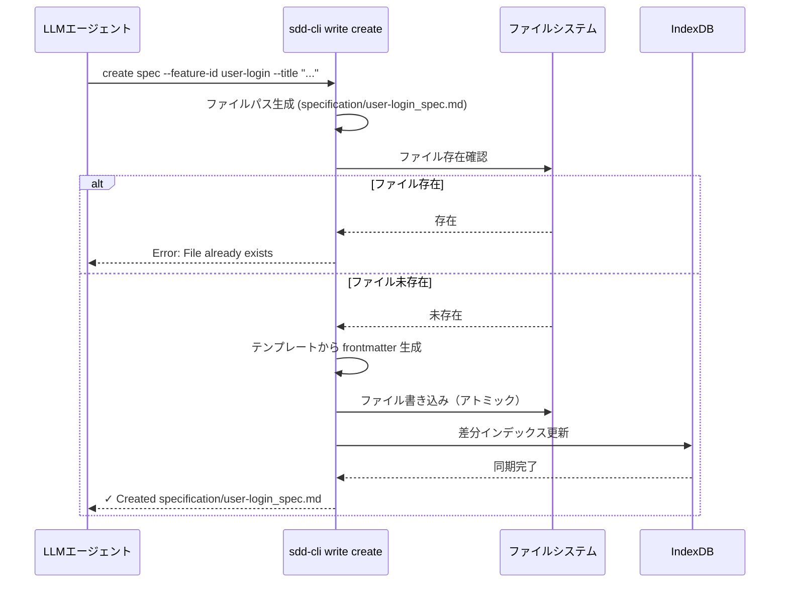
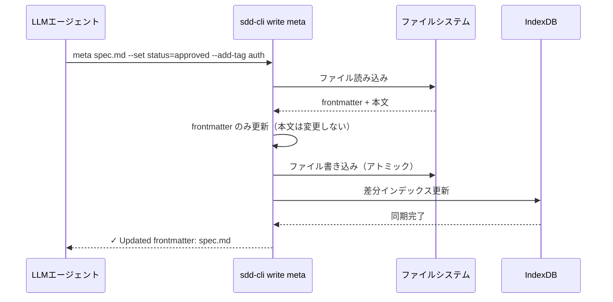

# ドキュメント書き込み機能

**ドキュメント種別:** 抽象仕様書 (Spec)
**SDDフェーズ:** Specify (仕様化)
**最終更新日:** 2026-03-12
**関連 Design Doc:** [document-write_design.md](document-write_design.md)
**関連 PRD:** [document-write.md](../requirement/document-write.md)

---

# 1. 背景

sdd-cli は現在、ドキュメントの読み取り（index/search/visualize/lint）のみをサポートする「読み取り専用 CLI」である。LLM エージェント（sdd-workflow プラグイン）が `.sdd/` 配下のドキュメントを作成・更新するためには、別途ファイル操作ツールが必要であり、AI-SDD ワークフローの自動化に障害となっていた。

本機能は `sdd-cli write` コマンド群を追加し、LLM エージェントが以下の操作を CLI 経由で安全に実行できるようにする：

- 命名規則に準拠したドキュメントの新規作成
- 既存ドキュメントの本文を保護したうえでのメタデータ（frontmatter）部分更新
- LLM が提供する完全な Markdown によるファイル全体の書き換え

また、書き込み操作後の `sdd-cli index --incremental` による差分インデックス更新機能を提供し、検索結果を即時に最新状態へ同期する基盤を整える。

# 2. 概要

本機能は以下の CLI コマンド群を提供する：

1. **`sdd-cli write create <type>`**: 命名規則に従ったドキュメントをスキャフォールドから新規作成する
2. **`sdd-cli write file <path>`**: ファイル全体を指定コンテンツで書き込む（新規・上書き両対応）
3. **`sdd-cli write meta <path>`**: frontmatter フィールドのみを安全に更新し本文は変更しない
4. **`sdd-cli index --incremental`**: mtime 比較で変更ファイルのみ差分インデックス更新する（既存 `index` コマンドの拡張）

コンテンツ編集は追記・セクション置換を提供せず、**ファイル全体の書き換え**のみとする。これにより構造破壊リスクを排除する。frontmatter は構造化されているため部分更新のみ安全に行う。

本仕様書は「何を実現するか」に焦点を当て、技術的な実装詳細は含めない。

# 3. 要求定義

## 3.1. 機能要件 (Functional Requirements)

### write create — ドキュメント新規作成

| ID     | 要件                                                                          | 優先度 | 根拠                               |
|:-------|:-----------------------------------------------------------------------------|:------|:----------------------------------|
| FR-001 | `requirement` / `spec` / `design` / `task` の4種類のドキュメントタイプを指定して作成できる | Must  | UR-001: ドキュメント新規作成           |
| FR-002 | `--feature-id` と type から命名規則に従ったファイルパスを自動生成する                   | Must  | UR-001: 命名規則準拠の自動化           |
| FR-003 | `.sdd/*_TEMPLATE.md` または内蔵ミニマルテンプレートから frontmatter スキャフォールドを生成する | Must  | UR-001: 最小限のドキュメント構造保証  |
| FR-004 | `--parent` でディレクトリ階層（親 feature-id）を指定できる                           | Should | UR-001: 階層構造プロジェクトへの対応 |
| FR-005 | 既存ファイルが存在する場合はエラーを返す（上書き防止）                                  | Must  | UR-001: 誤上書きリスクの排除          |
| FR-006 | 作成後にインデックスを自動差分更新する                                                | Must  | UR-005: 書き込み後の自動同期          |

### write file — ファイル全体書き込み

| ID     | 要件                                                                               | 優先度 | 根拠                               |
|:-------|:----------------------------------------------------------------------------------|:------|:----------------------------------|
| FR-007 | `--content` オプション または stdin からコンテンツを受け取りファイル全体として書き込む        | Must  | UR-003: ファイル全体書き換え            |
| FR-008 | 新規ファイル・既存ファイル両方に対応する（既存ファイルへの書き込みは `--force` を指定しない限りエラー終了。`--force` 指定時は確認なしで上書き） | Must | UR-003: 誤上書きリスクの排除 |
| FR-009 | 書き込み後にインデックスを自動差分更新する                                                | Must  | UR-005: 書き込み後の自動同期          |

### write meta — frontmatter 部分更新

| ID     | 要件                                                                    | 優先度 | 根拠                               |
|:-------|:-----------------------------------------------------------------------|:------|:----------------------------------|
| FR-010 | `--set key=value` で frontmatter の任意フィールドを更新できる                 | Must  | UR-002: frontmatter 部分更新         |
| FR-011 | `--add-tag` / `--remove-tag` でタグリストを追加・削除できる                  | Should | UR-002: タグ管理の利便性向上         |
| FR-012 | `--add-dep` / `--remove-dep` で `depends-on` リストを追加・削除できる       | Should | UR-002: 依存関係管理の利便性向上     |
| FR-013 | 本文コンテンツを変更せずにメタデータのみ更新する                                | Must  | UR-002: 本文保護の安全性確保          |
| FR-014 | 更新後にインデックスを自動差分更新する                                         | Must  | UR-005: 書き込み後の自動同期          |

### index --incremental — 差分インデックス更新

| ID     | 要件                                                                              | 優先度 | 根拠                                |
|:-------|:--------------------------------------------------------------------------------|:------|:-----------------------------------|
| FR-015 | ファイルの最終更新時刻（mtime）を既存インデックス DB に記録する                          | Must  | UR-004: 差分検出の基盤                |
| FR-016 | `--incremental` フラグ指定時、mtime 比較で変更ファイルのみ再インデックスする              | Must  | UR-004: 全再構築の回避               |
| FR-017 | インデックスに存在するが実ファイルが削除されたエントリを除去する                          | Must  | UR-004: インデックスの一貫性維持       |
| FR-018 | 新規追加ファイルをインデックスに追加する                                               | Must  | UR-004: インデックスの一貫性維持       |
| FR-019 | 同期結果（追加件数・更新件数・削除件数）を text 形式で出力する（json 形式対応は将来検討）  | Should | UR-004: 実行結果の可視性              |

## 3.2. 非機能要件 (Non-Functional Requirements)

| ID      | カテゴリ  | 要件                                                                  | 目標値・根拠                               |
|:--------|:---------|:----------------------------------------------------------------------|:------------------------------------------|
| NFR-001 | 互換性   | Python 3.9〜3.13 互換性を維持する                                        | T-001: CI マトリックスで全バージョン通過      |
| NFR-002 | 後方互換性 | `index` コマンドはフラグなしで従来の全 rebuild 動作を維持する               | B-002: CLI-First による破壊的変更禁止       |
| NFR-003 | 安全性   | ファイル書き込みはアトミック操作で行い部分書き込みを防止する                  | T-003: パス安全性・書き込み安全性           |
| NFR-004 | 安全性   | パス操作は `pathlib.Path` を使用しパストラバーサルを防止する                | T-003: パス安全性                          |
| NFR-005 | 一貫性   | 各 write コマンドの出力は text/json 形式の両方に対応する                   | B-002: 既存コマンドとの一貫性               |

# 4. API

## 4.1. CLIコマンド一覧

| コマンド                  | サブコマンド | オプション                                                                        | 概要                           |
|:------------------------|:-----------|:--------------------------------------------------------------------------------|:-------------------------------|
| `sdd-cli write`         | `create`   | `<type>` `--feature-id` `--title` `[--parent]` `[--root]` `[--format]`         | 命名規則準拠ドキュメントの新規作成  |
| `sdd-cli write`         | `file`     | `<rel-path>` `[--content]` `[--force]` `[--root]` `[--format]`                 | ファイル全体のコンテンツ書き込み   |
| `sdd-cli write`         | `meta`     | `<rel-path>` `[--set k=v]` `[--add-tag t]` `[--remove-tag t]` `[--add-dep d]` `[--remove-dep d]` `[--root]` `[--format]` | frontmatter 部分更新 |
| `sdd-cli index`         | -          | `[--incremental]` `[--quiet]` `[--root]`                                        | インデックス構築（差分対応拡張）   |

## 4.2. コマンド別入出力仕様

### write create

```
# 入力
sdd-cli write create <type: requirement|spec|design|task>
    --feature-id <id>       # 機能識別子（例: user-login）
    --title <title>         # ドキュメントタイトル
    [--parent <parent-id>]  # 親機能の feature-id（階層構造時）
    [--root <path>]         # プロジェクトルート（デフォルト: カレントディレクトリ）
    [--format text|json]    # 出力形式（デフォルト: text）

# 生成パス規則
# spec:        specification/{feature-id}_spec.md
# design:      specification/{feature-id}_design.md
# requirement: requirement/{feature-id}.md
# task:        task/{feature-id}/tasks.md
# --parent 指定時:
# spec:        specification/{parent}/{feature-id}_spec.md
# requirement: requirement/{parent}/{feature-id}.md

# 出力 (text)
✓ Created specification/user-login_spec.md

# 出力 (json)
{"success": true, "file_path": "specification/user-login_spec.md", "message": "Created"}
```

### write file

```
# 入力 (--content オプション)
sdd-cli write file specification/user-login_spec.md --content "---\nid: ...\n---\n# ..."

# 入力 (stdin)
echo "---\nid: ...\n---\n# ..." | sdd-cli write file specification/user-login_spec.md

# オプション
[--force]   # 既存ファイルへの上書きを許可（なしの場合エラー）
[--root]    # プロジェクトルート
[--format]  # 出力形式

# 出力 (text)
✓ Written specification/user-login_spec.md
```

### write meta

```
# 入力
sdd-cli write meta specification/user-login_spec.md \
    --set status=approved \
    --add-tag security \
    --remove-tag draft \
    --add-dep prd-user-auth

# オプション
--set key=value      # frontmatter フィールドの上書き（複数指定可）
--add-tag tag        # tags リストへの追加（複数指定可）
--remove-tag tag     # tags リストからの削除（複数指定可）
--add-dep dep-id     # depends-on リストへの追加（複数指定可）
--remove-dep dep-id  # depends-on リストからの削除（複数指定可）

# 出力 (text)
✓ Updated frontmatter: specification/user-login_spec.md
```

### index --incremental

```
# 入力
sdd-cli index --incremental [--quiet] [--root]

# 出力 (text, --quiet なし)
Incremental sync: 2 added, 1 updated, 0 deleted (total: 45 documents)
✓ Index synced

# 出力 (json 形式は将来の --format 対応で検討)
```

## 4.3. 型定義（概念）

**WriteResult** — write create/file/meta の実行結果

| フィールド  | 型      | 説明                                   |
|:----------|:--------|:--------------------------------------|
| success   | boolean | 操作の成否                              |
| file_path | string  | 書き込み対象の相対パス（SDD ルートからの相対） |
| message   | string  | 操作結果の説明メッセージ                   |

**SyncResult** — index --incremental の実行結果

| フィールド | 型      | 説明                       |
|:---------|:--------|:--------------------------|
| added    | integer | 新規追加されたドキュメント件数  |
| updated  | integer | 更新されたドキュメント件数     |
| deleted  | integer | 削除されたドキュメント件数     |
| total    | integer | 現在のインデックス総ドキュメント数 |

# 5. 用語集

| 用語                | 説明                                                            |
|:------------------|:---------------------------------------------------------------|
| スキャフォールド       | frontmatter のみを含む最小限のドキュメントひな形                    |
| アトミック書き込み     | 一時ファイルへの書き込みと rename による部分書き込み防止手法           |
| mtime             | ファイルの最終更新時刻（modification time）                        |
| 差分インデックス       | 全ファイルではなく変更のあったファイルのみを再インデックスする手法         |
| frontmatter       | Markdown ファイル先頭の `---` で囲まれた YAML メタデータ領域         |
| LLM エージェント     | sdd-workflow プラグインを通じて Bash 経由で CLI を呼び出す AI エージェント |

# 6. 使用例

```bash
# 1. 新規スキャフォールド作成
sdd-cli write create spec --feature-id user-login --title "ユーザーログイン仕様"
# → specification/user-login_spec.md が作成される（frontmatter のみ）

# 2. 階層構造での作成
sdd-cli write create spec --feature-id user-login --title "ユーザーログイン仕様" --parent auth
# → specification/auth/user-login_spec.md が作成される

# 3. LLM が完全なコンテンツを書き込む
echo "---\nid: spec-user-login\n...\n---\n# ユーザーログイン仕様\n..." \
    | sdd-cli write file specification/user-login_spec.md

# 4. ステータスを更新
sdd-cli write meta specification/user-login_spec.md --set status=approved

# 5. タグを追加
sdd-cli write meta specification/user-login_spec.md --add-tag security --add-tag auth

# 6. 差分インデックス更新
sdd-cli index --incremental
# → 変更ファイルのみ再インデックス

# 7. 検索で確認
sdd-cli search "ユーザーログイン"
```

# 7. 振る舞い図

## write create フロー



## write meta フロー



# 8. 制約事項

- **セクション単位の部分書き換え非対応**: 構造破壊リスクがあるため、コンテンツ編集はファイル全体の書き換えのみとする
- **ファイル削除非対応**: 安全性の観点から `write` コマンドでのファイル削除は行わない
- **task ディレクトリの特殊性**: task の `write create` では `task/{feature-id}/tasks.md` を生成する。`--parent` を指定した場合は無視し、常に `task/{feature-id}/tasks.md` として生成する（タスクディレクトリは機能階層とは独立したチケット管理領域のため）
- **SDD ルート外パス禁止**: `write file/meta` の相対パスは SDD ルート（`.sdd/`）の配下に限定する
- **インデックス未構築時の自動同期**: インデックス DB が存在しない場合、自動差分更新をスキップし警告のみ出力する

---

# PRD 整合性確認

## 要求カバレッジ

| PRD 要求 ID | 要求内容                                            | 対応 FR       | カバレッジ |
|:-----------|:--------------------------------------------------|:-------------|:---------|
| UR-001     | LLM エージェントが命名規則準拠のドキュメントを新規作成できる   | FR-001〜006  | ✅ 完全   |
| UR-002     | frontmatter を本文を変更せずに更新できる                  | FR-010〜014  | ✅ 完全   |
| UR-003     | ファイル全体を提供することで内容を書き換えられる             | FR-007〜009  | ✅ 完全   |
| UR-004     | 変更ファイルのみ差分インデックス更新できる                  | FR-015〜019  | ✅ 完全   |
| UR-005     | 書き込み操作後にインデックスが自動同期される                | FR-006, FR-009, FR-014 | ✅ 完全 |
| NFR-001    | Python 3.9〜3.13 互換性を維持する                       | NFR-001      | ✅ 完全   |
| NFR-002    | index コマンドはフラグなしで全 rebuild 動作を維持する       | NFR-002      | ✅ 完全   |
| NFR-003    | アトミック書き込みで部分書き込みを防止する                  | NFR-003      | ✅ 完全   |
| NFR-004    | pathlib.Path を使用する                               | NFR-004      | ✅ 完全   |
| NFR-005    | text/json 形式に対応する                              | NFR-005      | ✅ 完全   |
