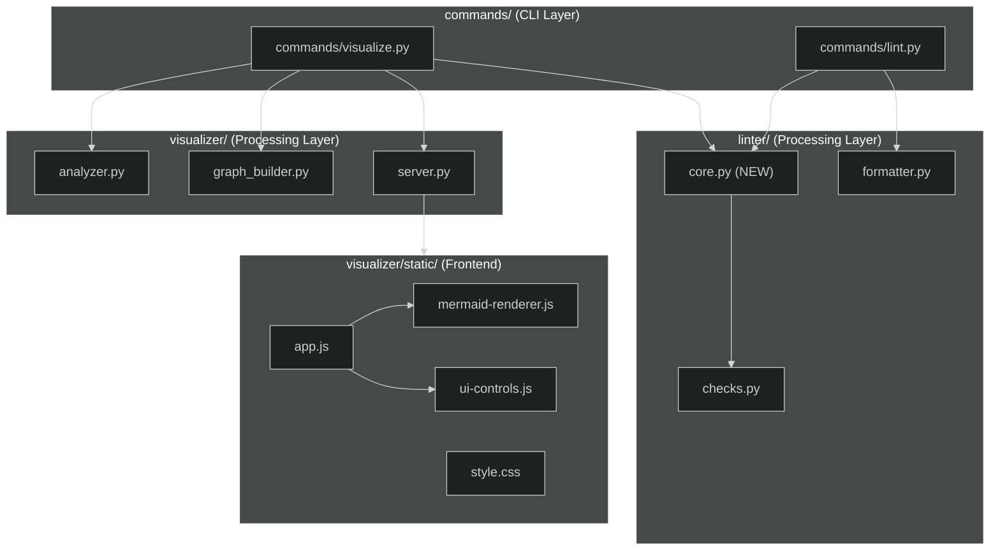

# 依存関係可視化における lint エラー表示機能

**ドキュメント種別:** 技術設計書 (Design Doc)
**SDDフェーズ:** Plan (計画/設計)
**最終更新日:** 2026-03-02
**関連 Spec:** [visualize-lint-integration_spec.md](visualize-lint-integration_spec.md)
**関連 PRD:** [visualize-lint-integration.md](../requirement/visualize-lint-integration.md)

---

# 1. 実装ステータス

**ステータス:** 🔴 未実装

## 1.1. 実装進捗

| モジュール/機能 | ステータス | 備考 |
|:-------------|:---------|:-----|
| linter/core.py（新規） | 🔴 | lint コアロジック抽出 |
| commands/lint.py（リファクタリング） | 🔴 | core.py を利用するよう変更 |
| commands/visualize.py（拡張） | 🔴 | lint 自動実行 + lintIssues 追加 |
| visualizer/static/js/mermaid-renderer.js | 🔴 | バッジ・ゴーストノード・循環ハイライト |
| visualizer/static/js/app.js | 🔴 | lint サマリー表示 |
| visualizer/static/js/ui-controls.js | 🔴 | 詳細パネル lint セクション |
| visualizer/static/css/style.css | 🔴 | lint 関連スタイル |
| visualizer/static/index.html | 🔴 | lint サマリー用 HTML 要素 |
| tests/test_visualize_lint.py（新規） | 🔴 | lint 連携テスト |

---

# 2. 設計目標

1. **レイヤー分離**: lint コアロジックを `linter/core.py` に配置し、`commands/lint.py` と `commands/visualize.py` の両方から呼び出す。上位→下位の単方向依存を維持する（CONSTITUTION A-002）
2. **最小依存**: 新しいランタイム依存を追加しない。標準ライブラリのみを使用する（CONSTITUTION A-003）
3. **後方互換性**: 既存の `sdd-cli lint` と `sdd-cli visualize` の動作を変更しない（CONSTITUTION B-002）
4. **Python 3.9-3.13 互換**: すべてのモジュールで互換性を維持する（CONSTITUTION T-001）
5. **テスタビリティ**: lint コアロジック、JSON データ構築、フロントエンドの各レイヤーを独立してテスト可能にする（CONSTITUTION D-002）

---

# 3. 技術スタック

| 領域 | 採用技術 | 選定理由 |
|:-----|:-------|:--------|
| lint コアロジック | Python 標準ライブラリ | 既存の linter/checks.py を再利用。新規依存不要 |
| JSON データ構築 | json (stdlib) | 既存の visualize コマンドと同じ |
| フロントエンド | Vanilla JS + CSS | 既存の Web View と同じ。外部フレームワーク不使用 |
| グラフスタイル | Mermaid.js style/classDef/linkStyle | 既存の Mermaid レンダリングの拡張 |

---

# 4. アーキテクチャ

## 4.1. システム構成図



## 4.2. モジュール分割

| モジュール名 | 責務 | 依存関係 | 配置場所 |
|:-----------|:-----|:--------|:--------|
| linter/core.py | lint チェック実行の中核ロジック | linter/checks, indexer/scanner, indexer/parser, config, types | src/sdd_cli/linter/core.py (新規) |
| commands/lint.py | CLI lint コマンド（core.py + formatter を呼び出す） | linter/core, linter/formatter | src/sdd_cli/commands/lint.py (リファクタリング) |
| commands/visualize.py | lint 自動実行 + lintIssues JSON 追加 | linter/core, visualizer/* | src/sdd_cli/commands/visualize.py (拡張) |
| mermaid-renderer.js | ノードバッジ・スタイル・ゴーストノード・循環ハイライト生成 | - | visualizer/static/js/ (拡張) |
| app.js | lint サマリー表示・lintIssues データ保持 | mermaid-renderer, ui-controls | visualizer/static/js/ (拡張) |
| ui-controls.js | 詳細パネルに lint セクション追加 | - | visualizer/static/js/ (拡張) |
| style.css | lint 関連スタイル（エラー赤、警告黄、ゴーストノード） | - | visualizer/static/css/ (拡張) |

---

# 5. データモデル

## 5.1. linter/core.py の公開関数

```python
from pathlib import Path
from sdd_cli.types import LintIssue, LintResult

def run_lint_issues(root: Path) -> LintResult:
    """lint チェックを実行し結果を返す。
    commands/lint.py の run_lint() から共通ロジックを抽出。
    """
    ...

def group_issues_by_file(issues: list[LintIssue]) -> dict[str, list[LintIssue]]:
    """issue を file_path でグループ化する。
    visualize の JSON データ構築で使用。
    """
    ...

def extract_cycle_edges(issues: list[LintIssue]) -> list[tuple[str, str]]:
    """circular-dependency issue の details から
    循環パスのエッジペア (source_path, target_path) を抽出する。
    """
    ...

def extract_unresolved_deps(issues: list[LintIssue]) -> list[tuple[str, str]]:
    """unresolved-dependency issue から
    (source_file_path, unresolved_id) ペアを抽出する。
    """
    ...
```

## 5.2. JSON データ構造拡張

```python
# _build_graph_data の戻り値に lintIssues を追加
graph_data = {
    "title": str,
    "subtitle": str,
    "nodes": list[GraphNode],
    "edges": list[GraphEdge],
    "lintIssues": {
        # file_path -> lint issues のリスト
        "requirement/auth.md": [
            {
                "severity": "error",
                "rule": "broken-link",
                "message": "Link target not found: ../spec/auth_spec.md",
                "line": 15,
            }
        ],
    },
}
```

---

# 6. インターフェース定義

## 6.1. linter/core.py → commands/lint.py

```python
# commands/lint.py のリファクタリング
# Before: run_lint() 内にスキャン・パース・チェックロジックが直接記述
# After: core.py の run_lint_issues() を呼び出し、結果を format_issues() でフォーマット

def run_lint(root: Path, json_output: bool, quiet: bool) -> tuple[str, bool]:
    result = run_lint_issues(root)
    if quiet and result["error_count"] == 0 and result["warning_count"] == 0:
        return ("", False)
    output = format_issues(result, json_output)
    return (output, result["error_count"] > 0)
```

## 6.2. linter/core.py → commands/visualize.py

```python
# commands/visualize.py の拡張
from sdd_cli.linter.core import run_lint_issues, group_issues_by_file

def generate_visualization(root, output, filter_dir=None, feature_id=None):
    # ... 既存のインデックス・分析処理 ...

    # lint 自動実行
    try:
        lint_result = run_lint_issues(root)
        lint_issues_by_file = group_issues_by_file(lint_result["issues"])
    except Exception:
        lint_issues_by_file = {}

    # JSON 構築時に lint_issues を渡す
    json_data["dependency-graph.json"] = _build_graph_data(
        graph, title, subtitle, lint_issues_by_file
    )
    # ... split graphs も同様 ...
```

## 6.3. フロントエンド JS インターフェース

```javascript
// app.js: graphData に lintIssues が含まれる
// graphData.lintIssues = { "file_path": [{severity, rule, message, line}] }

// mermaid-renderer.js: generateMermaidCode(nodes, edges, theme, lintIssues)
//   - lintIssues からノードバッジ・スタイル生成
//   - ゴーストノード追加
//   - 循環依存エッジハイライト

// ui-controls.js: showNodeDetail(node, lintIssues)
//   - 詳細パネルに lint セクション追加
```

---

# 7. 非機能要件実現方針

| 要件 | 実現方針 |
|:-----|:-------|
| NFR-001: テーマ対応 | CSS 変数 + `[data-theme]` セレクタで light/dark 両対応。エラー赤・警告黄はテーマ非依存色を使用 |
| NFR-002: 表示崩れ耐性 | ゴーストノード上限 10 個、バッジは `[E:N]` 最小形式、サマリーはコントロールバー内に収める |
| NFR-003: 後方互換性 | JSON に `lintIssues` フィールドを追加するのみ。既存フィールドは変更しない。JS 側は `lintIssues` が存在しない場合を graceful に処理 |

---

# 8. テスト戦略

| テストレベル | 対象 | カバレッジ目標 |
|:-----------|:-----|:-----------|
| ユニットテスト | linter/core.py の各関数 | 90%+ |
| ユニットテスト | commands/lint.py のリファクタリング後動作 | 既存テスト通過 |
| 統合テスト | commands/visualize.py の lint 連携 | JSON に lintIssues が正しく含まれること |
| 統合テスト | _build_graph_data() の lint 情報含有 | lintIssues フォーマット検証 |

### テストファイル

| ファイル | テスト内容 |
|:--------|:---------|
| tests/test_linter_core.py (新規) | run_lint_issues, group_issues_by_file, extract_cycle_edges, extract_unresolved_deps |
| tests/test_lint_command.py (既存) | リファクタリング後も全テスト通過を確認 |
| tests/test_visualize_lint.py (新規) | visualize コマンドの lint 連携統合テスト |

---

# 9. 設計判断

## 9.1. 決定事項

| 決定事項 | 選択肢 | 決定内容 | 理由 |
|:--------|:------|:--------|:-----|
| lint コアロジックの配置先 | A) linter/core.py (新規) / B) commands/lint.py に関数追加 | A) linter/core.py | A-002 レイヤー分離。commands/ は CLI 層、linter/ は処理層 |
| ゴーストノードの実装方法 | A) Mermaid ノードとして追加 / B) CSS オーバーレイ | A) Mermaid ノード | Mermaid の DAG レイアウトに自然に統合される |
| 循環依存ハイライトの実装 | A) linkStyle でエッジ着色 / B) classDef でノード着色のみ | A) linkStyle | エッジ単位のハイライトがより直感的 |
| lint 失敗時の挙動 | A) グラフ表示を中断 / B) lint なしで表示継続 | B) 表示継続 | visualize の主機能はグラフ表示。lint は付加的な情報 |
| JSON への lint データ格納形式 | A) file_path キーの辞書 / B) フラットなリスト | A) 辞書形式 | ノード別のルックアップが O(1) で高速 |

## 9.2. 未解決の課題

| 課題 | 影響度 | 対応方針 |
|:-----|:------|:--------|
| Mermaid linkStyle のエッジインデックス依存 | 中 | エッジ定義順序を追跡して正確なインデックスを計算する |
| ゴーストノードのグラフレイアウト影響 | 低 | 上限 10 個で影響を最小化 |

---

# 10. 変更履歴

## v1.0

**変更内容:**

- 初版作成
