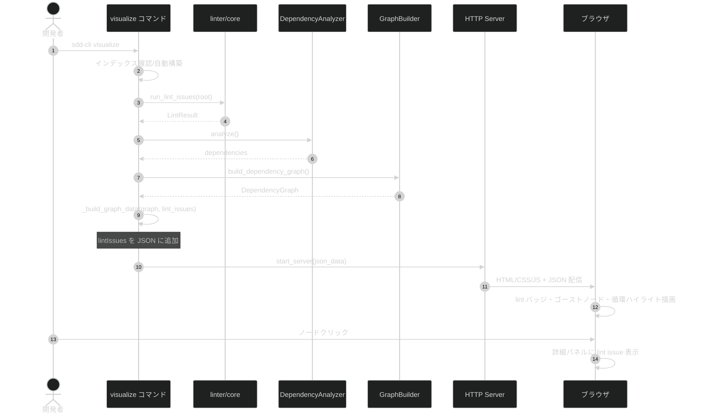

# 依存関係可視化における lint エラー表示機能

**ドキュメント種別:** 抽象仕様書 (Spec)
**SDDフェーズ:** Specify (仕様化)
**最終更新日:** 2026-03-02
**関連 Design Doc:** [visualize-lint-integration_design.md](visualize-lint-integration_design.md)
**関連 PRD:** [visualize-lint-integration.md](../requirement/visualize-lint-integration.md)

---

# 1. 背景

`sdd-cli lint` コマンドでドキュメントの整合性チェック（循環依存、壊れたリンク、必須フィールド不足、ID重複等）が可能になったが、`sdd-cli visualize` の Web View にはこれらの lint 結果が反映されていない。ユーザーは CLI の lint 出力とグラフ表示を別々に確認する必要があり、ドキュメント品質の問題を依存関係グラフと一体的に把握できない。

lint エラーはグラフの正確性にも影響する（未解決依存でエッジ欠落、循環依存等）ため、Web View 上で視覚的にフィードバックすることで、ドキュメント品質の問題を素早く把握できるようにする。

---

# 2. 概要

本機能は `sdd-cli visualize` コマンドに lint 統合を追加し、以下を実現する:

1. **lint 自動実行**: visualize コマンド実行時に lint を内部的に実行し、結果を JSON データに含める
2. **ノード別 lint バッジ**: エラー/警告のあるノードに枠線色とバッジで視覚的フィードバック
3. **ゴーストノード**: 未解決依存をグラフ上にゴーストノードとして可視化
4. **循環依存ハイライト**: 循環依存エッジを赤色でハイライト
5. **詳細パネル拡張**: ノード詳細パネルに lint issue リストを追加
6. **lint サマリー**: コントロールバーに全体のエラー数・警告数バッジを表示

---

# 3. 要求定義

## 3.1. 機能要件 (Functional Requirements)

| ID | 要件 | 優先度 | 根拠 |
|:------|:-----|:------|:-----|
| FR-001 | visualize コマンド実行時に lint を自動実行し、結果を JSON の `lintIssues` フィールドに含める | Must | UR-001: lint 統合の基盤 |
| FR-002 | lint issue があるノードにバッジ（`[E:N]`, `[W:M]`）と枠線色（エラー: 赤、警告: 黄）を表示する | Must | UR-001, UR-002: ノード単位のフィードバック |
| FR-003 | 未解決依存（`unresolved-dependency`）をゴーストノード（破線枠、薄背景）として表示し、`--x` エッジで接続する | Should | UR-001: 未解決依存の可視化 |
| FR-004 | 循環依存（`circular-dependency`）エッジを赤色 `linkStyle` でハイライトする | Should | UR-001: 循環依存の可視化 |
| FR-005 | ノード詳細パネルに lint issue リスト（severity, rule, message）を表示する | Should | UR-002: 詳細情報の提供 |
| FR-006 | コントロールバーに `N errors / M warnings` バッジを表示する | Could | UR-003: 全体サマリー |
| FR-007 | lint コアロジックを `linter/core.py` に抽出し、visualize と lint コマンドの両方から利用可能にする | Must | FR-001: コード再利用 |

## 3.2. 非機能要件 (Non-Functional Requirements)

| ID | カテゴリ | 要件 | 目標値 |
|:------|:------|:-----|:------|
| NFR-001 | 互換性 | Light/Dark テーマ両方で lint スタイルが適切に表示される | 両テーマで視認性確保 |
| NFR-002 | 堅牢性 | 大量エラー時でも表示崩れしない | ゴーストノード上限 10、バッジ最小化 |
| NFR-003 | 後方互換性 | 既存の visualize/lint コマンドの動作を変更しない | JSON に `lintIssues` 追加のみ |

---

# 4. API

## 4.1. Python API

| pkg | class/file | member | 概要 |
|:----|:-----------|:-------|:-----|
| linter | core.py | `run_lint_issues(root: Path) -> LintResult` | lint チェックを実行し結果を返す |
| linter | core.py | `group_issues_by_file(issues: list[LintIssue]) -> dict[str, list[LintIssue]]` | issue を file_path でグループ化 |
| linter | core.py | `extract_cycle_edges(issues: list[LintIssue]) -> list[tuple[str, str]]` | 循環依存 issue からエッジペアを抽出 |
| linter | core.py | `extract_unresolved_deps(issues: list[LintIssue]) -> list[tuple[str, str]]` | 未解決依存 issue から (source, target_id) ペアを抽出 |
| commands | visualize.py | `_build_graph_data(graph, title, subtitle, lint_issues)` | lint 情報付き JSON データ構築（既存関数拡張） |

## 4.2. JSON データ構造

グラフ JSON に `lintIssues` フィールドを追加:

```python
# 既存フィールド
{
    "title": str,
    "subtitle": str,
    "nodes": list[GraphNode],
    "edges": list[GraphEdge],
    # 新規追加
    "lintIssues": dict[str, list[LintIssueJSON]],
}

# LintIssueJSON 構造
{
    "severity": "error" | "warning",
    "rule": str,
    "message": str,
    "line": int | None,
}
```

## 4.3. Web View データフロー

```
lintIssues (JSON)
  → app.js: graphData.lintIssues として保持
  → mermaid-renderer.js: ノードバッジ・スタイル・ゴーストノード・循環エッジ生成
  → ui-controls.js: 詳細パネルに lint セクション追加
  → app.js: コントロールバーに lint サマリー表示
```

---

# 5. 用語集

| 用語 | 説明 |
|:-----|:-----|
| lint issue | lint チェックで検出されたドキュメント品質の問題 |
| ゴーストノード | 未解決依存の参照先を表す仮想ノード。破線枠で表示 |
| lint バッジ | ノードタイトルに付加される `[E:N W:M]` 形式のテキスト |
| lint サマリー | コントロールバーに表示される全体のエラー数・警告数 |
| 循環依存ハイライト | 循環パスのエッジを赤色で強調表示すること |

---

# 6. 使用例

```python
from pathlib import Path
from sdd_cli.linter.core import run_lint_issues, group_issues_by_file

# lint チェック実行
result = run_lint_issues(Path("."))

# ファイル別にグループ化
grouped = group_issues_by_file(result["issues"])
# => {"requirement/auth.md": [{"severity": "error", "rule": "broken-link", ...}]}
```

---

# 7. 振る舞い図



---

# 8. 制約事項

- Mermaid.js の `style` / `classDef` / `linkStyle` の機能範囲内で視覚的表現を実現する
- ゴーストノードは Mermaid のノードとして追加するため、グラフレイアウトに影響する
- 循環依存ハイライトは `linkStyle` でエッジインデックス指定が必要なため、エッジ定義順序に依存する
- lint 実行が失敗した場合でもグラフ表示は正常に行われる（lint issue が空として扱う）

---

# PRD 要求カバレッジ

| PRD 要求 ID | カバー先 | 状況 |
|:-----------|:--------|:-----|
| UR-001 | FR-001〜FR-004 | カバー済み |
| UR-002 | FR-002, FR-005 | カバー済み |
| UR-003 | FR-006 | カバー済み |
| FR-001 (PRD) | FR-001, FR-007 | カバー済み |
| FR-002 (PRD) | FR-002 | カバー済み |
| FR-003 (PRD) | FR-003 | カバー済み |
| FR-004 (PRD) | FR-004 | カバー済み |
| FR-005 (PRD) | FR-005 | カバー済み |
| FR-006 (PRD) | FR-006 | カバー済み |
| FR-007 (PRD) | FR-007 | カバー済み |
| NFR-001 (PRD) | NFR-001 | カバー済み |
| NFR-002 (PRD) | NFR-002 | カバー済み |
| NFR-003 (PRD) | NFR-003 | カバー済み |
