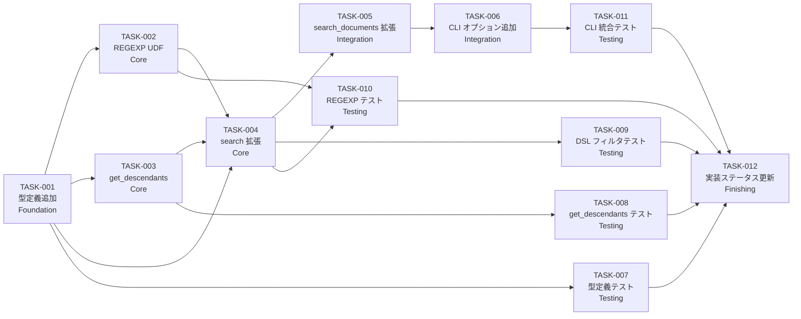

# ドキュメント検索機能 タスクブレイクダウン

**対象設計書:** [document-search_design.md](../../specification/document-search_design.md)
**対象仕様書:** [document-search_spec.md](../../specification/document-search_spec.md)
**対象 PRD:** [document-search.md](../../requirement/document-search.md)
**生成日:** 2026-03-12

---

## 実装スコープ

本タスクは `impl-status: partial` の document-search 機能に、以下を追加実装する:

- フィルタ DSL (`--filter "field:op:value"`)
- 論理演算子 (`--or` フラグ)
- 親子再帰トラバーサル (`--parent`)
- 正規表現マッチ (Python UDF)

---

## タスク依存関係図



---

## Phase 1: Foundation（基盤）

### TASK-001: FilterCondition / MatchOp 型定義を追加

**カテゴリ:** Foundation
**対象ファイル:** `src/sdd_cli/types.py`
**依存タスク:** なし
**FR:** FR-014, FR-017

**作業内容:**

`types.py` に `MatchOp` と `FilterCondition` 型定義を追加する。

```python
from typing import Literal

MatchOp = Literal["exact", "contains", "regex"]

class FilterCondition(TypedDict):
    field: str
    op: MatchOp
    value: str
```

**完了条件:**
- [ ] `MatchOp` が `Literal["exact", "contains", "regex"]` として定義されている
- [ ] `FilterCondition` TypedDict が `field: str`, `op: MatchOp`, `value: str` フィールドを持つ
- [ ] `mypy` でエラーが発生しない
- [ ] `ruff check` でエラーが発生しない

---

## Phase 2: Core Implementation（コア実装）

### TASK-002: IndexDB に REGEXP UDF を実装

**カテゴリ:** Core
**対象ファイル:** `src/sdd_cli/indexer/db.py`
**依存タスク:** TASK-001
**FR:** FR-017, FR-018

**作業内容:**

`IndexDB.__init__()` で `conn.create_function()` を呼び出し、`REGEXP(pattern, value)` を登録する。
不正なパターンは `re.error` をキャッチし `None` を返す（SQL 側では `WHERE REGEXP(...) = 1` と比較）。

```python
import re

def _regexp_func(pattern: str, value: str) -> bool:
    try:
        return bool(re.search(pattern, value or ""))
    except re.error:
        raise ValueError(f"Invalid regex pattern: {pattern}")

# __init__ 内:
self.conn.create_function("REGEXP", 2, _regexp_func)
```

**完了条件:**
- [ ] `IndexDB` のコンストラクタで `REGEXP` 関数が SQLite に登録される
- [ ] 正常な正規表現パターンでマッチ/非マッチが正しく動作する
- [ ] 不正な正規表現パターンで `ValueError` が発生する
- [ ] Python 3.9〜3.13 で動作する

---

### TASK-003: IndexDB.get_descendants() を実装

**カテゴリ:** Core
**対象ファイル:** `src/sdd_cli/indexer/db.py`
**依存タスク:** TASK-001
**FR:** FR-016

**作業内容:**

`parent_feature_id` チェーンを Python 側の反復クエリで辿り、全子孫 feature_id セットを返す。

```python
def get_descendants(self, feature_id: str) -> set[str]:
    visited: set[str] = set()
    queue = [feature_id]
    while queue:
        current = queue.pop()
        if current in visited:
            continue
        visited.add(current)
        cursor = self.conn.cursor()
        cursor.execute(
            "SELECT feature_id FROM documents_meta WHERE parent_feature_id = ?",
            (current,),
        )
        children = [row[0] for row in cursor.fetchall()]
        queue.extend(children)
    return visited - {feature_id}
```

**完了条件:**
- [ ] 指定した `feature_id` 自身は結果に含まれない
- [ ] 直接の子のみでなく全子孫（孫・ひ孫）を収集する
- [ ] 循環参照が発生した場合も無限ループにならない
- [ ] 対象が存在しない場合は空セットを返す

---

### TASK-004: IndexDB.search() にフィルタ DSL / OR / parent を追加

**カテゴリ:** Core
**対象ファイル:** `src/sdd_cli/indexer/db.py`
**依存タスク:** TASK-001, TASK-002, TASK-003
**FR:** FR-014, FR-015, FR-016, FR-017, FR-018

**作業内容:**

既存の `search()` メソッドシグネチャに以下を追加し、SQL 構築ロジックを拡張する:

```python
def search(
    self,
    query: Optional[str] = None,
    feature_id: Optional[str] = None,
    tag: Optional[str] = None,
    directory: Optional[str] = None,
    filters: Optional[list[FilterCondition]] = None,  # 追加
    or_operator: bool = False,                         # 追加
    parent: Optional[str] = None,                     # 追加
    limit: int = 10,
) -> list[SearchResult]:
```

フィルタ DSL の SQL 構築ルール:
- `op=exact`: `meta.{field} = ?`
- `op=contains`: `meta.{field} LIKE ?`（値を `%value%` でラップ）
- `op=regex`: `REGEXP(meta.{field}, ?)` (Python UDF)
- `or_operator=True` の場合: `(cond1 OR cond2 OR ...)`
- `or_operator=False`（デフォルト）の場合: `cond1 AND cond2 AND ...`
- `parent` 指定時: `get_descendants()` で全子孫を取得し、`meta.feature_id IN (?, ?, ...)` に追加

不正な `field` 名（許可リスト外）は `ValueError` を発生させる。

**許可フィールドリスト:** `feature_id`, `status`, `type`, `tags`, `category`, `directory`, `file_type`

**完了条件:**
- [ ] 既存の `query/feature_id/tag/directory/limit` の動作が変わらない（後方互換）
- [ ] `filters=None` かつ `or_operator=False` かつ `parent=None` の場合は従来と同一の SQL を実行する
- [ ] `op=exact`/`contains`/`regex` それぞれが正しく SQL に変換される
- [ ] `--or` フラグで OR 結合される
- [ ] `parent` 指定で全子孫ドキュメントが返される
- [ ] 不正フィールド名で `ValueError` が発生する
- [ ] すべての SQL パラメータが `?` プレースホルダーを使用している（T-002 準拠）

---

## Phase 3: Integration（統合）

### TASK-005: commands/search.py の search_documents() を拡張

**カテゴリ:** Integration
**対象ファイル:** `src/sdd_cli/commands/search.py`
**依存タスク:** TASK-004
**FR:** FR-014, FR-015, FR-016

**作業内容:**

`search_documents()` に新パラメータを追加し、`IndexDB.search()` に渡す:

```python
def search_documents(
    root: Path,
    query: Optional[str] = None,
    feature_id: Optional[str] = None,
    tag: Optional[str] = None,
    directory: Optional[str] = None,
    filters: Optional[list[FilterCondition]] = None,  # 追加
    or_operator: bool = False,                         # 追加
    parent: Optional[str] = None,                     # 追加
    output_format: str = "text",
    limit: int = 10,
) -> str:
```

また、CLI から渡される `--filter "field:op:value"` 文字列をパースして `FilterCondition` リストに変換するヘルパー `_parse_filter()` を実装する:

```python
def _parse_filter(filter_str: str) -> FilterCondition:
    """"field:op:value" 文字列を FilterCondition に変換する。

    不正な形式は ValueError を発生させる。
    """
```

**完了条件:**
- [ ] `_parse_filter("status:exact:approved")` が正しい `FilterCondition` を返す
- [ ] `_parse_filter("bad-format")` が `ValueError` を発生させる
- [ ] 複数の `--filter` 指定がリストとして `IndexDB.search()` に渡される
- [ ] 既存の引数（`query/feature_id/tag/directory/limit`）の動作が変わらない（後方互換）

---

### TASK-006: cli.py に --filter / --or / --parent オプションを追加

**カテゴリ:** Integration
**対象ファイル:** `src/sdd_cli/cli.py`
**依存タスク:** TASK-005
**FR:** FR-014, FR-015, FR-016, FR-018

**作業内容:**

`search` コマンド定義に以下を追加する:

```python
@click.option(
    "--filter",
    "filters",
    multiple=True,
    help='Filter by metadata field: "field:op:value" (op: exact/contains/regex). Repeatable.',
)
@click.option(
    "--or",
    "or_operator",
    is_flag=True,
    default=False,
    help="Combine --filter conditions with OR (default: AND)",
)
@click.option(
    "--parent",
    help="Retrieve all descendant documents of the specified parent feature_id",
)
```

`search_documents()` 呼び出しに新パラメータを追加する。`filters` は `tuple[str, ...]` で渡されるため、`_parse_filter()` でリストに変換する（変換エラーは `ValueError` として `SDDGroup` がハンドリング）。

**完了条件:**
- [ ] `sdd-cli search --help` に `--filter`, `--or`, `--parent` が表示される
- [ ] `sdd-cli search --filter "status:exact:draft"` が実行できる
- [ ] `sdd-cli search --filter "type:exact:spec" --filter "type:exact:design" --or` が実行できる
- [ ] `sdd-cli search --parent document-search` が実行できる
- [ ] 不正なフィルタ形式で `Error: ...` が stderr に出力され終了コード 1 となる

---

## Phase 4: Testing（テスト）

### TASK-007: FilterCondition / MatchOp の型定義テスト

**カテゴリ:** Testing
**対象ファイル:** `tests/test_types.py`（または既存テストファイルに追加）
**依存タスク:** TASK-001
**FR:** FR-014

**作業内容:**

- `FilterCondition` の各フィールドが正しい型であることを確認するテスト
- `MatchOp` に許可値以外は型チェックでエラーになることを確認（runtime は文字列なので mypy で検証）

**完了条件:**
- [ ] `FilterCondition(field="status", op="exact", value="draft")` が正常に構築できる
- [ ] `mypy` で `MatchOp` の型チェックが通る

---

### TASK-008: IndexDB.get_descendants() のユニットテスト

**カテゴリ:** Testing
**対象ファイル:** `tests/test_db.py`（または `tests/test_db_descendants.py`）
**依存タスク:** TASK-003
**FR:** FR-016

**テストケース:**

| テストケース | 期待結果 |
|:-----------|:--------|
| 存在しない feature_id | 空セット |
| 子が 1 つ | 子の feature_id のセット |
| 孫・ひ孫まで | 全子孫の feature_id セット |
| 循環参照がある場合 | 無限ループせず有限のセットを返す |

**完了条件:**
- [ ] 上記 4 テストケースがすべてパスする
- [ ] テスト内で実際の SQLite DB（`:memory:` または一時ファイル）を使用する

---

### TASK-009: IndexDB.search() フィルタ DSL のユニットテスト

**カテゴリ:** Testing
**対象ファイル:** `tests/test_db.py`（または `tests/test_db_filter.py`）
**依存タスク:** TASK-004
**FR:** FR-014, FR-015

**テストケース:**

| テストケース | 期待結果 |
|:-----------|:--------|
| `op=exact` で一致するドキュメント | 一致のみ返す |
| `op=exact` で一致しないドキュメント | 空リスト |
| `op=contains` で部分一致 | 部分一致を返す |
| 複数フィルタ AND 結合 | 全条件を満たすのみ |
| 複数フィルタ OR 結合 | いずれかを満たすものを返す |
| 異なるフィールド間の OR | 異なるフィールドで OR が動作する |
| 不正フィールド名 | `ValueError` が発生する |

**完了条件:**
- [ ] 上記テストケースがすべてパスする
- [ ] 既存の検索テスト（query/feature_id/tag/directory フィルタ）が引き続きパスする

---

### TASK-010: IndexDB.search() REGEXP UDF のユニットテスト

**カテゴリ:** Testing
**対象ファイル:** `tests/test_db.py`（または `tests/test_db_regexp.py`）
**依存タスク:** TASK-002, TASK-004
**FR:** FR-017, FR-018

**テストケース:**

| テストケース | 期待結果 |
|:-----------|:--------|
| `op=regex` で一致するパターン | 一致ドキュメントを返す |
| `op=regex` で一致しないパターン | 空リスト |
| `op=regex` で `^` アンカー付きパターン | 先頭一致のみ返す |
| 不正な正規表現パターン | `ValueError` が発生し終了コード 1 |
| `None` 値フィールドに regex | エラーなく空マッチとして扱う |

**完了条件:**
- [ ] 上記テストケースがすべてパスする
- [ ] SQL インジェクションの危険がないことを確認（パラメータ化クエリのみ使用）

---

### TASK-011: CLI 統合テスト（--filter / --or / --parent）

**カテゴリ:** Testing
**対象ファイル:** `tests/test_cli.py`
**依存タスク:** TASK-006
**FR:** FR-014, FR-015, FR-016, FR-017, FR-018

**テストケース（Click テストクライアント `CliRunner` 使用）:**

| テストケース | 期待結果 |
|:-----------|:--------|
| `sdd-cli search --filter "status:exact:draft"` | フィルタ済み結果を返す |
| `sdd-cli search --filter "type:exact:spec" --filter "type:exact:design" --or` | OR 結果を返す |
| `sdd-cli search --parent document-search` | 子孫ドキュメントを返す |
| `sdd-cli search --filter "feature_id:regex:^doc"` | regex フィルタ結果を返す |
| `sdd-cli search --filter "bad-format"` | exit_code=1、stderr に `Error:` |
| `sdd-cli search --filter "invalid_field:exact:x"` | exit_code=1、stderr に `Error:` |
| `sdd-cli search --filter "status:exact:draft" --format json` | JSON 形式で出力 |

**完了条件:**
- [ ] 上記テストケースがすべてパスする
- [ ] 既存の CLI テスト（`query`, `--feature-id`, `--tag`, `--dir` 等）が引き続きパスする
- [ ] `uv run pytest` でテストスイート全体がパスする

---

## Phase 5: Finishing（仕上げ）

### TASK-012: 実装ステータスを更新

**カテゴリ:** Finishing
**対象ファイル:** `.sdd/specification/document-search_design.md`
**依存タスク:** TASK-007, TASK-008, TASK-009, TASK-010, TASK-011

**作業内容:**

- `impl-status: partial` → `impl-status: implemented` に変更
- Section 1.1 の未実装項目を実装済み（🟢）に更新

**完了条件:**
- [ ] `impl-status` が `implemented` に更新されている
- [ ] Section 1.1 の全モジュールが `🟢` になっている
- [ ] `updated` 日付が更新されている

---

## タスクサマリー

| ID | フェーズ | タスク名 | 対象ファイル | FR/NFR |
|:---|:--------|:--------|:-----------|:------|
| TASK-001 | Foundation | FilterCondition/MatchOp 型定義追加 | `types.py` | FR-014, FR-017 |
| TASK-002 | Core | REGEXP UDF 実装 | `indexer/db.py` | FR-017, FR-018 |
| TASK-003 | Core | get_descendants() 実装 | `indexer/db.py` | FR-016 |
| TASK-004 | Core | search() 拡張（DSL/OR/parent） | `indexer/db.py` | FR-014〜018 |
| TASK-005 | Integration | search_documents() 拡張 | `commands/search.py` | FR-014〜016 |
| TASK-006 | Integration | CLI オプション追加 | `cli.py` | FR-014〜018 |
| TASK-007 | Testing | 型定義テスト | `tests/` | FR-014 |
| TASK-008 | Testing | get_descendants() テスト | `tests/` | FR-016 |
| TASK-009 | Testing | フィルタ DSL テスト | `tests/` | FR-014, FR-015 |
| TASK-010 | Testing | REGEXP UDF テスト | `tests/` | FR-017, FR-018 |
| TASK-011 | Testing | CLI 統合テスト | `tests/test_cli.py` | FR-014〜018 |
| TASK-012 | Finishing | 実装ステータス更新 | `document-search_design.md` | — |

---

## 要求カバレッジ

### 機能要件（FR）カバレッジ

| FR ID | 要件概要 | カバーするタスク |
|:------|:--------|:--------------|
| FR-001〜013 | 既存実装済み | 既存コード（変更なし） |
| FR-014 | フィルタ DSL `field:op:value` | TASK-001, TASK-004, TASK-005, TASK-006 |
| FR-015 | `--or` フラグで OR 結合 | TASK-004, TASK-005, TASK-006 |
| FR-016 | `--parent` で再帰トラバーサル | TASK-003, TASK-004, TASK-005, TASK-006 |
| FR-017 | `op=regex` で正規表現マッチ | TASK-002, TASK-004 |
| FR-018 | 不正 regex のエラーハンドリング | TASK-002, TASK-006 |

### 非機能要件（NFR）カバレッジ

| NFR ID | 要件概要 | カバーするタスク |
|:-------|:--------|:--------------|
| NFR-001 | FTS5 trigram 依存 | 既存実装（変更なし） |
| NFR-002 | Python 3.9〜3.13 互換 | 全タスク（構文確認） |
| NFR-003 | XDG 準拠キャッシュ | 既存実装（変更なし） |
| NFR-004 | SDDGroup エラーハンドリング | TASK-006 |
| NFR-005 | 最小依存（Click のみ） | TASK-004（re は stdlib） |
| NFR-006 | カバレッジ 80% 以上 | TASK-007〜011 |
| T-002 | SQL インジェクション防止 | TASK-004, TASK-010 |
| T-003 | パス安全性 | 既存実装（変更なし） |

---

## 参考資料

- **設計書:** [document-search_design.md](../../specification/document-search_design.md)
- **仕様書:** [document-search_spec.md](../../specification/document-search_spec.md)
- **PRD:** [document-search.md](../../requirement/document-search.md)
- **CONSTITUTION.md:** [CONSTITUTION.md](../../CONSTITUTION.md)
