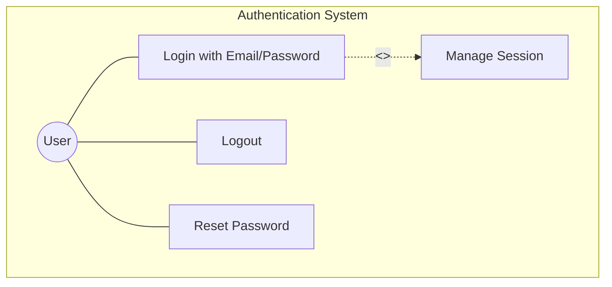
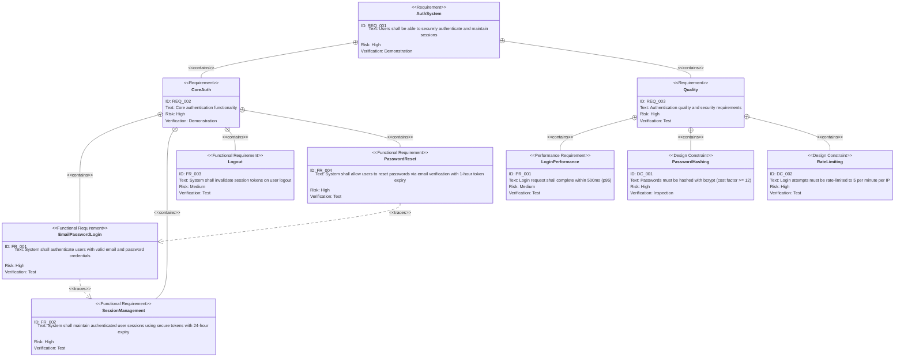

# Authentication Requirements Specification

## Overview

This document defines the requirements for the authentication feature. It enables users to securely log in with email and password, manage sessions, and recover access through password reset.

---

# 1. How to Read Requirements Diagrams

## 1.1. Requirement Types

- **requirement**: General requirement
- **functionalRequirement**: Functional requirement
- **performanceRequirement**: Performance requirement
- **designConstraint**: Design constraint

## 1.2. Risk Levels

- **High**: Business critical, difficult to implement
- **Medium**: Important but alternatives exist
- **Low**: Nice to have

## 1.3. Verification Methods

- **Test**: Verification by testing
- **Demonstration**: Verification by demonstration
- **Inspection**: Verification by inspection (review)

## 1.4. Relationship Types

- **contains**: Parent requirement contains child requirements
- **derives**: Requirement derives another requirement
- **traces**: Traceability between requirements

---

# 2. Requirements List

## 2.1. Use Case Diagram (Overview)

## 2.2. Function List (Text Format)

- Authentication
    - Login with email and password
        - Email format validation
        - Password verification
        - Session token generation
    - Logout
        - Session token invalidation
    - Session Management
        - Token-based session maintenance
        - Session expiry handling
    - Password Reset
        - Reset request via email
        - Token-based verification
        - New password submission

---

# 3. Requirements Diagram (SysML Requirements Diagram)

## 3.1. Overall Requirements Diagram

---

# 4. Detailed Requirements Description

## 4.1. Functional Requirements

### FR_001: Email/Password Login

Users shall authenticate using a valid email address and password. On successful authentication, the system returns a session token. On failure, a generic error message is returned without revealing which field is incorrect.

**Acceptance Criteria:**

- Valid email format (RFC 5322) required
- Password minimum 8 characters
- Returns session token on success (200)
- Returns generic error on invalid credentials (401)
- Returns validation error on malformed input (400)

**Verification method:** Test

### FR_002: Session Management

The system shall maintain authenticated user sessions using JWT tokens. Sessions expire after 24 hours. Each authenticated request must include a valid, non-expired token.

**Acceptance Criteria:**

- JWT token issued on successful login
- Token validated on each authenticated request
- Expired tokens rejected with 401 response
- Tampered tokens rejected with 401 response

**Verification method:** Test

### FR_003: Logout

The system shall invalidate the current session token when a user logs out. Subsequent requests with the invalidated token shall be rejected.

**Acceptance Criteria:**

- POST /api/logout invalidates current token
- Invalidated tokens rejected on subsequent requests
- Returns success even if token is already expired

**Verification method:** Test

### FR_004: Password Reset

The system shall provide email-based password reset. A secure reset token is sent to the registered email address. The token expires in 1 hour and is single-use.

**Acceptance Criteria:**

- Reset request always returns success (prevents email enumeration)
- Reset token sent via email to registered address
- Token expires after 1 hour
- Token is single-use
- New password must meet minimum requirements

**Verification method:** Test

## 4.2. Performance Requirements

### PR_001: Login Performance

Login request shall complete within 500ms at the 95th percentile under normal load conditions.

**Verification method:** Test

## 4.3. Design Constraints

### DC_001: Password Hashing

Passwords must be hashed using bcrypt with a cost factor of at least 12. Raw passwords must never be stored or logged.

**Verification method:** Inspection

### DC_002: Rate Limiting

Login attempts must be rate-limited to 5 attempts per minute per IP address. Password reset requests must be limited to 3 per hour per IP.

**Verification method:** Test

---

# 5. Constraints

## 5.1. Technical Constraints

- All endpoints must use HTTPS in production
- Session tokens must be JWT signed with HS256 or RS256
- Email maximum length: 255 characters
- Password minimum length: 8 characters

## 5.2. Security Constraints

- Generic error messages for authentication failures (prevent information leakage)
- No timing-based information leakage on credential verification
- Password reset tokens must be cryptographically secure (256-bit)

---

# 6. Out of Scope

The following are out of scope for this PRD:

- OAuth/Social login (future enhancement)
- Multi-factor authentication (future enhancement)
- Account lockout policies
- User registration flow

---

# 7. Glossary

| Term | Definition |
|:-----|:-----------|
| JWT | JSON Web Token - compact, URL-safe token format for session management |
| bcrypt | Password hashing algorithm using key stretching for secure storage |
| Rate Limiting | Restricting number of requests per time period to prevent brute force attacks |
| Session Token | JWT token identifying an authenticated user session |