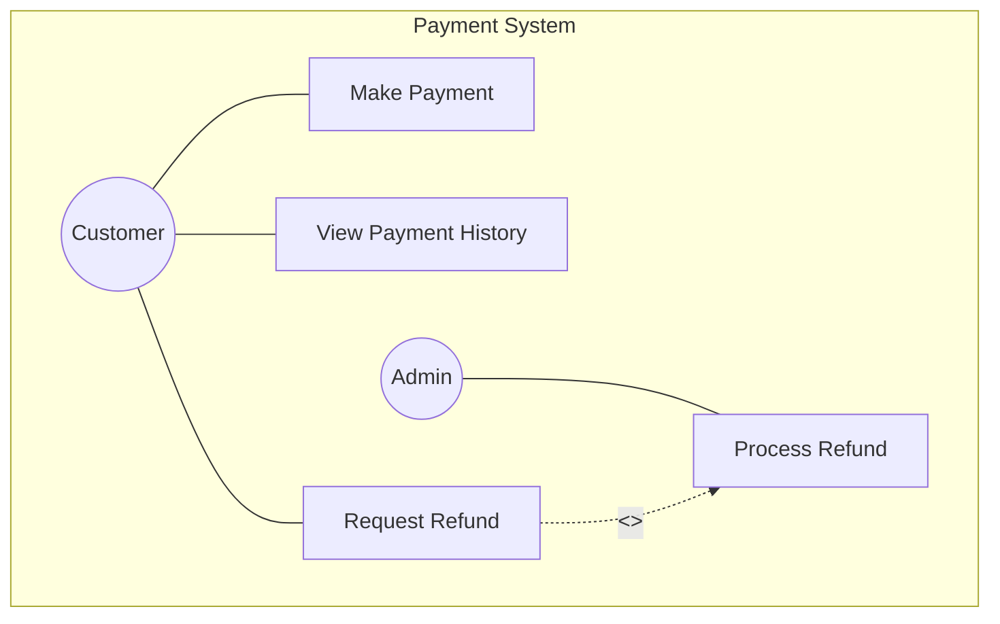

# Payment Requirements Specification

## Overview

This document defines the requirements for the payment feature. It enables secure credit card payment processing, provides transaction history tracking, and supports refund operations.

---

# 1. How to Read Requirements Diagrams

## 1.1. Requirement Types

- **requirement**: General requirement
- **functionalRequirement**: Functional requirement
- **performanceRequirement**: Performance requirement
- **designConstraint**: Design constraint

## 1.2. Risk Levels

- **High**: Business critical, difficult to implement
- **Medium**: Important but alternatives exist
- **Low**: Nice to have

## 1.3. Verification Methods

- **Test**: Verification by testing
- **Demonstration**: Verification by demonstration
- **Inspection**: Verification by inspection (review)

## 1.4. Relationship Types

- **contains**: Parent requirement contains child requirements
- **derives**: Requirement derives another requirement
- **traces**: Traceability between requirements

---

# 2. Requirements List

## 2.1. Use Case Diagram (Overview)

## 2.2. Function List (Text Format)

- Payment Processing
    - Credit card payment submission
        - Card information validation
        - Payment gateway integration
        - Payment confirmation
    - Payment error handling
        - Decline handling
        - Timeout handling
- Payment History
    - Transaction list display
        - Date, amount, status, payment method
    - Transaction detail view
- Refund Processing
    - Refund request submission
        - Full refund
        - Partial refund
    - Refund status tracking

---

# 3. Requirements Diagram (SysML Requirements Diagram)

## 3.1. Overall Requirements Diagram

```mermaid
requirementDiagram
    requirement PaymentSystem {
        id: REQ_001
        text: "Users shall be able to make payments, view history, and request refunds"
        risk: high
        verifymethod: demonstration
    }

    requirement CorePayment {
        id: REQ_002
        text: "Core payment processing functionality"
        risk: high
        verifymethod: demonstration
    }

    requirement PaymentHistory {
        id: REQ_003
        text: "Payment transaction history functionality"
        risk: medium
        verifymethod: demonstration
    }

    requirement RefundSupport {
        id: REQ_004
        text: "Refund processing functionality"
        risk: high
        verifymethod: demonstration
    }

    requirement Quality {
        id: REQ_005
        text: "Payment quality and security requirements"
        risk: high
        verifymethod: test
    }

    functionalRequirement ProcessPayment {
        id: FR_001
        text: "System shall process credit card payments through a PCI-compliant payment gateway"
        risk: high
        verifymethod: test
    }

    functionalRequirement ValidateCard {
        id: FR_002
        text: "System shall validate card number format, expiration date, and CVV before submission"
        risk: high
        verifymethod: test
    }

    functionalRequirement PaymentConfirmation {
        id: FR_003
        text: "System shall provide payment confirmation or error feedback within 5 seconds"
        risk: medium
        verifymethod: test
    }

    functionalRequirement DisplayHistory {
        id: FR_004
        text: "Users shall view payment history including date, amount, status, and payment method"
        risk: medium
        verifymethod: test
    }

    functionalRequirement ProcessRefund {
        id: FR_005
        text: "Authorized users shall issue full or partial refunds within 90 days of original payment"
        risk: high
        verifymethod: test
    }

    functionalRequirement TrackRefundStatus {
        id: FR_006
        text: "System shall track and display refund status in transaction history"
        risk: medium
        verifymethod: test
    }

    performanceRequirement PaymentSpeed {
        id: PR_001
        text: "Payment processing shall complete within 5 seconds under normal load"
        risk: medium
        verifymethod: test
    }

    designConstraint PCIDSSCompliance {
        id: DC_001
        text: "Payment processing must comply with PCI DSS standards"
        risk: high
        verifymethod: inspection
    }

    designConstraint NoCardStorage {
        id: DC_002
        text: "Application must not store raw credit card numbers"
        risk: high
        verifymethod: inspection
    }

    PaymentSystem - contains -> CorePayment
    PaymentSystem - contains -> PaymentHistory
    PaymentSystem - contains -> RefundSupport
    PaymentSystem - contains -> Quality
    CorePayment - contains -> ProcessPayment
    CorePayment - contains -> ValidateCard
    CorePayment - contains -> PaymentConfirmation
    PaymentHistory - contains -> DisplayHistory
    RefundSupport - contains -> ProcessRefund
    RefundSupport - contains -> TrackRefundStatus
    Quality - contains -> PaymentSpeed
    Quality - contains -> PCIDSSCompliance
    Quality - contains -> NoCardStorage
    ProcessPayment - traces -> ValidateCard
    ProcessRefund - traces -> ProcessPayment
    TrackRefundStatus - traces -> DisplayHistory
```

---

# 4. Detailed Requirements Description

## 4.1. Functional Requirements

### FR_001: Process Credit Card Payments

The system shall process payments from Visa, Mastercard, and American Express credit cards through a PCI-compliant payment gateway.

**Acceptance Criteria:**

- Supports Visa, Mastercard, and American Express
- Sends tokenized card data to payment gateway
- Returns transaction ID on success (201)
- Returns appropriate error on decline (402)
- Handles gateway timeout gracefully

**Verification method:** Test

### FR_002: Validate Card Information

The system shall validate credit card number format, expiration date, and CVV before submitting to the payment gateway.

**Acceptance Criteria:**

- Card number passes Luhn algorithm check
- Expiration date is in the future
- CVV is 3 or 4 digits
- Returns validation errors for invalid input (400)

**Verification method:** Test

### FR_003: Payment Confirmation

The system shall provide immediate payment confirmation or error feedback to users within 5 seconds of transaction submission.

**Acceptance Criteria:**

- Success response includes transaction ID and amount
- Error response includes actionable error message
- Response returned within 5 seconds

**Verification method:** Test

### FR_004: Display Payment History

Users shall be able to view their payment transaction history including date, amount, status, and payment method.

**Acceptance Criteria:**

- Displays transaction list sorted by date (newest first)
- Each entry shows date, amount, status, last 4 digits of card
- Supports pagination for large result sets

**Verification method:** Test

### FR_005: Process Refunds

Authorized users shall be able to issue full or partial refunds for transactions within 90 days of the original payment.

**Acceptance Criteria:**

- Supports full and partial refunds
- Refund amount cannot exceed original payment amount
- Only transactions within 90 days are eligible
- Returns refund confirmation with refund ID

**Verification method:** Test

### FR_006: Track Refund Status

The system shall track refund status and display it in transaction history with expected completion timeline.

**Acceptance Criteria:**

- Refund status visible in transaction history
- Status transitions: pending -> succeeded/failed
- Expected completion timeline provided

**Verification method:** Test

## 4.2. Performance Requirements

### PR_001: Payment Processing Speed

Payment processing shall complete within 5 seconds under normal load conditions.

**Verification method:** Test

## 4.3. Design Constraints

### DC_001: PCI DSS Compliance

Payment processing must comply with PCI DSS standards. All card data in transit must be encrypted using TLS 1.2 or higher.

**Verification method:** Inspection

### DC_002: No Direct Card Storage

The application must not store raw credit card numbers. Payment gateway tokenization must be used for all card operations.

**Verification method:** Inspection

---

# 5. Constraints

## 5.1. Technical Constraints

- Must integrate with a PCI-compliant payment gateway (e.g., Stripe)
- All monetary values must use appropriate decimal precision
- Payment IDs must be unique across the system
- Transaction records must be retained for minimum 7 years

## 5.2. Business Constraints

- Initial release limited to credit cards only (no debit, digital wallets, or bank transfers)
- Initial release supports USD transactions only
- Refund window limited to 90 days from original transaction

## 5.3. Security Constraints

- Card data must be tokenized before storage
- All payment endpoints must use HTTPS
- Sensitive card details (full number, CVV) must never be logged

---

# 6. Out of Scope

The following are out of scope for this PRD:

- Cryptocurrency payments (future enhancement)
- Recurring subscription billing (separate feature)
- Multi-currency support (future enhancement)
- Debit card and digital wallet support (future enhancement)

---

# 7. Glossary

| Term | Definition |
|:-----|:-----------|
| Payment Gateway | Third-party service that processes credit card transactions (e.g., Stripe) |
| PCI DSS | Payment Card Industry Data Security Standard for card data handling |
| Tokenization | Replacing sensitive card data with non-sensitive token for secure storage |
| Chargeback | Forced transaction reversal initiated by cardholder's bank |
| Luhn Algorithm | Checksum formula for validating credit card numbers |