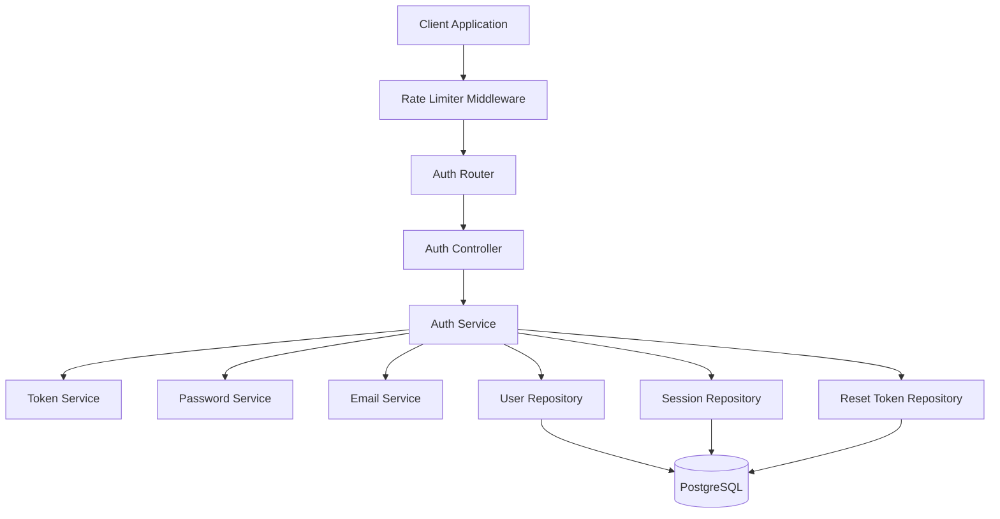

# Authentication Technical Design Document

**Document Type:** Technical Design Document (Design Doc)
**SDD Phase:** Plan (Design)
**Last Updated:** 2026-02-21
**Related Spec:** [auth_spec.md](./auth_spec.md)
**Related PRD:** [auth.md](../requirement/auth.md)

---

# 1. Implementation Status

**Status:** :red_circle: Not Implemented

| Module/Feature | Status | Notes |
|:---------------|:-------|:------|
| Login API | :red_circle: | POST /api/login endpoint |
| Logout API | :red_circle: | POST /api/logout endpoint |
| Password Reset API | :red_circle: | POST /api/password-reset endpoint |
| JWT Token Management | :red_circle: | Token generation, validation, invalidation |
| Password Hashing | :red_circle: | bcrypt integration |
| Rate Limiting | :red_circle: | Per-IP request throttling |

---

# 2. Design Goals

1. **Security First**: Implement authentication following OWASP best practices with bcrypt password hashing and JWT token management
2. **Stateless Authentication**: Use JWT tokens for stateless session management, enabling horizontal scalability
3. **Abuse Prevention**: Implement rate limiting on authentication endpoints to prevent brute-force attacks
4. **Information Leakage Prevention**: Return generic error messages for authentication failures to prevent user enumeration

---

# 3. Technology Stack

| Area | Technology | Selection Rationale |
|:-----|:-----------|:--------------------|
| Runtime | Node.js (LTS) | Widely adopted, async I/O suitable for API servers |
| Framework | Express.js | Lightweight, flexible HTTP framework with middleware ecosystem |
| Authentication Token | jsonwebtoken (JWT) | Industry standard for stateless session management, supports HS256/RS256 |
| Password Hashing | bcrypt (bcryptjs) | Proven adaptive hashing algorithm with configurable cost factor |
| Rate Limiting | express-rate-limit | Simple middleware-based rate limiting for Express |
| Validation | joi / zod | Schema-based input validation for request payloads |
| Database | PostgreSQL | Reliable RDBMS for user and session data storage |
| ORM | Prisma / TypeORM | Type-safe database access with migration support |

---

# 4. Architecture

## 4.1. System Architecture Diagram



## 4.2. Module Structure

| Module Name | Responsibility | Dependencies | Location |
|:------------|:---------------|:-------------|:---------|
| AuthRouter | Route definitions for /api/login, /api/logout, /api/password-reset | AuthController | `src/routes/auth.ts` |
| AuthController | Request/response handling, input validation | AuthService | `src/controllers/authController.ts` |
| AuthService | Business logic for login, logout, password reset | TokenService, PasswordService, EmailService, Repositories | `src/services/authService.ts` |
| TokenService | JWT token generation, validation, invalidation | jsonwebtoken | `src/services/tokenService.ts` |
| PasswordService | Password hashing and comparison | bcryptjs | `src/services/passwordService.ts` |
| EmailService | Password reset email delivery | Email provider SDK | `src/services/emailService.ts` |
| UserRepository | User CRUD operations | ORM, DB | `src/repositories/userRepository.ts` |
| SessionRepository | Session token storage and lookup | ORM, DB | `src/repositories/sessionRepository.ts` |
| ResetTokenRepository | Reset token CRUD operations | ORM, DB | `src/repositories/resetTokenRepository.ts` |
| AuthMiddleware | JWT validation middleware for protected routes | TokenService | `src/middleware/authMiddleware.ts` |
| RateLimitMiddleware | Rate limiting configuration | express-rate-limit | `src/middleware/rateLimitMiddleware.ts` |

## 4.3. Directory Structure

```
src/
  routes/
    auth.ts                    # Auth route definitions
  controllers/
    authController.ts          # Request/response handling
  services/
    authService.ts             # Auth business logic
    tokenService.ts            # JWT operations
    passwordService.ts         # bcrypt operations
    emailService.ts            # Email delivery
  repositories/
    userRepository.ts          # User data access
    sessionRepository.ts       # Session data access
    resetTokenRepository.ts    # Reset token data access
  middleware/
    authMiddleware.ts          # JWT validation middleware
    rateLimitMiddleware.ts     # Rate limit middleware
  types/
    auth.ts                    # Auth-related type definitions
```

---

# 5. Data Model

```typescript
// User table
interface UserEntity {
  id: string            // UUID v4, primary key
  email: string         // unique, max 255 chars
  password_hash: string // bcrypt hash (cost factor >= 12)
  created_at: Date
  updated_at: Date
}

// Session table (for token invalidation tracking)
interface SessionEntity {
  id: string            // UUID v4, primary key
  user_id: string       // FK -> users.id
  token_jti: string     // JWT ID claim (unique identifier)
  expires_at: Date      // 24h from creation
  invalidated_at: Date | null  // null = active, Date = invalidated timestamp
  created_at: Date
}

// Password Reset Token table
interface ResetTokenEntity {
  id: string            // UUID v4, primary key
  user_id: string       // FK -> users.id
  token_hash: string    // SHA-256 hash of the reset token
  expires_at: Date      // 1h from creation
  used: boolean         // Single-use flag
  created_at: Date
}
```

---

# 6. Interface Definition

```typescript
// AuthService interface
interface IAuthService {
  login(email: string, password: string): Promise<LoginResponse>
  logout(token: string): Promise<void>
  requestPasswordReset(email: string): Promise<void>
  resetPassword(token: string, newPassword: string): Promise<void>
}

// Token payload structure
interface TokenPayload {
  userId: string    // User ID from token claims
  jti: string       // JWT ID (unique token identifier)
  exp: number       // Expiration timestamp (Unix time)
  iat: number       // Issued at timestamp (Unix time)
}

// TokenService interface
interface ITokenService {
  generateToken(userId: string): Promise<{ token: string; expiresAt: Date }>
  validateToken(token: string): Promise<TokenPayload>
  invalidateToken(jti: string): Promise<void>
}

// PasswordService interface
interface IPasswordService {
  hash(password: string): Promise<string>
  compare(password: string, hash: string): Promise<boolean>
}

// Repository interfaces
interface IUserRepository {
  findByEmail(email: string): Promise<UserEntity | null>
  findById(id: string): Promise<UserEntity | null>
  updatePassword(id: string, passwordHash: string): Promise<void>
}

interface ISessionRepository {
  create(session: Omit<SessionEntity, 'id' | 'created_at'>): Promise<SessionEntity>
  findByJti(jti: string): Promise<SessionEntity | null>
  invalidate(jti: string): Promise<void>
}

interface IResetTokenRepository {
  create(token: Omit<ResetTokenEntity, 'id' | 'created_at'>): Promise<ResetTokenEntity>
  findByTokenHash(hash: string): Promise<ResetTokenEntity | null>
  markUsed(id: string): Promise<void>
}
```

---

# 7. Non-Functional Requirements Implementation

| Requirement | Implementation Approach |
|:------------|:------------------------|
| Login within 500ms (p95) | Optimize DB queries with indexes on email column; bcrypt cost factor 12 balances security and speed |
| Token validation within 50ms (p95) | JWT signature verification is CPU-bound (~1ms); session lookup uses indexed jti column |
| Password security (bcrypt >= 12) | PasswordService enforces minimum cost factor via configuration constant |
| Rate limiting (5/min login, 3/hr reset) | express-rate-limit middleware with separate configurations per endpoint |
| Generic error messages | AuthController returns identical error structure for all auth failures |
| HTTPS enforcement | Handled at infrastructure/reverse proxy level (nginx/ALB) |
| Timing-attack prevention | Use constant-time comparison for password and token validation |

---

# 8. Test Strategy

| Test Level | Target | Coverage Goal |
|:-----------|:-------|:--------------|
| Unit | PasswordService (hash/compare) | 100% - All hash and comparison paths |
| Unit | TokenService (generate/validate/invalidate) | 100% - Valid, expired, tampered, invalidated tokens |
| Unit | AuthService (login/logout/reset) | 100% - Success and all error paths |
| Integration | Auth API endpoints | All status codes (200, 400, 401, 429) |
| Integration | Rate limiting | Verify threshold enforcement |
| Integration | Database operations | Repository CRUD with test database |
| E2E | Login -> Authenticated request -> Logout flow | Full happy path |
| E2E | Password reset -> New login flow | Full reset workflow |
| Security | Timing attacks | Verify constant-time behavior |
| Security | Token tampering | Verify rejection of modified tokens |

---

# 9. Design Decisions

## 9.1. Decisions Made

| Decision | Options | Chosen | Rationale |
|:---------|:--------|:-------|:----------|
| Session management approach | (A) Stateless JWT only (B) JWT + DB session tracking | (B) JWT + DB session tracking | Enables token invalidation on logout while maintaining JWT benefits for validation speed |
| Password hashing algorithm | (A) bcrypt (B) Argon2 (C) scrypt | (A) bcrypt | Widely supported, well-tested, meets spec requirement (DC_001). Argon2 is newer but has less library maturity |
| Reset token storage | (A) Store raw token (B) Store hashed token | (B) Store hashed token | Even if DB is compromised, reset tokens cannot be used directly |
| Rate limiter storage | (A) In-memory (B) Redis-backed | (A) In-memory | Sufficient for single-instance deployment; can migrate to Redis for horizontal scaling |
| JWT signing algorithm | (A) HS256 (B) RS256 | (A) HS256 | Simpler key management for single-service architecture; RS256 recommended if tokens need cross-service verification |

## 9.2. Unresolved Issues

| Issue | Impact | Proposed Resolution |
|:------|:-------|:--------------------|
| Email provider selection | Affects EmailService implementation | Evaluate SendGrid, AWS SES, or Mailgun during implementation |
| Token refresh strategy | UX impact for long sessions | Consider implementing refresh tokens in future iteration |
