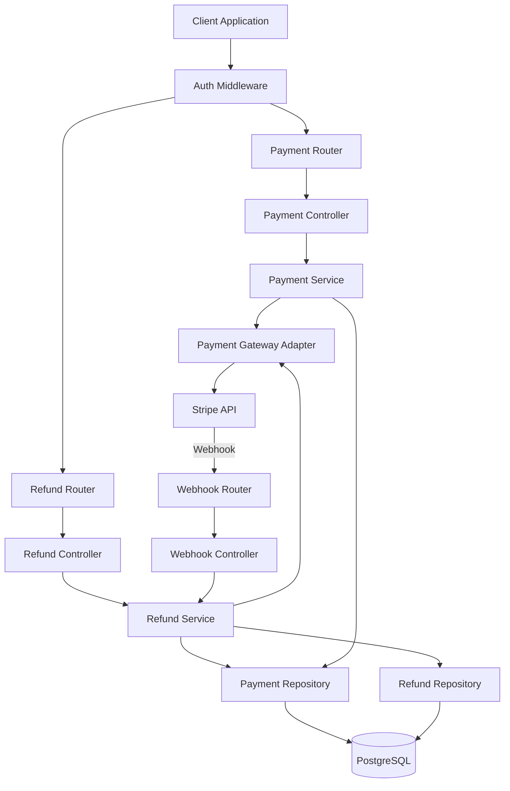

# Payment Technical Design Document

**Document Type:** Technical Design Document (Design Doc)
**SDD Phase:** Plan (Design)
**Last Updated:** 2026-02-21
**Related Spec:** [payment_spec.md](./payment_spec.md)
**Related PRD:** [payment.md](../requirement/payment.md)

---

# 1. Implementation Status

**Status:** :red_circle: Not Implemented

| Module/Feature | Status | Notes |
|:---------------|:-------|:------|
| Payment Processing API | :red_circle: | POST /api/payments endpoint |
| Payment History API | :red_circle: | GET /api/payments/:id endpoint |
| Refund Processing API | :red_circle: | POST /api/refunds endpoint |
| Payment Gateway Integration | :red_circle: | Stripe SDK integration |
| Card Validation | :red_circle: | Luhn check, expiry, CVV validation |
| Webhook Handler | :red_circle: | Refund status update via gateway callback |

---

# 2. Design Goals

1. **PCI DSS Compliance**: Never store raw card data in the application; use payment gateway tokenization for all card operations
2. **Reliable Payment Processing**: Implement idempotent payment operations with proper error handling and timeout management
3. **Audit Trail**: Maintain complete transaction records for all payments and refunds with immutable history
4. **Gateway Abstraction**: Abstract payment gateway behind an interface to enable future provider switching without business logic changes

---

# 3. Technology Stack

| Area | Technology | Selection Rationale |
|:-----|:-----------|:--------------------|
| Runtime | Node.js (LTS) | Consistent with auth module; async I/O for gateway communication |
| Framework | Express.js | Shared with auth module for unified API layer |
| Payment Gateway | Stripe API (stripe-node) | Industry-leading PCI DSS Level 1 certified gateway; excellent SDK and documentation |
| Validation | joi / zod | Schema-based validation for payment amounts, currency codes, card tokens |
| Database | PostgreSQL | Consistent with auth module; ACID transactions for payment integrity |
| ORM | Prisma / TypeORM | Shared with auth module for consistent data access patterns |
| Webhook Verification | stripe-node (built-in) | Stripe SDK provides webhook signature verification out of the box |
| Currency Handling | dinero.js | Precise decimal arithmetic for monetary values, avoids floating-point issues |

---

# 4. Architecture

## 4.1. System Architecture Diagram



## 4.2. Module Structure

| Module Name | Responsibility | Dependencies | Location |
|:------------|:---------------|:-------------|:---------|
| PaymentRouter | Route definitions for /api/payments | PaymentController | `src/routes/payment.ts` |
| RefundRouter | Route definitions for /api/refunds | RefundController | `src/routes/refund.ts` |
| WebhookRouter | Route definitions for /webhooks/stripe | WebhookController | `src/routes/webhook.ts` |
| PaymentController | Payment request/response handling, validation | PaymentService | `src/controllers/paymentController.ts` |
| RefundController | Refund request/response handling, validation | RefundService | `src/controllers/refundController.ts` |
| WebhookController | Webhook event processing | RefundService | `src/controllers/webhookController.ts` |
| PaymentService | Payment business logic, amount validation | GatewayAdapter, PaymentRepository | `src/services/paymentService.ts` |
| RefundService | Refund business logic, eligibility checks | GatewayAdapter, PaymentRepository, RefundRepository | `src/services/refundService.ts` |
| GatewayAdapter | Payment gateway abstraction (Stripe implementation) | stripe-node | `src/adapters/stripeGatewayAdapter.ts` |
| PaymentRepository | Payment record CRUD operations | ORM, DB | `src/repositories/paymentRepository.ts` |
| RefundRepository | Refund record CRUD operations | ORM, DB | `src/repositories/refundRepository.ts` |

## 4.3. Directory Structure

```
src/
  routes/
    payment.ts                 # Payment route definitions
    refund.ts                  # Refund route definitions
    webhook.ts                 # Webhook route definitions
  controllers/
    paymentController.ts       # Payment request handling
    refundController.ts        # Refund request handling
    webhookController.ts       # Webhook event handling
  services/
    paymentService.ts          # Payment business logic
    refundService.ts           # Refund business logic
  adapters/
    gatewayAdapter.ts          # Gateway interface definition
    stripeGatewayAdapter.ts    # Stripe implementation
  repositories/
    paymentRepository.ts       # Payment data access
    refundRepository.ts        # Refund data access
  types/
    payment.ts                 # Payment-related type definitions
```

---

# 5. Data Model

```typescript
// Payment table
interface PaymentEntity {
  id: string              // UUID v4, primary key
  user_id: string         // FK -> users.id (from auth module)
  amount: number          // Payment amount (stored as integer cents)
  currency: string        // ISO 4217 currency code (e.g., "USD")
  status: PaymentStatus   // "pending" | "succeeded" | "failed" | "refunded"
  card_last4: string      // Last 4 digits of card
  gateway_payment_id: string  // Stripe payment intent ID
  metadata: object        // Additional transaction metadata (JSONB)
  created_at: Date
  updated_at: Date
}

// Refund table
interface RefundEntity {
  id: string              // UUID v4, primary key
  payment_id: string      // FK -> payments.id
  amount: number          // Refund amount (stored as integer cents)
  status: RefundStatus    // "pending" | "succeeded" | "failed"
  reason: string          // Refund reason (optional)
  gateway_refund_id: string   // Stripe refund ID
  created_at: Date
  updated_at: Date
}

type PaymentStatus = "pending" | "succeeded" | "failed" | "refunded"
type RefundStatus = "pending" | "succeeded" | "failed"
```

**Note**: Monetary values are stored as integer cents internally to avoid floating-point precision issues. Conversion to decimal format (2 decimal places) occurs at the API boundary.

---

# 6. Interface Definition

```typescript
// PaymentService interface
interface IPaymentService {
  processPayment(params: ProcessPaymentParams): Promise<PaymentResponse>
  getPaymentById(id: string): Promise<PaymentDetailResponse>
}

// RefundService interface
interface IRefundService {
  processRefund(params: ProcessRefundParams): Promise<RefundResponse>
  updateRefundStatus(gatewayRefundId: string, status: RefundStatus): Promise<void>
}

// Gateway Adapter interface (abstraction for payment providers)
interface IPaymentGatewayAdapter {
  createPayment(params: GatewayPaymentParams): Promise<GatewayPaymentResult>
  createRefund(params: GatewayRefundParams): Promise<GatewayRefundResult>
  verifyWebhookSignature(payload: string, signature: string): boolean
}

// Repository interfaces
interface IPaymentRepository {
  create(payment: Omit<PaymentEntity, 'id' | 'created_at' | 'updated_at'>): Promise<PaymentEntity>
  findById(id: string): Promise<PaymentEntity | null>
  findByIdWithRefunds(id: string): Promise<PaymentEntity & { refunds: RefundEntity[] } | null>
  updateStatus(id: string, status: PaymentStatus): Promise<void>
}

interface IRefundRepository {
  create(refund: Omit<RefundEntity, 'id' | 'created_at' | 'updated_at'>): Promise<RefundEntity>
  findByPaymentId(paymentId: string): Promise<RefundEntity[]>
  findByGatewayRefundId(gatewayRefundId: string): Promise<RefundEntity | null>
  updateStatus(id: string, status: RefundStatus): Promise<void>
  getTotalRefundedAmount(paymentId: string): Promise<number>
}
```

---

# 7. Non-Functional Requirements Implementation

| Requirement | Implementation Approach |
|:------------|:------------------------|
| Payment processing within 5 seconds | Set Stripe API timeout to 4.5s; implement circuit breaker for gateway failures |
| Payment history retrieval within 200ms (p95) | Index on payments.id and payments.user_id; eager load refunds in single query |
| PCI DSS compliance (DC_001) | Never receive raw card data; use Stripe.js client-side tokenization; only handle cardToken |
| No direct card storage (DC_002) | Store only card_last4 for display; gateway_payment_id for reference; card details stay in Stripe |
| Monetary precision | Store amounts as integer cents; use dinero.js for arithmetic; convert at API boundary |
| HTTPS enforcement | Handled at infrastructure level; webhook endpoint validates Stripe signature |
| Idempotency | Use Stripe idempotency keys to prevent duplicate payments |
| 7-year data retention | Soft-delete only; implement archival strategy for old records |

---

# 8. Test Strategy

| Test Level | Target | Coverage Goal |
|:-----------|:-------|:--------------|
| Unit | PaymentService (validation, business rules) | 100% - Amount validation, currency checks, all error paths |
| Unit | RefundService (eligibility, amount checks) | 100% - 90-day window, amount limits, all error paths |
| Unit | GatewayAdapter (Stripe SDK interaction) | 100% - Mock Stripe API responses for success, decline, errors |
| Integration | Payment API endpoints | All status codes (201, 400, 402, 404, 500) |
| Integration | Refund API endpoints | All status codes (201, 400, 404) |
| Integration | Webhook processing | Verify refund status updates from gateway callbacks |
| Integration | Database operations | Repository CRUD with test database |
| E2E | Payment -> View details -> Refund flow | Full happy path with test Stripe keys |
| E2E | Partial refund -> Multiple refunds flow | Verify cumulative amount tracking |
| Security | PCI compliance | Verify no card data in logs, DB, or API responses beyond last4 |

---

# 9. Design Decisions

## 9.1. Decisions Made

| Decision | Options | Chosen | Rationale |
|:---------|:--------|:-------|:----------|
| Payment gateway | (A) Stripe (B) PayPal (C) Adyen | (A) Stripe | Best developer experience, comprehensive SDK, PCI Level 1 certified, tokenization built-in |
| Monetary value storage | (A) Decimal column (B) Integer cents | (B) Integer cents | Avoids floating-point precision issues; standard practice in payment systems |
| Gateway abstraction | (A) Direct Stripe SDK usage (B) Adapter pattern | (B) Adapter pattern | Enables future gateway switching; improves testability with mock adapters |
| Refund status updates | (A) Polling (B) Webhooks | (B) Webhooks | Real-time status updates; reduces API calls; Stripe-recommended approach |
| Idempotency approach | (A) Client-generated keys (B) Server-generated keys | (A) Client-generated keys | Stripe standard; client controls retry behavior; prevents duplicate charges |

## 9.2. Unresolved Issues

| Issue | Impact | Proposed Resolution |
|:------|:-------|:--------------------|
| Multi-currency support | Currently USD only per PRD scope | Design adapter interface to support currency-specific rules in future |
| Chargeback handling | Not in current scope but impacts payment status | Plan webhook handler extension for dispute events |
| Payment list pagination | FR_004 mentions pagination but spec API only has single payment retrieval | Add GET /api/payments endpoint with pagination in future iteration |
