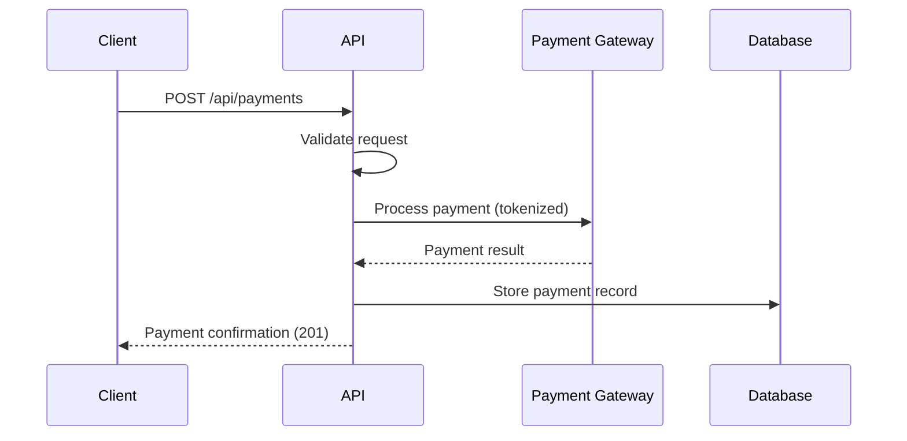
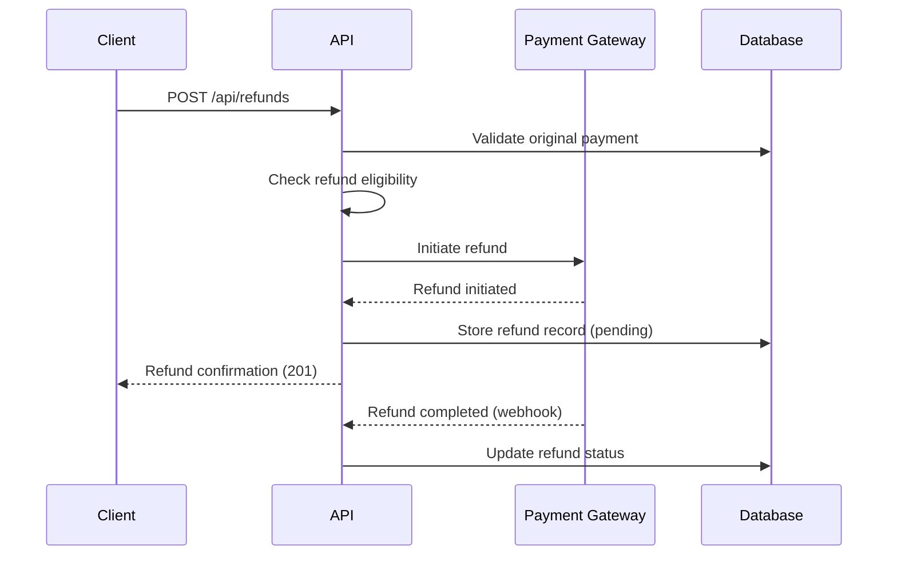

# Payment Specification

## Background

The payment feature enables secure credit card transaction processing for the application. Users need to make payments, view transaction history, and request refunds for completed transactions.

**PRD Reference**: [payment.md](../requirement/payment.md)

## Overview

This specification defines the abstract structure and behavior of the payment system. It provides:

- Credit card payment processing via PCI-compliant gateway
- Card information validation before submission
- Payment transaction history with filtering
- Full and partial refund processing within 90-day window
- Refund status tracking

**Target Users**: Application customers and administrators

## Requirements Definition

| Requirement ID | PRD Requirement | Specification Mapping |
|:---------------|:----------------|:----------------------|
| FR_001 | Process credit card payments | API: POST /api/payments |
| FR_002 | Validate card information | API: POST /api/payments (validation) |
| FR_003 | Payment confirmation | API: POST /api/payments (response) |
| FR_004 | Display payment history | API: GET /api/payments/:id |
| FR_005 | Process refunds | API: POST /api/refunds |
| FR_006 | Track refund status | Data Model: RefundStatus |
| PR_001 | Payment processing speed | Constraints: Performance |
| DC_001 | PCI DSS compliance | Constraints: Security |
| DC_002 | No direct card storage | Constraints: Security |

## API

### POST /api/payments

**Description**: Process a new credit card payment transaction.

**Request**:

```typescript
{
  amount: number,       // Payment amount (positive, 2 decimal places)
  currency: string,     // ISO 4217 currency code (e.g., "USD")
  cardToken: string,    // Tokenized card information from gateway
  metadata: object      // Optional additional transaction metadata
}
```

**Response (201 Created)**:

```typescript
{
  id: string,           // Unique payment transaction ID
  amount: number,       // Charged amount
  currency: string,     // Currency code
  status: string,       // "succeeded" or "pending"
  cardLast4: string,    // Last 4 digits of card
  createdAt: string     // ISO 8601 timestamp
}
```

**Error Responses**:

| Status | Code | Description |
|:-------|:-----|:------------|
| 400 | VALIDATION_ERROR | Invalid amount, currency, or card token |
| 402 | PAYMENT_DECLINED | Card declined by payment gateway |
| 500 | GATEWAY_ERROR | Payment gateway communication failure |

### GET /api/payments/:id

**Description**: Retrieve payment transaction details.

**Path Parameters**:

| Parameter | Type | Description |
|:----------|:-----|:------------|
| id | string | Payment transaction ID |

**Response (200 OK)**:

```typescript
{
  id: string,
  amount: number,
  currency: string,
  status: string,       // "pending" | "succeeded" | "failed" | "refunded"
  cardLast4: string,
  refunds: Refund[],    // Associated refunds
  createdAt: string,
  updatedAt: string
}
```

**Error Responses**:

| Status | Code | Description |
|:-------|:-----|:------------|
| 404 | NOT_FOUND | Payment with given ID does not exist |

### POST /api/refunds

**Description**: Process a refund for an existing payment transaction.

**Request**:

```typescript
{
  paymentId: string,    // Original payment transaction ID
  amount: number,       // Refund amount (must not exceed original)
  reason: string        // Optional refund reason
}
```

**Response (201 Created)**:

```typescript
{
  id: string,           // Unique refund ID
  paymentId: string,    // Reference to original payment
  amount: number,       // Refund amount
  status: string,       // "pending"
  createdAt: string     // ISO 8601 timestamp
}
```

**Error Responses**:

| Status | Code | Description |
|:-------|:-----|:------------|
| 400 | VALIDATION_ERROR | Invalid amount or missing paymentId |
| 400 | REFUND_EXCEEDS_PAYMENT | Refund amount exceeds original payment |
| 400 | REFUND_WINDOW_EXPIRED | Transaction is older than 90 days |
| 404 | PAYMENT_NOT_FOUND | Original payment does not exist |

## Type Definitions

### Payment

```typescript
type Payment = {
  id: string             // Unique payment identifier
  amount: number         // Payment amount (2 decimal places)
  currency: string       // ISO 4217 currency code
  status: PaymentStatus  // Current payment status
  cardLast4: string      // Last 4 digits of card (for display)
  metadata: object       // Additional metadata
  createdAt: string      // ISO 8601 timestamp
  updatedAt: string      // ISO 8601 timestamp
}
```

### Refund

```typescript
type Refund = {
  id: string             // Unique refund identifier
  paymentId: string      // Reference to original payment
  amount: number         // Refund amount (2 decimal places)
  status: RefundStatus   // Current refund status
  reason: string         // Refund reason
  createdAt: string      // ISO 8601 timestamp
}
```

### PaymentStatus

```typescript
type PaymentStatus =
  | "pending"    // Payment initiated but not completed
  | "succeeded"  // Payment successfully processed
  | "failed"     // Payment processing failed
  | "refunded"   // Payment fully refunded
```

### RefundStatus

```typescript
type RefundStatus =
  | "pending"    // Refund initiated but not completed
  | "succeeded"  // Refund successfully processed
  | "failed"     // Refund processing failed
```

## Use Cases

### UC-1: Make Payment

1. User submits payment with card token and amount to POST /api/payments
2. System validates amount (positive, 2 decimal places) and currency
3. System sends tokenized card data to payment gateway
4. Gateway processes payment and returns result
5. On success: Store payment record, return confirmation with transaction ID
6. On decline: Return 402 with decline reason
7. On gateway error: Return 500 with generic error

### UC-2: View Payment Details

1. User requests payment details via GET /api/payments/:id
2. System retrieves payment record by ID
3. System includes associated refunds in response
4. Return payment details with status and history

### UC-3: Request Refund

1. User submits refund request to POST /api/refunds
2. System validates original payment exists and is within 90-day window
3. System validates refund amount does not exceed original payment
4. System initiates refund through payment gateway
5. On success: Store refund record with "pending" status
6. Gateway processes refund asynchronously
7. System updates refund status on gateway callback

## Behavior Diagrams

### Payment Processing Sequence



### Refund Processing Sequence



## Constraints

### Security

- All card data must be tokenized before reaching the application
- Application must never store raw credit card numbers
- All payment endpoints must use HTTPS
- Sensitive card details (full number, CVV) must never be logged
- Payment processing must comply with PCI DSS standards

### Performance

- Payment processing must complete within 5 seconds under normal load
- Payment history retrieval must complete within 200ms (p95)

### Data

- All monetary values use 2 decimal places
- Payment IDs must be unique across the system
- Currency codes follow ISO 4217 standard
- Transaction records retained for minimum 7 years
- Refund window: 90 days from original transaction

## Glossary

| Term | Definition |
|:-----|:-----------|
| Payment Gateway | Third-party service that processes credit card transactions (e.g., Stripe) |
| PCI DSS | Payment Card Industry Data Security Standard for card data handling |
| Tokenization | Replacing sensitive card data with non-sensitive token for secure storage |
| Card Token | Secure representation of card information provided by payment gateway |
| Chargeback | Forced transaction reversal initiated by cardholder's bank |
| Luhn Algorithm | Checksum formula for validating credit card numbers |
