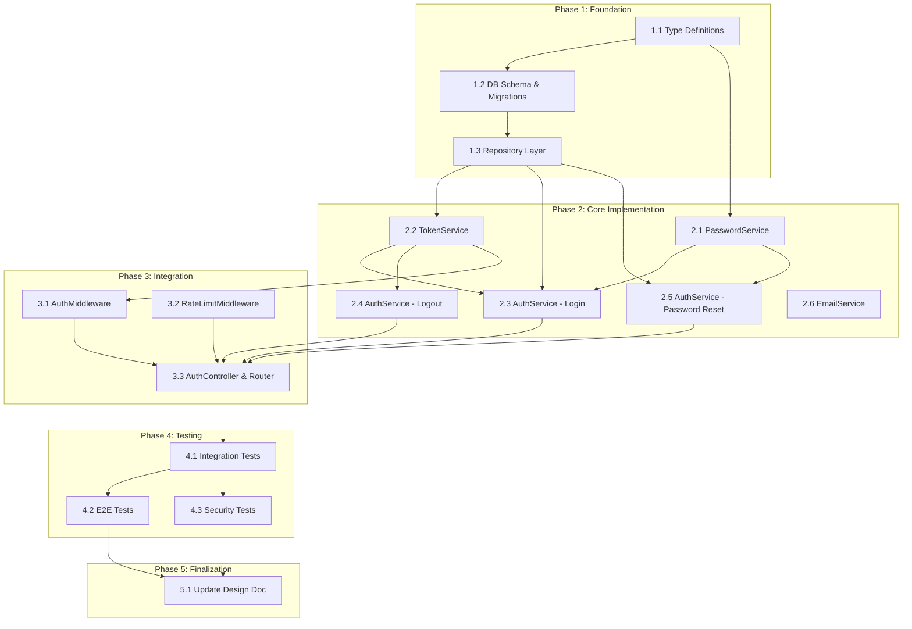

# Authentication Task Breakdown

## Metadata

| Item | Content |
|:-----|:--------|
| Feature Name | Authentication |
| Ticket Number | AUTH-001 |
| Design Doc | `.sdd/specification/auth_design.md` |
| Created Date | 2026-02-21 |

## Task List

### Phase 1: Foundation

| # | Task | Description | Completion Criteria | Dependencies |
|:--|:-----|:------------|:--------------------|:-------------|
| 1.1 | Define auth type definitions | Create TypeScript type definitions for User, Session, PasswordResetToken, TokenPayload, and all request/response types in `src/types/auth.ts` | All types defined matching spec and design doc data models; types compile without errors | - |
| 1.2 | Set up database schema and migrations | Create database migration files for `users`, `sessions`, and `password_reset_tokens` tables with proper indexes (email, token_jti, token_hash) | Migrations run successfully; tables created with correct columns, constraints, and indexes | 1.1 |
| 1.3 | Implement repository layer | Create UserRepository, SessionRepository, and ResetTokenRepository with CRUD operations matching IUserRepository, ISessionRepository, IResetTokenRepository interfaces | All repository methods implemented; unit tests pass with test database | 1.2 |

### Phase 2: Core Implementation

| # | Task | Description | Completion Criteria | Dependencies |
|:--|:-----|:------------|:--------------------|:-------------|
| 2.1 | Implement PasswordService | Create PasswordService with `hash()` and `compare()` methods using bcrypt with cost factor >= 12. Use constant-time comparison | Unit tests pass covering: hash generation, correct password comparison, incorrect password rejection, cost factor >= 12 verification | 1.1 |
| 2.2 | Implement TokenService | Create TokenService with `generateToken()`, `validateToken()`, and `invalidateToken()` methods using jsonwebtoken (HS256). Generate JWT ID (jti) for each token with 24h expiry | Unit tests pass covering: token generation, valid token validation, expired token rejection, tampered token rejection, token invalidation | 1.3 |
| 2.3 | Implement AuthService - Login | Create AuthService `login()` method: validate email format, retrieve user by email, compare password hash, generate JWT token on success, return generic error on failure | Unit tests pass covering: successful login with valid credentials, 401 on invalid email, 401 on wrong password, 400 on invalid email format | 1.3, 2.1, 2.2 |
| 2.4 | Implement AuthService - Logout | Create AuthService `logout()` method: validate token, extract jti, invalidate session record | Unit tests pass covering: successful logout, 401 on invalid token, idempotent logout on expired token | 2.2 |
| 2.5 | Implement AuthService - Password Reset | Create AuthService `requestPasswordReset()` and `resetPassword()` methods: generate 256-bit secure random token, store hashed token with 1h expiry, validate token on reset, update password hash, mark token as used. Always return success on request regardless of email existence | Unit tests pass covering: reset request for existing email, reset request for non-existing email (same response), valid token reset, expired token rejection, used token rejection, new password hash stored | 1.3, 2.1 |
| 2.6 | Implement EmailService | Create EmailService with method to send password reset email containing reset link with token | Unit tests pass with mocked email provider; email content includes reset link with token | - |

### Phase 3: Integration

| # | Task | Description | Completion Criteria | Dependencies |
|:--|:-----|:------------|:--------------------|:-------------|
| 3.1 | Implement AuthMiddleware | Create JWT validation middleware for protected routes: extract Bearer token from Authorization header, validate via TokenService, attach user context to request, return 401 on invalid/expired/missing token | Unit tests pass covering: valid token passes, expired token rejected, missing header rejected, malformed header rejected | 2.2 |
| 3.2 | Implement RateLimitMiddleware | Configure express-rate-limit with separate rate limits: 5 requests/minute for login, 3 requests/hour for password-reset, per-IP tracking | Unit tests pass covering: requests within limit pass, requests exceeding limit return 429, rate limits reset after window | - |
| 3.3 | Implement AuthController and AuthRouter | Create AuthController with request validation (joi/zod schemas) and response formatting. Create AuthRouter with POST /api/login, POST /api/logout, POST /api/password-reset routes. Apply rate limiting middleware to login and password-reset endpoints | Integration tests pass covering all API endpoints with correct status codes (200, 400, 401, 429) | 2.3, 2.4, 2.5, 3.1, 3.2 |

### Phase 4: Testing

| # | Task | Description | Completion Criteria | Dependencies |
|:--|:-----|:------------|:--------------------|:-------------|
| 4.1 | Integration tests for auth API | Write integration tests for all auth API endpoints: POST /api/login (200, 400, 401, 429), POST /api/logout (200, 401), POST /api/password-reset (200, 400, 429). Test with real database | All integration tests pass; all documented status codes tested; response body matches spec schema | 3.3 |
| 4.2 | E2E tests for auth flows | Write E2E tests: (1) Login -> Authenticated request -> Logout flow, (2) Password reset -> New login flow. Test complete user journeys | E2E tests pass; full happy paths verified; token invalidation after logout confirmed | 4.1 |
| 4.3 | Security tests | Write security tests: (1) Timing attack resistance on login, (2) Token tampering detection, (3) Rate limit enforcement under load, (4) Generic error messages (no information leakage) | All security tests pass; constant-time behavior verified; tampered tokens rejected; rate limits enforced | 4.1 |

### Phase 5: Finalization

| # | Task | Description | Completion Criteria | Dependencies |
|:--|:-----|:------------|:--------------------|:-------------|
| 5.1 | Update design doc implementation status | Update auth_design.md implementation status from "Not Implemented" to "Implemented" for all completed modules | Design doc reflects actual implementation status; all module statuses updated | 4.2, 4.3 |

## Dependency Diagram

## Requirement Coverage

| Requirement ID | Requirement Content | Corresponding Tasks |
|:---------------|:--------------------|:--------------------|
| FR_001 | System shall authenticate users with valid email and password credentials | 2.1, 2.3, 3.3, 4.1 |
| FR_002 | System shall maintain authenticated user sessions using secure tokens with 24-hour expiry | 2.2, 3.1, 4.1, 4.2 |
| FR_003 | System shall invalidate session tokens on user logout | 2.4, 3.3, 4.1, 4.2 |
| FR_004 | System shall allow users to reset passwords via email verification with 1-hour token expiry | 2.5, 2.6, 3.3, 4.1, 4.2 |
| PR_001 | Login request shall complete within 500ms (p95) | 1.2 (indexes), 4.3 |
| DC_001 | Passwords must be hashed with bcrypt (cost factor >= 12) | 2.1, 4.3 |
| DC_002 | Login attempts must be rate-limited to 5 per minute per IP | 3.2, 4.1, 4.3 |

## Implementation Notes

- EmailService implementation depends on email provider selection (SendGrid, AWS SES, or Mailgun) - use interface-based design to enable easy provider switching
- Rate limiter uses in-memory storage initially; migrate to Redis if horizontal scaling is needed
- All sensitive operations use constant-time comparison to prevent timing attacks
- Password reset tokens are stored as SHA-256 hashes, not raw values

## Reference Documents

- Abstract Specification: `.sdd/specification/auth_spec.md`
- Technical Design Document: `.sdd/specification/auth_design.md`
- PRD: `.sdd/requirement/auth.md`
