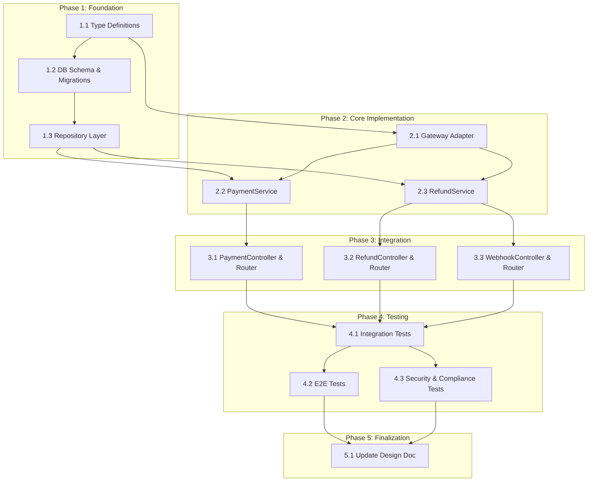

# Payment Task Breakdown

## Metadata

| Item | Content |
|:-----|:--------|
| Feature Name | Payment |
| Ticket Number | PAY-001 |
| Design Doc | `.sdd/specification/payment_design.md` |
| Created Date | 2026-02-21 |

## Task List

### Phase 1: Foundation

| # | Task | Description | Completion Criteria | Dependencies |
|:--|:-----|:------------|:--------------------|:-------------|
| 1.1 | Define payment type definitions | Create TypeScript type definitions for Payment, Refund, PaymentStatus, RefundStatus, and all request/response types in `src/types/payment.ts`. Include gateway adapter types | All types defined matching spec and design doc data models; types compile without errors | - |
| 1.2 | Set up database schema and migrations | Create database migration files for `payments` and `refunds` tables with proper indexes (payments.id, payments.user_id, refunds.payment_id, refunds.gateway_refund_id). Store amounts as integer cents | Migrations run successfully; tables created with correct columns, constraints, and indexes; amount columns use integer type | 1.1 |
| 1.3 | Implement repository layer | Create PaymentRepository and RefundRepository with CRUD operations matching IPaymentRepository and IRefundRepository interfaces. Include `findByIdWithRefunds()` and `getTotalRefundedAmount()` | All repository methods implemented; unit tests pass with test database; eager loading of refunds works correctly | 1.2 |

### Phase 2: Core Implementation

| # | Task | Description | Completion Criteria | Dependencies |
|:--|:-----|:------------|:--------------------|:-------------|
| 2.1 | Implement Payment Gateway Adapter interface | Define IPaymentGatewayAdapter interface with `createPayment()`, `createRefund()`, and `verifyWebhookSignature()` methods. Create Stripe implementation using stripe-node SDK | Interface defined; Stripe adapter implements all methods; unit tests pass with mocked Stripe API (success, decline, gateway error responses) | 1.1 |
| 2.2 | Implement PaymentService | Create PaymentService with `processPayment()` and `getPaymentById()` methods. Validate amount (positive, 2 decimal places), currency (ISO 4217), and cardToken. Convert between cents (internal) and decimal (API). Use Stripe idempotency keys. Set 4.5s timeout on gateway calls | Unit tests pass covering: successful payment, validation errors (amount, currency, token), gateway decline (402), gateway timeout (500), idempotent retry | 1.3, 2.1 |
| 2.3 | Implement RefundService | Create RefundService with `processRefund()` and `updateRefundStatus()` methods. Validate: original payment exists, payment is within 90-day window, refund amount does not exceed original payment minus previous refunds. Initiate refund through gateway adapter | Unit tests pass covering: full refund, partial refund, refund exceeding payment amount, 90-day window expired, payment not found, cumulative refund limit | 1.3, 2.1 |

### Phase 3: Integration

| # | Task | Description | Completion Criteria | Dependencies |
|:--|:-----|:------------|:--------------------|:-------------|
| 3.1 | Implement PaymentController and PaymentRouter | Create PaymentController with request validation (amount, currency, cardToken). Create PaymentRouter with POST /api/payments and GET /api/payments/:id routes. Apply auth middleware. Convert cents to decimal in responses | Integration tests pass covering: POST /api/payments (201, 400, 402, 500), GET /api/payments/:id (200, 404); response amounts are decimal format | 2.2 |
| 3.2 | Implement RefundController and RefundRouter | Create RefundController with request validation (paymentId, amount, reason). Create RefundRouter with POST /api/refunds route. Apply auth middleware | Integration tests pass covering: POST /api/refunds (201, 400 validation, 400 exceeds payment, 400 window expired, 404 payment not found) | 2.3 |
| 3.3 | Implement WebhookController and WebhookRouter | Create WebhookController to process Stripe webhook events for refund status updates. Create WebhookRouter with POST /webhooks/stripe route. Verify webhook signature using Stripe SDK. Update refund status on `refund.succeeded` and `refund.failed` events | Integration tests pass covering: valid webhook signature accepted, invalid signature rejected, refund status updated to succeeded, refund status updated to failed | 2.3 |

### Phase 4: Testing

| # | Task | Description | Completion Criteria | Dependencies |
|:--|:-----|:------------|:--------------------|:-------------|
| 4.1 | Integration tests for payment API | Write integration tests for all payment API endpoints with real database: POST /api/payments (201, 400, 402, 500), GET /api/payments/:id (200, 404), POST /api/refunds (201, 400, 404). Verify response schemas match spec | All integration tests pass; all documented status codes and error codes tested; response body matches spec schema; amounts use decimal format in responses | 3.1, 3.2, 3.3 |
| 4.2 | E2E tests for payment flows | Write E2E tests: (1) Payment -> View details -> Full refund flow, (2) Payment -> Partial refund -> View updated details flow, (3) Multiple partial refunds -> Verify cumulative amount tracking. Use Stripe test mode keys | E2E tests pass; full payment lifecycle verified; refund amounts correctly tracked; payment status transitions correct | 4.1 |
| 4.3 | Security and compliance tests | Write security tests: (1) Verify no raw card data in logs or database, (2) Verify only card_last4 stored, (3) Verify gateway_payment_id stored instead of card details, (4) Verify HTTPS required for payment endpoints, (5) Verify webhook signature validation | All security tests pass; no PCI violations detected; card data never logged; only tokenized references stored | 4.1 |

### Phase 5: Finalization

| # | Task | Description | Completion Criteria | Dependencies |
|:--|:-----|:------------|:--------------------|:-------------|
| 5.1 | Update design doc implementation status | Update payment_design.md implementation status from "Not Implemented" to "Implemented" for all completed modules | Design doc reflects actual implementation status; all module statuses updated | 4.2, 4.3 |

## Dependency Diagram

## Requirement Coverage

| Requirement ID | Requirement Content | Corresponding Tasks |
|:---------------|:--------------------|:--------------------|
| FR_001 | System shall process credit card payments through a PCI-compliant payment gateway | 2.1, 2.2, 3.1, 4.1 |
| FR_002 | System shall validate card number format, expiration date, and CVV before submission | 2.2 (cardToken validation), 3.1, 4.1 |
| FR_003 | System shall provide payment confirmation or error feedback within 5 seconds | 2.2 (4.5s timeout), 3.1, 4.1 |
| FR_004 | Users shall view payment history including date, amount, status, and payment method | 2.2 (getPaymentById), 3.1, 4.1 |
| FR_005 | Authorized users shall issue full or partial refunds within 90 days of original payment | 2.3, 3.2, 4.1, 4.2 |
| FR_006 | System shall track and display refund status in transaction history | 2.3 (updateRefundStatus), 3.3, 4.1, 4.2 |
| PR_001 | Payment processing shall complete within 5 seconds under normal load | 2.2 (4.5s gateway timeout), 4.2 |
| DC_001 | Payment processing must comply with PCI DSS standards | 2.1 (tokenization), 4.3 |
| DC_002 | Application must not store raw credit card numbers | 1.2 (card_last4 only), 2.2, 4.3 |

## Implementation Notes

- All monetary values are stored as integer cents internally to avoid floating-point precision issues. Conversion to decimal format (2 decimal places) occurs at the API boundary
- Stripe idempotency keys are used to prevent duplicate payments on retry
- Webhook signature verification is mandatory for all Stripe callback processing
- The auth module (AUTH-001) must be implemented first as payment endpoints require authentication via AuthMiddleware
- Card validation (FR_002) is handled by Stripe.js on the client side; the server only validates the cardToken

## Reference Documents

- Abstract Specification: `.sdd/specification/payment_spec.md`
- Technical Design Document: `.sdd/specification/payment_design.md`
- PRD: `.sdd/requirement/payment.md`
